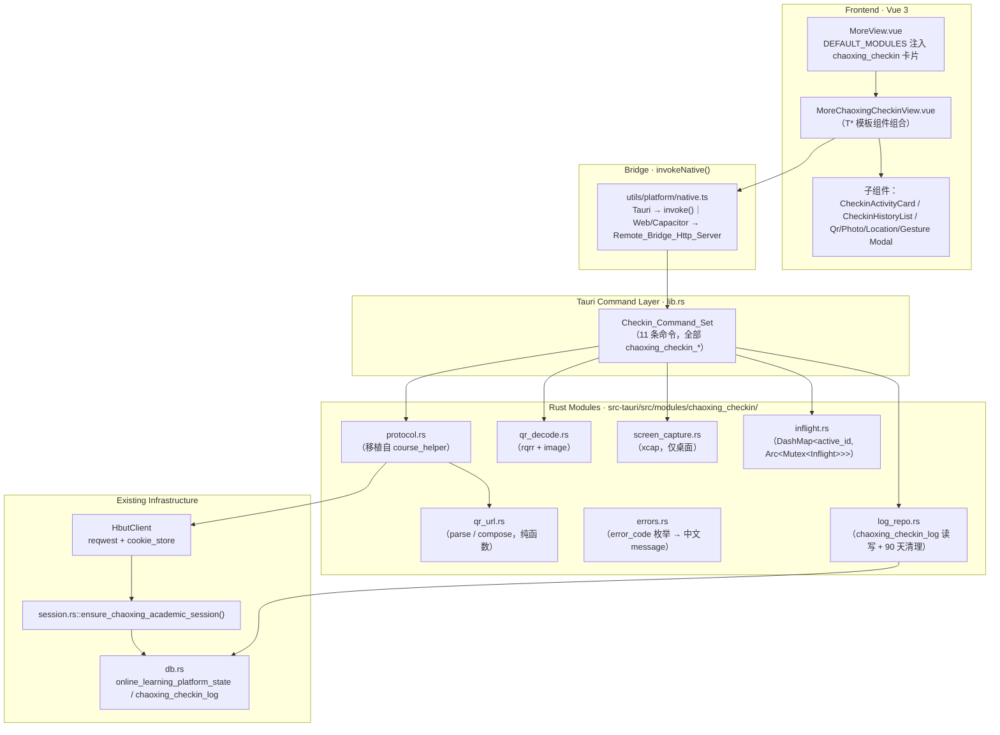
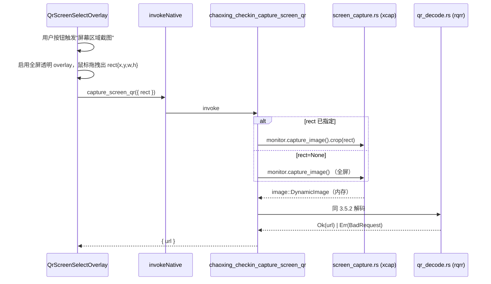
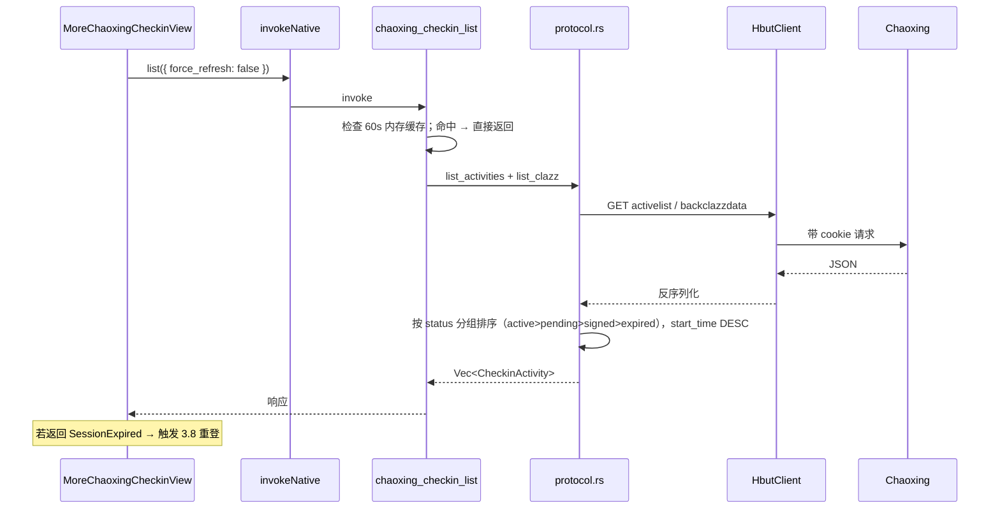
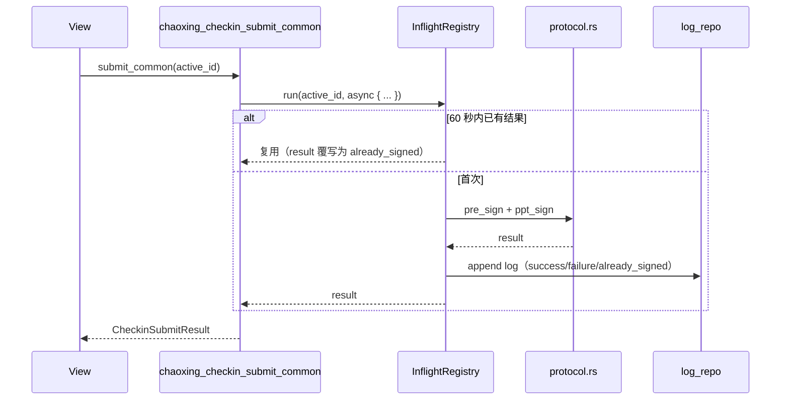
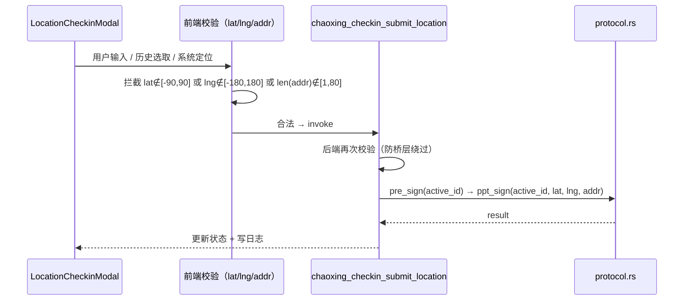
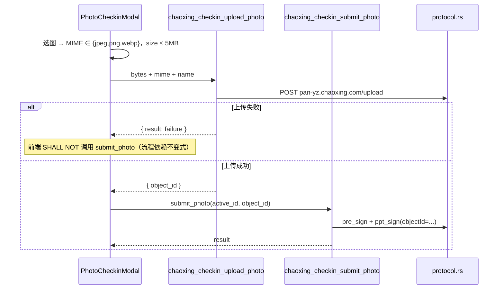
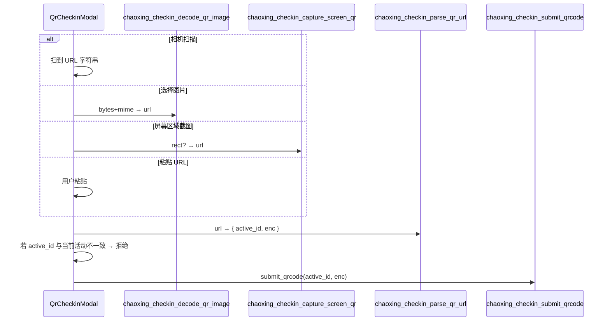
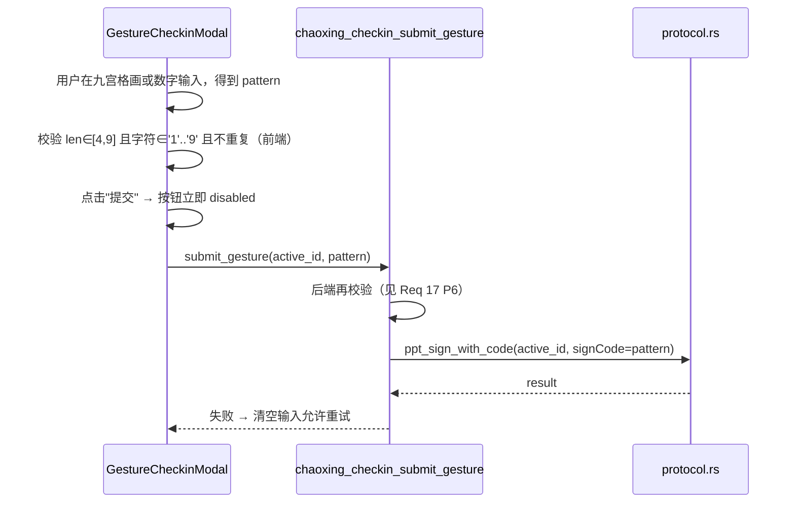
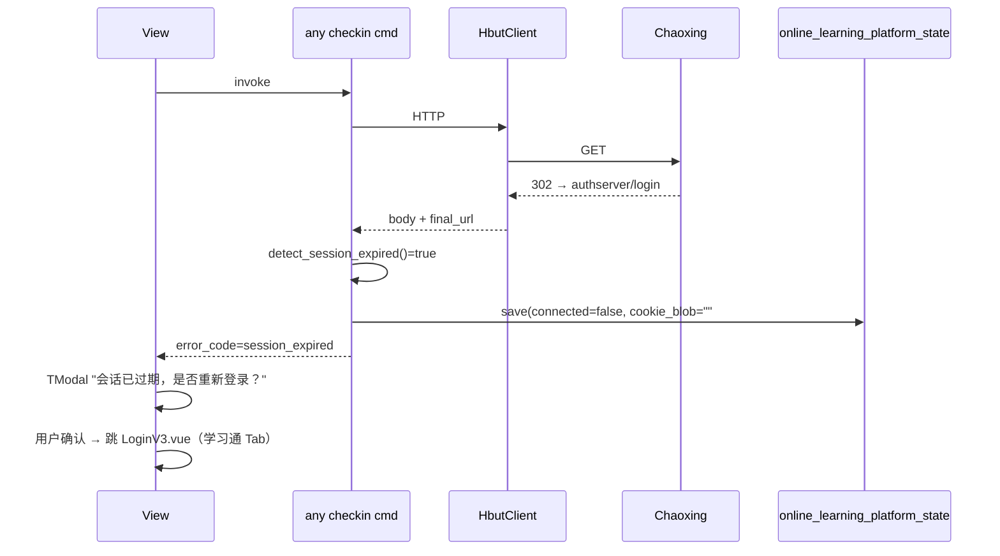

# Design Document · chaoxing-checkin

> 本设计文档基于已确认的 `requirements.md`（2025-06 定稿版）展开，所有 `SHALL` 级设计决策与条款号一一对应（引用格式：见 Req X.Y）。设计阶段默认采纳 Open Decisions 的全部默认项，三条桌面端扫码降级路径（粘贴 URL / 本地图片解码 / 屏幕区域截图）作为硬性范围（见 Req 7.1、Req 7.2、Req 7.3、Req 7.4），协议实现参考并**移植** `AneryCoft/course_helper`（GPL v3 → GPL v3，用 Rust 重写，保留 SPDX 与上游归属注释；见 Req 18）。

---

## 1. Overview

### 1.1 目标与约束

`chaoxing-checkin` 模块在"更多"页新增一张内部模块卡片 `chaoxing_checkin`，进入后提供五类签到（普通 / 位置 / 拍照 / 二维码 / 手势）与签到历史查询。模块**完全复用**已存在的学习通登录链路（SSO / 密码 / 扫码）与 Cookie 持久化（`online_learning_platform_state`），不新增第二套账号体系（见 Req 2、Req 19.5）。

核心架构假设（来自需求 Introduction）：

1. **前端视图层**：Vue 3 + Vite，`src/components/MoreChaoxingCheckinView.vue` 作为入口，只使用 `src/components/templates/T*` 骨架组件与运行时 `--ui-*` tokens（见 Req 12）。
2. **桥层**：统一 `invokeNative()`；Tauri 桌面直走 `#[tauri::command]`，Capacitor/Web 走 `Remote_Bridge_Http_Server`（见 Req 11）。
3. **命令层**：`#[tauri::command]` 注册在 `src-tauri/src/lib.rs`，实现聚合在 `src-tauri/src/modules/chaoxing_checkin.rs`，命令封闭集合 `Checkin_Command_Set`（见 Req Glossary、Req 1–10、Req 7.3、Req 7.4）。
4. **协议层**：移植 `AneryCoft/course_helper` 的签到协议（`preSign`/`pptSign`/`upload`/`activelist`/`backclazzdata`），Rust 重写，保留 SPDX + Attribution（见 Req 18）。
5. **HTTP 层**：沿用 `HbutClient`（内嵌 `reqwest::Client` + `cookie_store::Jar`），经 `Arc<Mutex<HbutClient>>` 串行化 cookie 访问（见 Req 14.4）。
6. **持久化层**：SQLite（`db.rs`）：Cookie 复用 `online_learning_platform_state(platform='chaoxing')`；新增 `chaoxing_checkin_log` 表（见 Req 2.3、Req 10）。

### 1.2 设计原则

- **最小变更**：不重构现有学习通会话子系统，只"搭积木"在其上。
- **纯逻辑与 IO 分离**：QR URL 解析、错误码映射、pattern 校验等为纯函数，单独模块便于 PBT（见 Req 15、Req 17）。
- **幂等/并发安全**：进行中请求通过 `DashMap<active_id, Arc<Mutex<Inflight>>>` 合并（见 Req 14.3、Req 16.4）。
- **隐私优先**：Cookie / enc / object_id / 学号在日志与 UI 中全部截断或脱敏（见 Req 13）。
- **可降级**：桌面无相机时，"选择图片 + 屏幕区域截图 + 粘贴 URL" 三路共用同一流水线（见 Req 7）。

### 1.3 研究要点（调研而来的关键事实）

| 领域 | 采用方案 | 选型理由 |
|---|---|---|
| Rust QR 解码 | **`rqrr`**（主）+ `image` crate 解码字节 | MIT 许可；纯 Rust；单核吞吐足够；`bardecoder` 体积更大且维护不活跃，作为 fallback 选择 |
| Rust 屏幕截图 | **`xcap`**（仅桌面端，含 `[target.'cfg(any(target_os=…)')]` gate） | Apache-2.0；同时支持 Windows/macOS/Linux；按显示器 + `crop(rect)` 接口友好；内存位图无落盘（见 Req 7.4、Req 17 P14） |
| Rust PBT | **`proptest`** + `proptest-derive` | Rust 生态标准；支持 shrinking；最小迭代 100（见 Req 17、Testing Strategy） |
| Web/TS PBT | **`fast-check`** | 前端纯函数（URL 解析 / pattern 校验 / 错误码映射 Vue 侧副本）复用 |
| Cookie 存储 | 复用 `db::save_online_learning_platform_state`（platform='chaoxing'） | 见 Req 2.3；不新增第二套 |
| 协议移植来源 | `AneryCoft/course_helper`（GPL-3.0-or-later） | 与本仓库同协议兼容；只移植签到相关 Dart 逻辑，重写为 Rust（见 Req 18） |

> 注：所有选型均可在 `docs/chaoxing-protocol.md` 与 `THIRD_PARTY_NOTICES.md` 中留痕（见 Req 18.3、Req 18.5）。

---

## 2. Architecture

### 2.1 分层总图



### 2.2 模块边界

| 边界 | 允许依赖 | 禁止依赖 |
|---|---|---|
| `qr_url.rs` | 仅 `url`、`percent-encoding` | reqwest / 文件 IO / tauri / 任何平台 API（保证纯函数，见 Req 15.1） |
| `qr_decode.rs` | `rqrr`、`image` | 网络 IO、`reqwest`、磁盘（Req 17 P13） |
| `screen_capture.rs` | `xcap`、`image`、`rqrr` | 磁盘写入（Req 7.4、Req 17 P14） |
| `protocol.rs` | `HbutClient`、`reqwest`、`serde_json` | tauri::State（通过命令层注入） |
| `inflight.rs` | `dashmap`、`tokio::sync::Mutex` | — |
| 命令层（lib.rs） | 以上所有 | 不在 lib.rs 内写业务逻辑，仅粘合 |

### 2.3 运行时视图

- **进程模型**：所有签到相关命令在 Tauri 主进程 tokio 运行时内异步执行，`Arc<Mutex<HbutClient>>` 保持 cookie 单写者（见 Req 14.4）。
- **UI 线程占用**：命令层立即 `spawn`，主 UI 线程 ≤ 50ms（见 Req 14.2）。
- **后台延续**：用户离开页面后，在途的 `tokio::task` 继续到完成，结果落 `chaoxing_checkin_log`（见 Req 14.6）。

---

## 3. Components and Interfaces

### 3.1 前端视图层

#### 3.1.1 文件与目录

```
src/components/
  MoreView.vue                              # 改造：DEFAULT_MODULES 追加 chaoxing_checkin（见 Req 1.1）
  MoreChaoxingCheckinView.vue               # 新增：顶层容器
  chaoxing_checkin/                         # 新增子目录（仅本模块私有组件）
    CheckinActivityCard.vue                 # 单条活动的卡片（TCard + TStatusBadge）
    CheckinHistoryList.vue                  # 历史页（见 Req 10.4）
    LocationCheckinModal.vue                # 见 Req 5
    PhotoCheckinModal.vue                   # 见 Req 6
    GestureCheckinModal.vue                 # 见 Req 8
    QrCheckinModal.vue                      # 见 Req 7（内含 4 个降级入口）
    QrScreenSelectOverlay.vue               # 屏幕区域截图框选浮层（见 Req 7.1、Req 7.4）
    SessionStatusBanner.vue                 # 会话状态（登录引导 / 会话过期重连，见 Req 2.5、Req 9.3）
  composables/
    useChaoxingCheckin.ts                   # 命令聚合与状态管理（pinia 风格 ref 合集）
    useQrScanner.ts                         # 相机扫描（Capacitor/Web 能力探测）
    useGeolocation.ts                       # 定位能力探测（见 Req 5.1、Req 5.6）
```

> 严禁在 `MoreChaoxingCheckinView.vue` 的 `<template>` 根节点直接写 `<div class="card">` 等自绘卡片（见 Req 12.1）。

#### 3.1.2 `MoreChaoxingCheckinView.vue` 骨架

```vue
<template>
  <div class="more-chaoxing-checkin">
    <TPageHeader title="学习通签到" @back="emit('back')">
      <template #actions>
        <button class="icon-btn" :disabled="refreshing" @click="refresh">↻</button>
      </template>
    </TPageHeader>

    <SessionStatusBanner
      v-if="!session.connected"
      @login="openChaoxingLoginModal"
    />

    <TSection title="进行中" v-if="activeActivities.length">
      <CheckinActivityCard
        v-for="a in activeActivities"
        :key="a.active_id"
        :activity="a"
        :busy="isInflight(a.active_id)"
        @submit="dispatchSubmit(a)"
      />
    </TSection>

    <TSection title="最近 24 小时" v-if="pendingOrExpired.length">
      <CheckinActivityCard v-for="a in pendingOrExpired" :key="a.active_id" :activity="a" />
    </TSection>

    <TEmptyState v-if="!activities.length" title="暂无可用签到，请稍后刷新" />

    <TSection title="签到历史">
      <CheckinHistoryList :items="history" />
    </TSection>

    <!-- 签到对话框：按活动类型动态挂载 -->
    <LocationCheckinModal v-if="modal==='location'" ... />
    <PhotoCheckinModal   v-if="modal==='photo'"    ... />
    <GestureCheckinModal v-if="modal==='gesture'"  ... />
    <QrCheckinModal      v-if="modal==='qrcode'"   ... />
  </div>
</template>
```

#### 3.1.3 设计 tokens 合规（见 Req 12）

- **仅使用运行时 CSS 变量**：`--ui-primary / --ui-surface / --ui-text / --ui-muted / --ui-danger / --ui-success / --ui-warning / --ui-shadow-soft / --ui-radius-scale / --ui-font-scale / --ui-bg-gradient`；禁止硬编码任何 hex（见 Req 12.2）。
- **图标**：Heroicons/Lucide SVG 组件（`<IconCheckSquare>` / `<IconQrCode>` / `<IconPhoto>` / `<IconMapPin>` / `<IconGesture>`），Emoji 只在 `MoreView` 卡片装饰前缀（见 Req 12.3、Req 1.1）。
- **Liquid Glass 风格**：`TModal` 使用 `backdrop-filter: blur(clamp(10px, 1.2vw, 20px))` 与 `border: 1px solid rgba(255,255,255,.18)`（见 Req 12.7）。
- **响应式**：375/768/1024/1440 四档断点下不产生横向滚动，`line-height ≥ 1.4`（见 Req 12.5）。
- **无障碍**：所有按钮 `cursor: pointer` + `:focus-visible` + `@media (prefers-reduced-motion: reduce)` 下动画降级（见 Req 12.4）。

### 3.2 桥层 `invokeNative()`

- Tauri 运行时 → `@tauri-apps/api/core::invoke`。
- Capacitor/Web → POST `http://127.0.0.1:{remote_bridge_port}/invoke` `{ cmd, args }`（见 Req 11.4）。
- 判定：`isTauriRuntime()`（已存在于 `utils/platform/native.ts`）。
- 降级：`isTauriRuntime() === false && bridgeUnreachable` → UI 展示"当前环境不支持签到"（见 Req 11.4）。

### 3.3 Tauri 命令层（Checkin_Command_Set）

所有命令注册于 `src-tauri/src/lib.rs::tauri::Builder::invoke_handler![…]`，命令名前缀 `chaoxing_checkin_*`，封闭集合共 **11 条**（见 Req Glossary）：

| # | 命令 | 入参 | 出参 | 关联需求 |
|---|---|---|---|---|
| 1 | `chaoxing_checkin_list` | `{ force_refresh: bool }` | `Vec<CheckinActivity>` | Req 3.1, 3.7 |
| 2 | `chaoxing_checkin_submit_common` | `{ active_id: String }` | `CheckinSubmitResult` | Req 4, 16 |
| 3 | `chaoxing_checkin_submit_location` | `{ active_id, latitude: f64, longitude: f64, address: String }` | `CheckinSubmitResult` | Req 5 |
| 4 | `chaoxing_checkin_upload_photo` | `{ image_bytes: Vec<u8>, mime_type, file_name }` | `PhotoUploadResult { object_id, thumb_url }` | Req 6.4 |
| 5 | `chaoxing_checkin_submit_photo` | `{ active_id, object_id }` | `CheckinSubmitResult` | Req 6.6 |
| 6 | `chaoxing_checkin_submit_qrcode` | `{ active_id, enc }` | `CheckinSubmitResult` | Req 7.7 |
| 7 | `chaoxing_checkin_submit_gesture` | `{ active_id, pattern: String }` | `CheckinSubmitResult` | Req 8.4 |
| 8 | `chaoxing_checkin_history` | `{ student_id: Option<String>, limit: u32 }` | `Vec<CheckinLogEntry>` | Req 10.3 |
| 9 | `chaoxing_checkin_parse_qr_url` | `{ url: String }` | `QrUrlParts { enc, active_id }` | Req 7.5, 15 |
| 10 | `chaoxing_checkin_decode_qr_image` | `{ image_bytes: Vec<u8>, mime_type: String }` | `{ url: String }` | Req 7.3 |
| 11 | `chaoxing_checkin_capture_screen_qr` | `{ rect: Option<ScreenRect> }` | `{ url: String }` | Req 7.4 |

> 另保留 1 条内部测试函数 `chaoxing_checkin_compose_qr_url(active_id, enc)`，作为 `parse` 的对合函数，仅 `#[cfg(test)]` 暴露用于 PBT（见 Req 15.2、Req 17 P1）。

#### 3.3.1 统一返回类型

```rust
#[derive(Serialize, Deserialize)]
pub struct CheckinSubmitResult {
    pub result: SubmitResult,                // "success" | "already_signed" | "failure"
    pub message: String,                     // 简体中文，UI 直接展示（见 Req 9.6）
    pub error_code: Option<CheckinErrorCode>,// 见 3.3.2
    pub server_response: Option<Value>,      // 原始服务端响应（仅结构化数据，不含 HTML）
}

#[derive(Serialize, Deserialize)]
#[serde(rename_all = "snake_case")]
pub enum SubmitResult { Success, AlreadySigned, Failure }
```

#### 3.3.2 错误码枚举（与 Req 9.1 完全对齐）

```rust
#[derive(Serialize, Deserialize, Clone, Copy, Debug, PartialEq, Eq)]
#[serde(rename_all = "snake_case")]
pub enum CheckinErrorCode {
    NetworkError,       // 连接失败、DNS、超时（见 Req 4.2、Req 9.4）
    SessionExpired,     // 命中 authserver/login 或 "请先登录"（见 Req 9.2）
    BadRequest,         // 经纬度越界、手势非法、mime 不合法、QR 不合法
    ServerError,        // 超星 5xx / 响应结构异常
    AlreadySigned,      // 幂等命中（见 Req 4.4、Req 16.1）
    RateLimited,        // 超星限流（见 Req 9.5）
    PermissionDenied,   // 相机/定位/屏幕截图在当前平台不可用（见 Req 7.4、Req 11.2）
    Unknown,            // 兜底
}
```

- 每个枚举值映射一条简体中文 message 常量（在 `errors.rs::human_message()`）；前端再做一次本地映射（防止后端漏翻）。
- Rust/TS 两侧的枚举值必须严格保持一致，TS 侧通过 `src/types/chaoxing_checkin.ts` 手写镜像类型并在 CI 用 snapshot 比对。

### 3.4 协议层（`modules/chaoxing_checkin/protocol.rs`）

#### 3.4.1 文件头（强制）

```rust
// SPDX-License-Identifier: GPL-3.0-or-later
// Portions of this module are ported from AneryCoft/course_helper (GPL-3.0-or-later).
// Upstream: https://github.com/AneryCoft/course_helper
```

上述 3 行出现在 `protocol.rs` 与任何直接对应 course_helper 的 Rust 文件头（见 Req 18.2）。

#### 3.4.2 端点映射（移植范围）

| 超星端点 | Rust fn（`protocol::`） | 用途 | 对应需求 |
|---|---|---|---|
| `GET mobilelearn.chaoxing.com/v2/apis/active/student/activelist` | `list_activities(client, limit_hours=24)` | 拉签到列表 | Req 3 |
| `GET mooc1-api.chaoxing.com/mycourse/backclazzdata` | `list_clazz(client)` | 列出班级课程补全 `course_id/clazz_id` | Req 3.2 |
| `GET mobilelearn.chaoxing.com/newsign/preSign` | `pre_sign(client, active_id, course_id, clazz_id)` | 预签 | Req 4, 5, 6, 7, 8 |
| `GET mobilelearn.chaoxing.com/pptSign` | `ppt_sign(client, params)` | 真正签到 | Req 4, 5, 7, 8 |
| `POST mobilelearn.chaoxing.com/pptSign`（`signCode`） | `ppt_sign_with_code` | 手势签到（pattern 字段作为 `signCode`） | Req 8 |
| `POST pan-yz.chaoxing.com/upload` | `upload_photo(client, bytes, mime, name)` | 拍照签到上传 | Req 6.4 |
| `GET mobilelearn.chaoxing.com/newsign/preSign?…enc=…` | `qr_pre_sign(client, active_id, enc)` | 二维码预签 | Req 7 |

> 所有 fn 仅接收 `&HbutClient`（或 `&mut HbutClient`）作为 IO 句柄；HTTP header 指纹（`UserAgent` 仿真 ChaoXingLearning X-Android/iOS 客户端）集中在 `protocol::headers::default()`，便于单点审查。

#### 3.4.3 Rust 包结构（子模块拆分）

```
src-tauri/src/modules/chaoxing_checkin/
  mod.rs                 # 聚合 + 对外 pub use
  protocol.rs            # 端点调用（移植，含 SPDX）
  qr_url.rs              # parse / compose 纯函数（见 Req 15）
  qr_decode.rs           # rqrr + image 解码（见 Req 7.3）
  screen_capture.rs      # xcap 截屏 + 裁剪（见 Req 7.4；仅 cfg(desktop)）
  inflight.rs            # DashMap 并发合并（见 Req 16.4）
  errors.rs              # CheckinErrorCode ↔ 中文 message
  log_repo.rs            # chaoxing_checkin_log 读写 + 惰性 90d 清理（见 Req 10）
  types.rs               # DTO（CheckinActivity/ResultSafeDomainWhitelist 常量等）
  session.rs             # 会话自愈：检测 session_expired 并清 connected 标志（见 Req 9.2、Req 2.6）
```

`modules/mod.rs` 追加 `pub mod chaoxing_checkin;`。

### 3.5 二维码流水线（三路降级）

#### 3.5.1 相机扫描（Capacitor Android / iOS 或配置相机的 Tauri）

- **Capacitor**：`@capacitor/camera` + `@capacitor-community/barcode-scanner`（若已集成；否则回退到选择图片）。
- **纯 Web**：`<input type="file" accept="image/*" capture="environment">` 拿到图片后走"选择图片解码"路径。
- 扫描结果 → URL → `chaoxing_checkin_parse_qr_url` → `chaoxing_checkin_submit_qrcode`。

#### 3.5.2 选择图片解码（所有平台；Req 7.3）

```mermaid
sequenceDiagram
  participant UI as QrCheckinModal
  participant Bridge as invokeNative
  participant Cmd as chaoxing_checkin_decode_qr_image
  participant Dec as qr_decode.rs (rqrr)
  UI->>UI: <input type=file accept="image/*">
  UI->>UI: 前端读为 Uint8Array，拒绝 >10MB 原始文件（本地预检）
  UI->>Bridge: decode_qr_image(bytes, mime)
  Bridge->>Cmd: invoke
  Cmd->>Dec: image::load_from_memory(bytes)<br/>→ to_luma8() → rqrr::PreparedImage::prepare()
  Dec-->>Cmd: Ok(url) | Err(BadRequest)
  Cmd-->>UI: { url }（或 error_code=bad_request）
  UI->>UI: parse_qr_url(url) → submit_qrcode
```



- **零网络**：`qr_decode.rs` 不 `use reqwest`；命令层断言"此命令在执行期间不产生任何 HTTP"（通过 `inflight` 层 mock 断言，见 Req 17 P13）。
- **内存处理**：`image` crate 直接吃 `&[u8]`，不写磁盘。

#### 3.5.3 屏幕区域截图解码（仅 Tauri 桌面；Req 7.4）



- **cfg gate**：`#[cfg(any(target_os = "windows", target_os = "macos", target_os = "linux"))]`；其他平台直接 `Err(PermissionDenied)`（见 Req 7.4）。
- **不落盘**：整个过程 `DynamicImage` 驻留内存，函数返回后由 Drop 释放（见 Req 17 P14）。
- **多屏**：默认主屏 `xcap::Monitor::all()?.into_iter().find(|m| m.is_primary())`；`rect` 坐标以主屏逻辑像素为基准，overlay 根据 DPR 做一次换算。

#### 3.5.4 粘贴 URL（所有平台；Req 7.1）

用户输入文本框 → 去首尾空白与 HTML 实体解码（`&amp; → &`）→ 交给 `parse_qr_url`（见 Req 15.4）。

### 3.6 QR URL 解析器（纯函数；Req 15）

```rust
// src-tauri/src/modules/chaoxing_checkin/qr_url.rs

pub struct QrUrlParts { pub active_id: String, pub enc: String }

pub fn parse(url: &str) -> Result<QrUrlParts, CheckinErrorCode> { … }

#[cfg(any(test, feature = "testing"))]
pub fn compose(active_id: &str, enc: &str) -> String { … }

pub const QR_HOST_WHITELIST: &[&str] = &[
    "mobilelearn.chaoxing.com",
    "www.chaoxing.com",
    "k.chaoxing.com",
];
```

- **对合性（见 Req 15.2、Req 17 P1）**：`parse(compose(x)) == Ok(x)` 对任意 `x ∈ ValidPairs` 成立；`compose(parse(y))?` 与原 `y` 在"查询参数顺序无关 + `%20`/`+` 空格等价 + `&amp;` → `&`"意义下等价。
- **容错**：使用 `url::Url::parse` + `query_pairs()` 再自行归一化 key；未知 key 保留但不进入返回结构。
- **白名单**：`host` 必须匹配 `QR_HOST_WHITELIST`，否则返回 `BadRequest`（见 Req 15.5）。
- **无 IO**：不 touch 文件系统、网络、环境变量（见 Req 15.1）。

### 3.7 幂等与并发合并（Req 14.3、Req 16）

```rust
// inflight.rs
pub struct InflightRegistry {
    map: DashMap<String /*active_id*/, Arc<Mutex<Option<CheckinSubmitResult>>>>,
}

impl InflightRegistry {
    pub async fn run<F, Fut>(&self, active_id: &str, f: F) -> CheckinSubmitResult
    where
        F: FnOnce() -> Fut,
        Fut: Future<Output = CheckinSubmitResult>,
    {
        let slot = self.map.entry(active_id.into()).or_insert_with(|| Arc::new(Mutex::new(None))).clone();
        let mut guard = slot.lock().await;
        if let Some(cached) = guard.as_ref() {
            // 60 秒内同 active_id：直接复用结果（success / already_signed）
            return cached.clone().with_result_override(SubmitResult::AlreadySigned);
        }
        let res = f().await;
        *guard = Some(res.clone());
        // 60 秒后后台清理
        tokio::spawn(async move { tokio::time::sleep(Duration::from_secs(60)).await; /* remove */ });
        res
    }
}
```

- **合并语义**：N 次并发调用 → 1 次真实 HTTP；其余 N-1 次共享首次结果（见 Req 16.1、Req 17 P12）。
- **幂等断言**：`submit_common` / `submit_qrcode` 满足 `f(f(x)) == f(x)`（见 Req 16.2）。
- **写日志只一次**：只有"真正发起远端请求"的那一次会写 `chaoxing_checkin_log`；共享结果的 N-1 次不写（见 Req 16.3）。

### 3.8 会话自愈（Req 2.6、Req 9.2、Req 9.3）

```rust
pub fn detect_session_expired(status: StatusCode, final_url: &str, body: &str) -> bool {
    status == StatusCode::FOUND && final_url.contains("authserver/login")
        || body.contains("请先登录")
        || body.contains("passport2.chaoxing.com/login")
}
```

- 任一签到命令检测到该信号 → 立即在 `online_learning_platform_state(platform='chaoxing')` 设 `connected = false` + 清空 `cookie_blob`（通过 `db::save_online_learning_platform_state`）。
- 返回 `error_code = SessionExpired`；前端收到后弹 `TModal`"会话已过期，是否重新登录？"→ 确认跳 `LoginV3.vue` 学习通 Tab。
- 不自动发起静默登录（避免静默失败后用户不知情）。

### 3.9 关键时序图

#### 3.9.1 签到列表拉取（Req 3）



#### 3.9.2 普通签到（Req 4、Req 16）



#### 3.9.3 位置签到（Req 5）



#### 3.9.4 拍照签到（Req 6、Req 17 P10）



#### 3.9.5 二维码签到（Req 7）



#### 3.9.6 手势签到（Req 8）



#### 3.9.7 会话自愈（Req 9）



---

## 4. Data Models

### 4.1 前端 TypeScript 类型（`src/types/chaoxing_checkin.ts`）

```ts
export type ActivityType = 'normal' | 'location' | 'photo' | 'qrcode' | 'gesture';
export type ActivityStatus = 'active' | 'pending' | 'signed' | 'expired';
export type SubmitResult = 'success' | 'already_signed' | 'failure';
export type CheckinErrorCode =
  | 'network_error' | 'session_expired' | 'bad_request' | 'server_error'
  | 'already_signed' | 'rate_limited' | 'permission_denied' | 'unknown';

export interface CheckinActivity {
  active_id: string;            // 超星活动 ID（u64 字符串化，见 Req Glossary）
  course_id: string;
  clazz_id: string;
  course_name: string;
  teacher_name: string;
  activity_type: ActivityType;
  status: ActivityStatus;
  start_time: number;           // epoch ms
  end_time: number;             // epoch ms
  snapshot_timestamp: number;   // 后端拉取时记录（P3 用）
}

export interface CheckinSubmitResponse {
  result: SubmitResult;
  message: string;
  error_code?: CheckinErrorCode;
  server_response?: unknown;
}

export interface CheckinLogEntry {
  student_id: string;           // UI 展示时脱敏（见 Req 13.3）
  active_id: string;
  activity_type: ActivityType;
  course_name: string;
  result: SubmitResult;
  error_code?: CheckinErrorCode;
  error_message?: string;
  submitted_at: number;         // epoch ms
}

export interface QrUrlParts { active_id: string; enc: string; }
export interface ScreenRect  { x: number; y: number; w: number; h: number; }
```

### 4.2 Rust 数据结构（`modules/chaoxing_checkin/types.rs`）

```rust
#[derive(Serialize, Deserialize, Clone, Debug)]
pub struct CheckinActivity {
    pub active_id: String,
    pub course_id: String,
    pub clazz_id: String,
    pub course_name: String,
    pub teacher_name: String,
    pub activity_type: ActivityType,
    pub status: ActivityStatus,
    pub start_time: i64,
    pub end_time: i64,
    pub snapshot_timestamp: i64,
}

#[derive(Serialize, Deserialize, Clone, Copy, Debug, PartialEq, Eq)]
#[serde(rename_all = "snake_case")]
pub enum ActivityType { Normal, Location, Photo, Qrcode, Gesture }

#[derive(Serialize, Deserialize, Clone, Copy, Debug, PartialEq, Eq)]
#[serde(rename_all = "snake_case")]
pub enum ActivityStatus { Active, Pending, Signed, Expired }

#[derive(Serialize, Deserialize, Clone, Debug)]
pub struct CheckinLogEntry {
    pub student_id: String,
    pub active_id: String,
    pub activity_type: ActivityType,
    pub course_name: String,
    pub result: SubmitResult,
    pub error_code: Option<CheckinErrorCode>,
    pub error_message: Option<String>,
    pub submitted_at: i64,      // epoch ms
    pub payload_hash: String,   // sha256(active_id|activity_type|… )，用于幂等审计（见 Req Glossary）
}

pub const SAFE_DOMAIN_WHITELIST: &[&str] = &[
    "passport2.chaoxing.com",
    "i.chaoxing.com",
    "mobilelearn.chaoxing.com",
    "mooc1-api.chaoxing.com",
    "mooc1.chaoxing.com",
    "pan-yz.chaoxing.com",
    "k.chaoxing.com",
    "www.chaoxing.com",
    "hbut.edu.cn",
    "hbut.jw.chaoxing.com",
    // 其余 *.hbut.edu.cn 通过子域后缀匹配（见 Req 13.1）
];
```

### 4.3 SQLite 表结构

#### 4.3.1 复用表（见 Req 2.3、Req 2.4）

`online_learning_platform_state` 已存在，字段 `(student_id, platform, connected, cookie_blob, account_id, updated_at)`。本模块仅以 `platform='chaoxing'` 读/写，**不新增列**。

#### 4.3.2 新增表 `chaoxing_checkin_log`（见 Req 10.1）

```sql
CREATE TABLE IF NOT EXISTS chaoxing_checkin_log (
  student_id    TEXT    NOT NULL,
  active_id     TEXT    NOT NULL,
  activity_type TEXT    NOT NULL CHECK (activity_type IN ('normal','location','photo','qrcode','gesture')),
  course_name   TEXT    NOT NULL DEFAULT '',
  result        TEXT    NOT NULL CHECK (result IN ('success','already_signed','failure')),
  error_code    TEXT,
  error_message TEXT,
  submitted_at  INTEGER NOT NULL,          -- epoch ms
  payload_hash  TEXT    NOT NULL DEFAULT '',
  PRIMARY KEY (student_id, active_id, submitted_at)
);

CREATE INDEX IF NOT EXISTS idx_checkin_log_student_time
  ON chaoxing_checkin_log (student_id, submitted_at DESC);
```

#### 4.3.3 迁移策略

- 新增 `db::migrate_add_chaoxing_checkin_log()`，在 `db::ensure_schema()` 末尾追加调用；幂等（`IF NOT EXISTS`）。
- 历史版本升级：无现存数据，直接 `CREATE`；无需回滚脚本。

#### 4.3.4 惰性清理（见 Req 10.5）

每次 `append_log` 成功后：
```sql
DELETE FROM chaoxing_checkin_log
 WHERE student_id = ?1
   AND submitted_at < (CAST(strftime('%s','now') AS INTEGER) * 1000 - 90 * 86400000);
```

### 4.4 内存缓存

| 缓存 | 键 | 值 | TTL | 位置 |
|---|---|---|---|---|
| 签到列表 | `student_id` | `Vec<CheckinActivity>` + `cached_at` | 60s | `Mutex<HashMap>` in `AppState`（见 Req 3.7） |
| 位置历史 | `student_id` | 最近 5 条 `{address, lat, lng}` | 持久化到 `kv_store` 表（沿用已有工具） | 见 Req 5.5 |
| Inflight | `active_id` | `Arc<Mutex<Option<CheckinSubmitResult>>>` | 60s 后台清理 | `DashMap` in `AppState` |

---

## 5. Correctness Properties

> 本章列出的是**可用 PBT 验证**的纯逻辑不变式与 round-trip。PBT 仅作用于本项目代码的纯逻辑部分（URL 解析器、校验器、脱敏/截断、排序/去重、并发合并、日志保留等）；涉及超星后端真实行为、外部网络路径、UI 视觉渲染等均以集成测试（1–3 样本）覆盖。
>
> *一个属性（Property）描述了系统在所有合法执行下都应成立的一条形式化特征，它连接"人类可读的规范"与"可被机器验证的正确性保证"。*
>
> 每条属性对应 `proptest`（Rust，纯后端逻辑）或 `fast-check`（TS，前端镜像逻辑）下的单一 property 测试，最少 100 次迭代（见 §8 Testing Strategy）。

### Property 1：QR URL 解析/构造 round-trip

**对于任意** `active_id ∈ /^[1-9][0-9]{0,18}$/` 与 `enc ∈ /^[0-9a-fA-F]{1,64}$/`，在 `qr_url::parse` 与 `qr_url::compose` 之间存在对合关系：`parse(compose(active_id, enc)) == Ok(QrUrlParts { active_id, enc })`；且对任意"合法且 host 落在 `QR_HOST_WHITELIST` 内"的 `url`，`compose(parse(url)?.active_id, parse(url)?.enc)` 与原 `url` 在"查询参数顺序无关 + `%20`/`+` 空格等价 + `&amp;` → `&`"意义下等价。该解析器必须是纯函数（零 IO、零全局状态），对含额外查询参数、fragment、空格编码、HTML 实体的 URL 稳健。

**Validates: Requirements 7.5, 7.6, 15.1, 15.2, 15.4**

### Property 2：普通签到幂等性（顺序）

**对于任意** `active_id`，顺序执行 `submit_common(active_id)` 任意次数 N ≥ 2，最终 `chaoxing_checkin_log` 中 `result='success' AND active_id=active_id` 的条数必须 ≤ 1；第二次及之后调用的返回值 `result ∈ {success, already_signed}`；远端 HTTP 真实调用次数 ≤ 1。

**Validates: Requirements 4.4, 16.1, 16.2, 16.3**

### Property 3：活动状态分类互斥

**对于任意** 由 `chaoxing_checkin_list` 返回的活动 `a`，`a.status ∈ {active, pending, signed, expired}` 且只属于其中一个分类；同一 `(active_id, snapshot_timestamp)` 二元组在返回列表中不得同时出现两条记录（即对相同快照时间，`active_id` 唯一）。

**Validates: Requirements 3.2, 3.3**

### Property 4：列表排序不变式

**对于任意** `chaoxing_checkin_list` 的输出列表 `L`：(a) 对任意相邻元素 `L[i], L[i+1]`，`status_rank(L[i]) ≤ status_rank(L[i+1])`，其中 `status_rank` 按 `{active:0, pending:1, signed:2, expired:3}` 定义；(b) 同 `status` 组内 `L[i].start_time ≥ L[i+1].start_time`；(c) 若 `L` 非空，则首项 `L[0].status == 'active'` 或整个列表中不存在 `status=='active'` 的元素。

**Validates: Requirements 3.3, 3.4**

### Property 5：位置签到输入合法性

**对于任意** `(latitude, longitude, address)`：`submit_location` 成功返回 `result='success'` ⇔ `latitude ∈ [-90.0, 90.0] ∧ longitude ∈ [-180.0, 180.0] ∧ 1 ≤ len(address) ≤ 80`；违反任一条件时命令必须返回 `error_code='bad_request'` 且前端必须在调用命令之前就拦截（真实 HTTP 调用次数 = 0）。

**Validates: Requirements 5.2, 5.3, 5.7**

### Property 6：手势密码格式

**对于任意** `pattern: String`：`submit_gesture(active_id, pattern)` 成功返回 `result='success'` 的必要条件是 `len(pattern) ∈ [4, 9] ∧ ∀c ∈ pattern: c ∈ {'1','…','9'} ∧ 字符互不重复`；违反任一条件时必须返回 `error_code='bad_request'` 且不发起远端 HTTP（前后端两处校验）。

**Validates: Requirements 8.2, 8.3**

### Property 7：图片 MIME 与大小

**对于任意** `(bytes, mime, name)`：`upload_photo` 接受输入 ⇔ `len(bytes) ≤ 5 * 1024 * 1024 ∧ mime ∈ {'image/jpeg', 'image/png', 'image/webp'}`；违反任一条件时命令必须返回 `error_code='bad_request'` 且不发起 `pan-yz.chaoxing.com/upload` 请求。

**Validates: Requirements 6.2, 6.3**

### Property 8：网络目的地白名单

**对于任意** `Checkin_Command_Set` 中命令的任意一次执行及其任意合法输入，`HbutClient` 发出的所有 HTTP 请求的 `host` 必须属于 `SAFE_DOMAIN_WHITELIST`（包含 `*.chaoxing.com` 与 `*.hbut.edu.cn` 子域）；对白名单外域的请求计数必须为 0。

**Validates: Requirements 11.5, 13.1, 13.2**

### Property 9：会话自愈一致性

**对于任意** 发生在 `Session_Store.connected == true` 条件下的签到命令调用，若该命令收到 `session_expired` 信号（302 → authserver/login 或 body 含"请先登录"），则命令返回后：`online_learning_platform_state(platform='chaoxing').connected == false` 且 `cookie_blob == ''`；前端 `useChaoxingCheckin` 必须在同一 tick 内观察到 `session.connected=false`。

**Validates: Requirements 2.6, 9.2, 9.3**

### Property 10：拍照签到流程依赖（metamorphic）

**对于任意** `(image, active_id)`：若 `upload_photo(image)` 返回 `result='failure'`，则 `submit_photo(active_id, _)` 的调用次数必须为 0；若 `upload_photo(image)` 返回 `object_id`，则紧随其后的 `submit_photo(active_id, oid)` 的实参 `oid` 必须等于 `upload_photo` 的返回值。

**Validates: Requirements 6.5, 6.6**

### Property 11：Checkin_Log 保留与查询

**对于任意** 写入 `chaoxing_checkin_log` 的日志序列 `L`：(a) 连续写入同一 `(student_id, active_id, result)` 多次时，表中满足 `submitted_at > now - 90d` 的记录数随时间单调不增（除自身写入外只会被惰性清理）；(b) 任意时刻表中 `max(submitted_at) - min(submitted_at) ≤ 90 * 86400000` 毫秒；(c) `chaoxing_checkin_history(student_id, limit)` 返回长度 ≤ `limit` 且按 `submitted_at DESC` 排序。

**Validates: Requirements 10.3, 10.5, 10.1**

### Property 12：并发合并

**对于任意** `N ∈ [2, 64]` 个并发 tokio 任务同时调用 `submit_common(active_id)`：真实远端 HTTP 调用计数必须 ≤ 1（通过 mock HTTP 层计数断言）；所有 N 个任务的返回值满足 `result ∈ {success, already_signed}` 且彼此的 `error_code` 一致；`chaoxing_checkin_log` 中 `result='success'` 的条数 ≤ 1。

**Validates: Requirements 14.3, 16.1, 16.3, 16.4**

### Property 13：本地 QR 解码纯粹性

**对于任意** 输入 `(bytes, mime)`：`chaoxing_checkin_decode_qr_image` 与 `chaoxing_checkin_capture_screen_qr` 在执行期间对任意域发起的 HTTP 请求计数必须为 0；相同输入下两次调用必须给出相同输出（解码稳定性）；对非图像字节、含 0 个 QR 码的图像、损坏图像必须返回 `error_code='bad_request'` 且不得 panic。

**Validates: Requirements 7.3, 7.10**

### Property 14：截屏数据不落盘

**对于任意** `chaoxing_checkin_capture_screen_qr(rect?)` 调用，命令执行前后 `std::env::temp_dir()` 下与截屏相关的临时文件数量差为 0；应用数据目录（`app_data_dir()`）下新增/修改的文件数也为 0；命令内部 `DynamicImage` 生命周期不超出函数作用域（通过 RAII 保证）。

**Validates: Requirements 7.4**

### Property 15（补充）：学号脱敏纯函数

**对于任意** 长度 `≥ 4` 的学号字符串 `sid`：`mask_student_id(sid)` 返回的字符串满足 "前 2 位 + `****` + 后 2 位" 的模式，总长度为 `8`，且对相同输入多次调用结果稳定；对长度 `< 4` 的输入返回固定占位 `"****"` 而非泄露任何字符。

**Validates: Requirements 13.3**

### Property 16（补充）：日志字段截断

**对于任意** 字符串 `s` 与敏感字段类型 `∈ {Cookie, EncParam, ObjectId, UrlFull}`：`truncate_sensitive(s)` 返回的字符串长度 ≤ 11 且以 `"..."` 结尾；若 `len(s) ≤ 8` 则直接返回 `"<len-" + len(s) + ">"`；函数不在任何代码路径下输出完整 `s` 到 stdout/stderr/文件。

**Validates: Requirements 13.5**

### Property 17（补充）：重试策略与指数退避

**对于任意** 返回错误序列 `[err_1, err_2, …, err_N]`：当 `err_i` 属于可重试类（`network_error | server_error`）时重试次数 ≤ 2；首次重试间隔 ∈ `[800ms, 900ms]`（含 ±10% 抖动），第二次重试间隔 ∈ `[1800ms, 1980ms]`；遇到 `session_expired | bad_request | rate_limited | permission_denied | already_signed` 立即停止且不重试。

**Validates: Requirements 9.4**

### Property 18（补充）：错误消息中文化

**对于任意** 超星端点返回的 body `b`（可能包含中文、英文、HTML 片段）与对应 `error_code`：经 `errors::human_message(code, b)` 映射后得到的 `message` 字符串满足：(a) 不包含 `<` 与 `>` 字符；(b) 不包含 ASCII 字符比例 `> 60%` 的片段；(c) 不直接引用 `b` 中超过 20 字节的原始英文/HTML 片段；(d) 属于一个预定义的中文模板集合（按 `error_code` 分组）。

**Validates: Requirements 9.1, 9.6**

---

## 6. Error Handling

### 6.1 错误码到中文消息与 UI 处理策略（见 Req 9.1）

| error_code | Rust 常量 | 中文 message（示例） | UI 处理 | 重试策略 |
|---|---|---|---|---|
| `network_error` | `MSG_NETWORK` | "网络连接失败，请检查网络后重试" | `TToast(type='danger')`，按钮保持可点 | 指数退避 800→1800ms，≤2 次（P17） |
| `session_expired` | `MSG_SESSION_EXPIRED` | "登录已过期，请重新登录学习通" | `TModal` 确认 → 跳 LoginV3.vue 学习通 Tab | 不重试，前置清 `connected=false` |
| `bad_request` | `MSG_BAD_REQUEST`（按子类动态，如 "经纬度非法" / "手势密码应为 4-9 位不重复的数字" / "二维码不合法" / "仅支持 JPG/PNG/WebP 图片" / "图片不得超过 5MB"） | `TToast(type='warning')`，留在当前弹窗让用户纠正 | 不重试 |
| `server_error` | `MSG_SERVER_ERROR` | "学习通服务暂时不可用，请稍后再试" | `TToast(type='danger')`，保留重试按钮 | 指数退避 800→1800ms，≤2 次 |
| `already_signed` | `MSG_ALREADY_SIGNED` | "该活动已完成签到" | `TStatusBadge(success)`，按钮改为 "已签到" | 不重试 |
| `rate_limited` | `MSG_RATE_LIMITED` | "操作太频繁，请稍后再试" | 按钮禁用 10s，显示倒计时（见 Req 9.5） | 不重试 |
| `permission_denied` | `MSG_PERMISSION_DENIED` | "当前设备不支持该功能"（含子模板：定位/相机/屏幕截图） | `TEmptyState` + 隐藏对应入口 | 不重试 |
| `unknown` | `MSG_UNKNOWN` | "签到失败，请稍后再试" | `TToast(type='danger')` | 不重试 |

### 6.2 异常路径的日志规则（见 Req 13.5）

- Cookie / enc / object_id / 完整 URL 全部走 `truncate_sensitive()`；任何 `println!` / `pushDebugLog` 直接透出原值都属违规。
- 原始超星响应体不进 Checkin_Log；仅保留 `error_code` + 经 `human_message` 本地化后的 `error_message`。

### 6.3 未捕获异常的兜底

- `#[tauri::command]` 层用 `Result<T, String>` 作为返回值；任何内部 `DynError` 经过 `CheckinErrorCode::from_anyhow` 映射为 `CheckinErrorCode::Unknown` + 中文消息。
- `qr_decode` / `screen_capture` / `protocol` 模块内禁止 `unwrap()`；违反者在 CI 的 `clippy::unwrap_used` 规则下报错。

### 6.4 典型错误场景决策矩阵

| 场景 | 触发条件 | 分类 | 处理 |
|---|---|---|---|
| 用户点击无网络状态的签到按钮 | `reqwest` 返回 `io::Error::ConnectionRefused/TimedOut` | `NetworkError` | 重试 + Toast |
| 超星 302 到 authserver/login | `detect_session_expired()=true` | `SessionExpired` | 清会话 + Modal |
| 用户提交经纬度 100.0 | 前端拦截 + 后端兜底 | `BadRequest` | Toast，不发请求 |
| 5.1MB 照片 | `bytes.len() > 5<<20` | `BadRequest` | Toast |
| 同一 `active_id` 1s 内 5 次点击 | Inflight 合并 | `AlreadySigned`（或原首次结果） | UI 按钮 disabled + Spinner |
| 用户拒绝相机权限 | Capacitor camera.requestPermissions → denied | `PermissionDenied` | 置灰相机入口，引导走"选择图片" |
| 桌面端屏幕截图 rect=全屏，屏幕上无 QR | `rqrr` 无结果 | `BadRequest`（"未识别到二维码，请换张更清晰的图片或重新框选"） | Toast，允许再次框选 |

---

## 7. Cross-Platform Capability Matrix

| 能力 | Tauri 桌面（Win/macOS/Linux） | Capacitor Android | Capacitor iOS | 纯 Web | 降级策略 |
|---|---|---|---|---|---|
| 模块入口卡片 | ✅ | ✅ | ✅ | ✅ | — |
| 学习通登录（SSO/密码/扫码） | ✅ 复用 | ✅ 复用 | ✅ 复用 | ❌ 依赖 Bridge | Web 无桥 → 显示"仅在 App 内可用"（Req 11.4） |
| 签到列表拉取 | ✅ | ✅ | ✅ | ✅（经 Bridge） | — |
| 普通/位置/手势签到 | ✅ | ✅ | ✅ | ✅（经 Bridge） | — |
| 拍照（相机） | ⚠️ 默认无相机 → 置灰 | ✅ `@capacitor/camera` | ✅ `@capacitor/camera` | ⚠️ `<input capture>` | 相机不可用 → 只保留"从相册选择"（Req 6.1） |
| 拍照（相册/文件） | ✅ 原生文件对话框 | ✅ | ✅ | ✅ `<input type=file>` | — |
| 定位 | ⚠️ 默认无 geolocation → 置灰 | ✅ `@capacitor/geolocation` | ✅ `@capacitor/geolocation` | ✅ `navigator.geolocation`（受 HTTPS 约束） | 定位不可用 → 手动输入 + 历史选取（Req 5.6） |
| QR - 相机扫描 | ⚠️ 默认无 → 置灰 | ✅ 扫描插件 | ✅ 扫描插件 | ⚠️ `<input capture>` → 解码 | 相机不可用 → 选择图片 / 屏幕截图 / 粘贴 URL（Req 7.2） |
| QR - 选择图片解码 | ✅ | ✅ | ✅ | ✅ | — |
| QR - 屏幕区域截图 | ✅ `xcap` | ❌ | ❌ | ❌ | 非桌面 → `PermissionDenied`，入口置灰（Req 7.4） |
| QR - 粘贴 URL | ✅ | ✅ | ✅ | ✅ | — |
| 签到日志（SQLite） | ✅ | ✅ | ✅ | ❌ | Web 无桥 → 不展示历史页 |

**前端运行时判定逻辑（伪代码）**：

```ts
function resolveQrEntries(): QrEntry[] {
  const e: QrEntry[] = []
  if (hasCameraCapability()) e.push('camera')            // 见 useQrScanner
  e.push('image_file')                                    // 始终可用
  if (isTauriRuntime() && !isMobile()) e.push('screen')   // 仅桌面
  e.push('paste_url')                                     // 始终可用
  return e
}
```

---

## 8. Testing Strategy

### 8.1 原则

- **PBT 应用范围（见 Req Introduction 与 §5）**：仅覆盖纯逻辑（URL 解析、校验、脱敏、排序去重、并发合并、日志保留、错误映射）。
- **集成/示例测试范围**：协议真实调用路径（移植端点 1–3 样本各一）、Tauri 命令契约、UI 视觉回归、跨平台能力矩阵。
- **UI 视觉层**：snapshot + Playwright 视口截图（见 Req 12.5、12.6）。
- **不对超星后端行为做 PBT**：只做集成样本。

### 8.2 测试栈

| 层 | 工具 | 用途 |
|---|---|---|
| Rust 纯逻辑 PBT | `proptest` + `proptest-derive` | P1–P18 中标记"Rust"的属性 |
| Rust 集成 | `tokio::test` + `wiremock` | 协议端点契约、会话自愈、并发合并 |
| Rust 单元 | `cargo test` | errors/mapper/mask/truncate 小工具 |
| TS 纯逻辑 PBT | `fast-check`（内嵌 vitest） | QR URL TS 镜像解析器、校验器、脱敏、截断 |
| Vue 组件 | `@vue/test-utils` + `vitest` | Modal、ActivityCard、HistoryList |
| 端到端 | `Playwright`（桌面 + Capacitor WebView） | 跨平台能力矩阵与视觉回归 |
| 构建/合规 | `cargo clippy -D warnings` + `stylelint` + CI grep | SPDX 头、禁止硬编码 hex、禁止 `unwrap`、禁止裸调 `*.chaoxing.com` |

### 8.3 PBT 测试配置（强制）

- **最小迭代 100 次**（`proptest!` 默认 `Config { cases: 256 }`，`fast-check` 用 `fc.assert(p, { numRuns: 100 })`）。
- **每个 property test 的注释首行必须写明**：
  ```rust
  // Feature: chaoxing-checkin, Property 1: QR URL 解析/构造 round-trip
  ```
- **单一属性 → 单一测试文件段落**，文件命名 `proptest_p{N}_{slug}.rs`，避免一个 case 覆盖多个属性。

### 8.4 属性到测试映射（总表）

| 属性 | 被测纯函数 / 子系统 | 测试位置 | 生成器要点 |
|---|---|---|---|
| P1 | `qr_url::parse / compose` | `modules/chaoxing_checkin/qr_url.rs` + TS 镜像 | `active_id ∈ u64`、`enc ∈ hex(1..64)`、URL 附加噪声（额外 key、fragment、`%20`、`&amp;`） |
| P2 | `inflight::run + submit_common` | `modules/chaoxing_checkin/inflight.rs` 集成 | 顺序调用 N∈[2,8]，mock HTTP 计数 |
| P3 | `protocol::list_activities` 归一化器 | `protocol.rs::normalize_activities` | 生成重复/错序/时间跨度的原始 JSON |
| P4 | `protocol::sort_activities` | 同上 | 同上，断言相邻元素比较 |
| P5 | 后端/前端校验器 | `types.rs::validate_location` | `lat/lng ∈ f64`（不受范围约束的生成器）、`addr ∈ String(任意长度)` |
| P6 | 后端/前端 pattern 校验 | `types.rs::validate_gesture_pattern` | `pattern ∈ String(any char)` |
| P7 | `upload_photo` 入参校验 | `protocol.rs::validate_photo_input` | `bytes.len() ∈ [0, 10MB]`，`mime ∈ 常见 MIME 集合` |
| P8 | `HbutClient` 拦截器 | 全部 Checkin_Command_Set 集成 | mock `reqwest::Client` with domain assert，`wiremock` 拒绝非白名单域 |
| P9 | `session.rs::detect_session_expired` + 自愈流程 | `modules/chaoxing_checkin/session.rs` | 生成 `(status, final_url, body)` 三元组，部分包含 authserver/login 与 "请先登录" |
| P10 | `submit_photo` 流水线 | 集成 | mock upload 随机成功/失败 |
| P11 | `log_repo::append + history + cleanup` | `log_repo.rs` | 生成任意 `(submitted_at)` 序列跨越 90 天边界 |
| P12 | 并发 inflight | `inflight.rs` 并发集成 | `join_all` N∈[2,64] 个 task；mock HTTP 计数 |
| P13 | `qr_decode + screen_capture` 无网络 | `qr_decode.rs` + `screen_capture.rs` | 生成任意 `bytes`；mock HTTP layer 断言 0 调用 |
| P14 | `screen_capture` 无落盘 | `screen_capture.rs` | 生成任意 `rect ∈ {None, Some(..)}`；fs snapshot diff |
| P15 | `mask_student_id` | `utils/mask.rs` | `sid ∈ String(任意长度)` |
| P16 | `truncate_sensitive` | `utils/truncate.rs` | `s ∈ String(任意长度)` |
| P17 | `retry_policy` | `protocol.rs::retry_policy` | 生成错误序列 |
| P18 | `errors::human_message` | `errors.rs` | `(code, body)` 组合，body ∈ 中文/英文/HTML 片段 |

### 8.5 集成测试样本（非 PBT）

| 测试 | 描述 | 覆盖需求 |
|---|---|---|
| E2E-001 | SSO 登录后 5s 内 `ensure_chaoxing_academic_session` 返回 true | Req 2.2 |
| E2E-002 | 调 `chaoxing_checkin_list` 返回 `Vec<CheckinActivity>`（wiremock 固定响应） | Req 3.1 |
| E2E-003 | 普通签到端到端（pre_sign + ppt_sign） | Req 4, 18.4 |
| E2E-004 | 位置签到真实参数（合法经纬度） | Req 5.4, 18.4 |
| E2E-005 | 拍照签到（upload + submit_photo） | Req 6.4, 6.6, 18.4 |
| E2E-006 | 二维码签到（全部 4 种入口各 1 样本） | Req 7 |
| E2E-007 | 手势签到正/反例 | Req 8 |
| E2E-008 | 会话自愈（mock 302 → authserver）→ 前端弹 Modal | Req 9.3 |
| E2E-009 | 签到历史分页 | Req 10.3 |
| Visual-1 | 375/768/1024/1440 视口截图比对 | Req 12.5 |
| Visual-2 | 深色模式跟随 tokens | Req 12.6 |
| Smoke-1 | 启动时加载 `DEFAULT_MODULES` 包含 `chaoxing_checkin` | Req 1.1, 1.2 |
| Smoke-2 | `cargo build` 输出包含 SPDX 头 | Req 18.2 |
| Smoke-3 | `THIRD_PARTY_NOTICES.md` 含 `course_helper` 条目 | Req 18.3 |

### 8.6 CI 与合规检查

- **clippy 门槛**：`-D warnings`，启用 `clippy::unwrap_used`、`clippy::expect_used`（test 模块除外）。
- **grep 检查**：
  - 禁止任何 `fetch(['"]https?://[^'"]*chaoxing.com)` 出现在 `src/**/*`（Vue/TS）。
  - 禁止 `modules/chaoxing_checkin/` 下出现硬编码 `sleep(10`（Req 7.8）。
  - SPDX 头缺失时阻塞 merge。
- **依赖审计**：新增 `rqrr`、`xcap`、`image`、`dashmap` 必须在 `cargo deny` 白名单中，许可证兼容 GPL-3.0-or-later。

---

## 9. Privacy & Security Boundaries

### 9.1 域名白名单（见 Req 13.1）

```rust
pub const SAFE_DOMAIN_WHITELIST: &[&str] = &[
    "passport2.chaoxing.com",
    "i.chaoxing.com",
    "mobilelearn.chaoxing.com",
    "mooc1-api.chaoxing.com",
    "mooc1.chaoxing.com",
    "pan-yz.chaoxing.com",
    "k.chaoxing.com",
    "www.chaoxing.com",
    "hbut.edu.cn",
    "hbut.jw.chaoxing.com",
];
// 子域后缀匹配：host.ends_with(".chaoxing.com") || host.ends_with(".hbut.edu.cn")
```

- `HbutClient` 外层包一层 `InterceptingClient`：所有 `request(url)` 在发起前断言 `host ∈ whitelist`；违反立即 panic（debug）或返回 `PermissionDenied`（release）。

### 9.2 敏感数据处理

| 数据 | 存储位置 | UI 展示 | 日志 |
|---|---|---|---|
| 学习通 Cookie | `online_learning_platform_state.cookie_blob`（SQLite） + `HbutClient.cookie_jar`（内存） | 绝不展示 | `truncate_sensitive(cookie)` → 前 8 位 + `...`（Req 13.5） |
| 学号 | `AppState.current_student_id` | `mask_student_id()` → `20****21`（Req 13.3） | 同上 |
| 位置经纬度 | `kv_store`（最近 5 条）+ Checkin_Log 不存 | 可见 | 不记录 |
| 照片字节 | 仅在上传调用内（Tokio stack） | 可见（上传前缩略图） | 不记录 |
| `object_id` / `enc` | Checkin_Log（存原值） | 不展示 | `truncate_sensitive()` |

### 9.3 清空数据级联（见 Req 13.4）

当 `MeView` 或"设置 → 退出登录"触发清空数据命令：
```rust
pub async fn clear_chaoxing_data(sid: &str) -> Result<(), DynError> {
    // 1) 清 cookie：online_learning_platform_state(platform='chaoxing')
    db::clear_online_learning_platform_state(DB_FILENAME, sid, Some("chaoxing"))?;
    // 2) 清签到日志
    db::delete_chaoxing_checkin_log_by_student(DB_FILENAME, sid)?;
    // 3) 清内存：inflight registry、list cache
    AppState::global().reset_chaoxing_checkin(sid).await;
    // 4) 要求在 2 秒内完成（见 Req 13.4）
    Ok(())
}
```

- 所有步骤放一个 `tokio::time::timeout(Duration::from_secs(2), …)`，超时告警但不阻塞 UI。

### 9.4 日志脱敏工具

```rust
pub fn truncate_sensitive(value: &str) -> String {
    if value.len() <= 8 { return format!("<len-{}>", value.len()); }
    let head: String = value.chars().take(8).collect();
    format!("{}...", head)
}

pub fn mask_student_id(sid: &str) -> String {
    if sid.chars().count() < 4 { return "****".to_string(); }
    let chars: Vec<char> = sid.chars().collect();
    let head: String = chars[..2].iter().collect();
    let tail: String = chars[chars.len() - 2..].iter().collect();
    format!("{}****{}", head, tail)
}
```

### 9.5 前端日志注意事项

- `pushDebugLog` 模板：`pushDebugLog('checkin.submit', { active_id, result, err: truncate(err) })`，永远不记录 Cookie/enc/object_id 原值。
- `console.log` 同理；CI 下对 `src/components/MoreChaoxingCheckinView.vue` 及子组件做 grep 检查 `console\.log\([^)]*(cookie|enc|object_id)`。

---

## 10. 移植合规清单（GPL v3；见 Req 18）

### 10.1 源文件头部强制注释

以下 Rust 源文件的**第 1-3 行**必须是：

```rust
// SPDX-License-Identifier: GPL-3.0-or-later
// Portions of this module are ported from AneryCoft/course_helper (GPL-3.0-or-later).
// Upstream: https://github.com/AneryCoft/course_helper
```

受约束的文件：
- `src-tauri/src/modules/chaoxing_checkin/protocol.rs`（端点与请求组装）
- `src-tauri/src/modules/chaoxing_checkin/qr_url.rs`（URL 参数命名与 host 白名单）
- 以及任何**明确**对应 course_helper Dart 源的辅助文件

未改写自 course_helper 的纯 Rust 新写代码（如 `inflight.rs`、`log_repo.rs`、`screen_capture.rs`）只需保留 `SPDX-License-Identifier: GPL-3.0-or-later`。

### 10.2 `THIRD_PARTY_NOTICES.md` 新增条目（见 Req 18.3）

```markdown
## AneryCoft/course_helper

- **Upstream**: https://github.com/AneryCoft/course_helper
- **License**: GPL-3.0-or-later
- **Use**: 本项目的 `src-tauri/src/modules/chaoxing_checkin/` 从 course_helper 参考移植了
  学习通签到协议流程（`preSign` / `pptSign` / `activelist` / `backclazzdata` / `upload`
  端点的请求参数组装、header 指纹、QR URL 结构）。移植使用 Rust 重写，未逐行拷贝 Dart 源。
- **Attribution Notes**: 文件级 SPDX 头注释（见 `protocol.rs` 等）。
```

### 10.3 `docs/chaoxing-protocol.md` 结构（见 Req 18.5）

```markdown
# Chaoxing Checkin Protocol Notes

## Scope
仅记录本仓库实际用到的签到协议流程；其他 course_helper 端点（雨课堂、作业、视频进度等）不在本文档范围。

## Endpoints
### mobilelearn.chaoxing.com/v2/apis/active/student/activelist
- upstream ref: course_helper @<commit-hash>/<dart-file>:<line>
- params: ...
- response shape: ...

### mobilelearn.chaoxing.com/newsign/preSign
...

### mobilelearn.chaoxing.com/pptSign
...

### mooc1-api.chaoxing.com/mycourse/backclazzdata
...

### pan-yz.chaoxing.com/upload
...

## Upstream Sync Log
| Date | course_helper commit | Diff summary | Reviewer |
|---|---|---|---|
| YYYY-MM-DD | abc123 | 初始移植 | … |
```

- 每次同步 course_helper 上游变更，必须在此文档追加一行 diff 记录 + Issue 链接（见 Req 18.5）。

### 10.4 明确排除的移植范围（见 Req 18.6、Req 19）

严禁在本 Spec 实现窗口期内移植：自动视频进度、作业、问卷、投票、主题讨论、群聊签到、人脸识别、雨课堂、定时后台签到。CI grep 规则阻塞任何包含对应关键端点（如 `record_page`、`homework`、`vote`、`face`、`yuketang` 等）的新增 Rust 文件出现在 `modules/chaoxing_checkin/`。

---

## 11. 关键设计决策与权衡

| 决策 | 选项 A | 选项 B | 选用 | 理由 |
|---|---|---|---|---|
| QR 解码库 | `rqrr`（纯 Rust，轻量） | `bardecoder`（体积大） | **A** | 编译体积、维护活跃度 |
| 屏幕截图库 | `xcap`（跨桌面平台） | `screenshots` crate | **A** | API 一致、支持按显示器抓取 + crop |
| 并发合并实现 | `DashMap<id, Arc<Mutex<Result>>>` | `tokio::sync::Notify` + `OnceCell` | **A** | 实现简单、测试易建 mock（见 Req 16.4） |
| 错误码设计 | 固定 8 枚 + 可选子消息 | 开放字符串 | **固定 8 枚**（Req 9.1） | 契约稳定、前端可穷举 |
| 列表缓存粒度 | 进程内 60s | IndexedDB/SQLite | **进程内** | 数据非关键 + 避免 I/O 抖动 |
| 位置历史存储 | SQLite `kv_store` | `localStorage` | **SQLite** | Req 13.7 要求不写 localStorage |
| Inflight TTL | 60s | 30s | **60s**（Req 4.4） | 与业务幂等窗口对齐 |
| PBT 框架 | `proptest` | `quickcheck` | **proptest** | 支持 shrinking、`proptest-derive` 更强 |
| TS PBT 框架 | `fast-check` | `jsverify` | **fast-check** | 维护活跃、类型支持好 |
| xcap rect 坐标系 | 逻辑像素 | 物理像素 | **逻辑** | 与前端 DPR 换算统一 |

---

## 12. 开放的设计风险与后续跟进

| 风险 | 影响 | 缓解 | 跟进 |
|---|---|---|---|
| course_helper 上游更新端点参数 | 签到失败率升高 | `docs/chaoxing-protocol.md` 同步日志 + 月度 diff review | Req 18.5 |
| 超星反作弊升级（header 指纹 / 频率限制） | 功能失效 | 集中在 `protocol::headers`，便于热更新；前端显式 rate_limited 倒计时 | Req 9.5 |
| 桌面相机支持扩展 | 降级链路冗余 | 可在未来 Spec 新增相机插件，现阶段不引入 | Req 7.2 |
| Capacitor BarcodeScanner 插件兼容 | Android/iOS 差异 | 以 "选择图片解码" 作为兜底即使扫描失败仍能完成签到 | Req 7 |
| `rqrr` 对高密度 QR 失败率 | 扫码识别率 | 预先在 `qr_decode` 中做灰度 + 亮度归一化；失败时返回 `bad_request` 让用户换图 | Req 7.10 |
| Tauri v1 vs v2 截屏 API 差异 | 编译失败 | 本项目已锁定版本；`xcap` 独立于 Tauri，不受影响 | — |

---

## 13. 与需求条款的对照索引（导航表）

> 便于 Review：任一需求条款都能在本设计中定位落地位置。

| 需求条款 | 落地位置 |
|---|---|
| Req 1（More 模块卡片） | §3.1.1 `MoreView.vue` 改造 + DEFAULT_MODULES 追加 |
| Req 2（登录与 Cookie 复用） | §2.1 分层图 + §3.4 protocol 层 + §9.3 清空级联 |
| Req 3（签到列表） | §3.9.1 时序图 + §4.1/§4.2 DTO + Property 3/4 |
| Req 4（普通签到） | §3.9.2 时序图 + §3.7 Inflight + Property 2/12 |
| Req 5（位置签到） | §3.9.3 时序图 + §6 错误表 + Property 5 |
| Req 6（拍照签到） | §3.9.4 时序图 + §3.4.2 upload + Property 7/10 |
| Req 7（二维码签到 + 三路降级） | §3.5 三路降级 + §3.9.5 时序图 + §7 能力矩阵 + Property 1/13/14 |
| Req 8（手势签到） | §3.9.6 时序图 + Property 6 |
| Req 9（错误与会话自愈） | §3.8 session 自愈 + §6 错误表 + Property 9/17/18 |
| Req 10（签到日志） | §4.3 SQLite 表 + §3.4.3 log_repo + Property 11 |
| Req 11（跨平台） | §7 能力矩阵 + §3.2 invokeNative |
| Req 12（设计系统） | §3.1.3 tokens 合规 + §8.5 Visual E2E |
| Req 13（隐私与安全） | §9 整章 + Property 8/15/16 |
| Req 14（性能与并发） | §3.7 Inflight + §8.5 E2E-001/002 + Property 2/12 |
| Req 15（URL round-trip） | §3.6 qr_url.rs + Property 1 |
| Req 16（幂等并发） | §3.7 Inflight + Property 2/12 |
| Req 17（Correctness Properties） | §5 整章（P1–P18） |
| Req 18（GPL v3 合规） | §10 整章（SPDX / NOTICE / docs） |
| Req 19（范围外） | §10.4 CI grep + §12 风险表 |

---

**文档结束。** 等待用户在 UI 按"进入下一阶段"按钮以触发 Tasks 生成。
