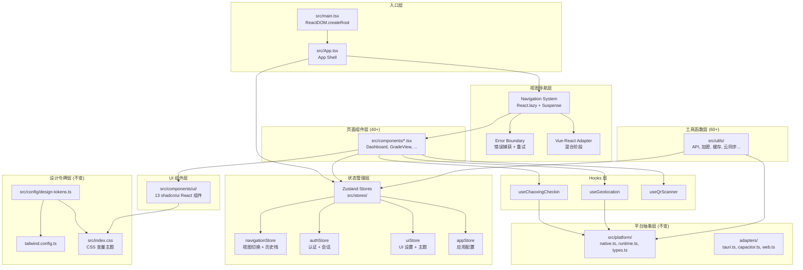
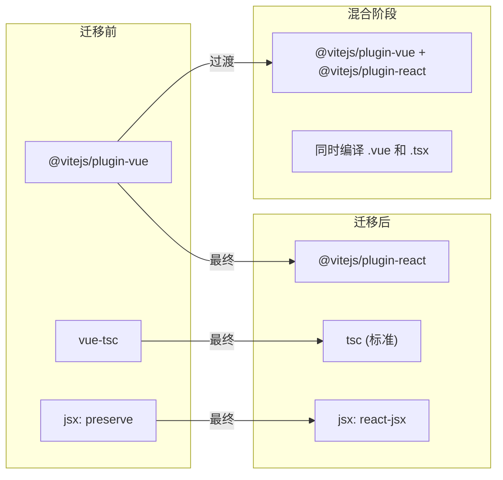
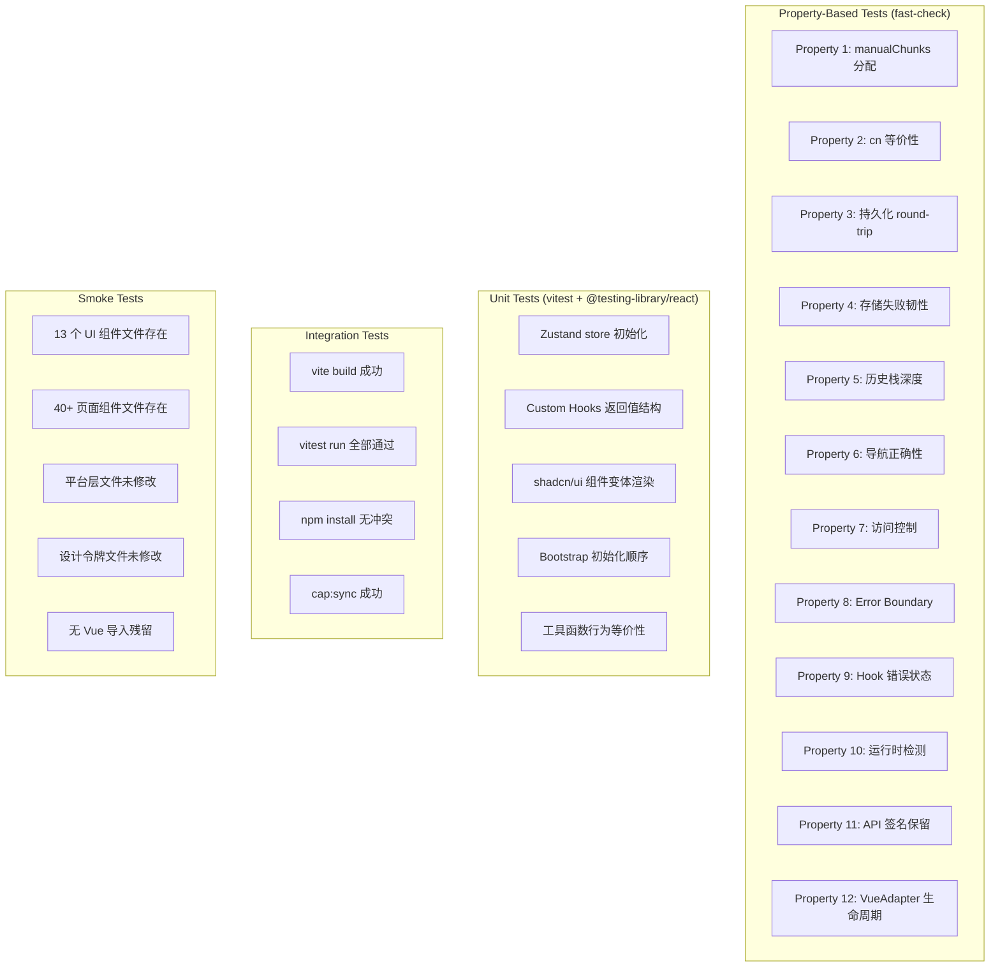

# Design Document: Frontend React Migration

## Overview

本设计文档描述将 Mini-HBUT（湖北工业大学教务助手）Tauri 桌面应用的前端框架从 Vue 3 + Composition API 完整迁移至 React 18+ TypeScript 技术栈的技术架构。

### 迁移范围

- **40+ 页面级组件**：从 `*.vue` SFC 迁移为 `*.tsx` React 函数组件
- **13 个 shadcn UI 组件**：从 shadcn-vue（基于 radix-vue/reka-ui）迁移为 shadcn/ui（基于 @radix-ui/react-*）
- **3 个 Composables → Hooks**：useChaoxingCheckin、useGeolocation、useQrScanner
- **状态管理**：从 Pinia + Vue reactive 迁移为 Zustand
- **60+ 工具函数模块**：移除 Vue 响应式依赖，保留纯 JS/TS 实现
- **设计令牌系统**：保留不变（`src/config/design-tokens.ts`）
- **平台抽象层**：保留不变（`src/platform/`）
- **自定义视图导航系统**：从 Vue 状态驱动迁移为 React + Zustand 状态驱动

### 设计目标

1. **功能完整性**：迁移后所有功能行为与 Vue 版本等价
2. **视觉一致性**：保留所有 Tailwind CSS 类名和设计令牌，视觉不退化
3. **渐进式迁移**：支持 Vue/React 混合阶段，分批验证
4. **构建兼容**：保留 Vite 5 构建管道、代码分割策略和 Vitest 测试框架
5. **跨平台兼容**：Tauri（Windows/macOS/Linux）和 Capacitor（Android/iOS）继续正常工作

### 技术选型决策

| 决策项 | 选择 | 理由 |
|--------|------|------|
| UI 框架 | React 18.x | 生态成熟，TypeScript 支持优秀，Hooks 模型与 Composition API 对应清晰 |
| 状态管理 | Zustand | 轻量（<1KB），支持组件外访问（getState/setState），persist 中间件内建 |
| UI 组件库 | shadcn/ui (React) | 与 shadcn-vue 同源设计，API 一致，基于 @radix-ui/react-* |
| 构建工具 | Vite 5 + @vitejs/plugin-react | 保留现有 Vite 管道，仅替换编译插件 |
| 测试框架 | Vitest + @testing-library/react | 保留现有测试基础设施，添加 React 组件测试支持 |
| PBT 框架 | fast-check（已集成） | 项目已有依赖，无需额外引入 |
| CSS 框架 | Tailwind CSS 3.4（保留） | 配置不变，仅更新 content 扫描路径 |
| 混合阶段适配 | Vue-in-React Adapter | 允许未迁移的 Vue 组件在 React 树中渲染 |


## Architecture

### 系统架构图



### 文件结构（迁移后）

```
src/
├── main.tsx                      # React 入口（替代 main.ts）
├── App.tsx                       # App Shell（替代 App.vue）
├── index.css                     # CSS 入口（保留不变）
├── style.css                     # 遗留样式（保留不变）
├── vite-env.d.ts                 # Vite 类型声明
├── stores/                       # Zustand stores（新增）
│   ├── index.ts                  # 统一导出
│   ├── navigation.ts             # 视图导航状态
│   ├── auth.ts                   # 认证状态
│   ├── ui.ts                     # UI 设置状态
│   ├── app.ts                    # 应用配置状态
│   └── types.ts                  # Store 类型定义
├── hooks/                        # React Hooks（替代 composables/）
│   ├── useChaoxingCheckin.ts
│   ├── useGeolocation.ts
│   └── useQrScanner.ts
├── components/
│   ├── ui/                       # shadcn/ui React 组件（替代 Vue 版本）
│   │   ├── avatar/
│   │   ├── badge/
│   │   ├── button/
│   │   ├── card/
│   │   ├── dialog/
│   │   ├── dropdown-menu/
│   │   ├── input/
│   │   ├── scroll-area/
│   │   ├── select/
│   │   ├── separator/
│   │   ├── sheet/
│   │   ├── sonner/
│   │   └── tabs/
│   ├── ErrorBoundary.tsx         # 全局错误边界（新增）
│   ├── VueAdapter.tsx            # Vue-React 适配器（混合阶段）
│   ├── Dashboard.tsx             # 页面组件（替代 .vue）
│   ├── GradeView.tsx
│   ├── ... (40+ 页面组件)
│   └── LoginV3.tsx
├── config/                       # 配置（保留不变）
│   ├── design-tokens.ts
│   └── ui_settings.ts
├── lib/
│   └── utils.ts                  # cn() 工具函数
├── platform/                     # 平台抽象层（保留不变）
│   ├── native.ts
│   ├── runtime.ts
│   ├── types.ts
│   ├── index.ts
│   ├── adapters/
│   └── capacitor/
├── utils/                        # 工具函数（移除 Vue 依赖）
│   ├── app_settings.ts           # reactive → plain object + subscribe
│   ├── ui_settings.ts            # reactive → plain object + subscribe
│   ├── theme-bridge.ts           # 保留（已无 Vue 依赖）
│   ├── ... (60+ 模块)
│   └── axios_adapter.js          # 保留不变
└── types/                        # 类型定义（保留不变）
```

### 构建配置变更




## Components and Interfaces

### 1. 应用入口 (`src/main.tsx`)

```typescript
import { createRoot } from 'react-dom/client'
import './index.css'
import { App } from './App'
import { initUiSettings } from './utils/ui_settings'
import { initAppSettings } from './utils/app_settings'
import { initFontSettings } from './utils/font_settings'
import { initThemeBridge } from './utils/theme-bridge'
import { initDebugLogger, pushDebugLog } from './utils/debug_logger'

const mountApp = () => {
  const container = document.getElementById('app')
  if (!container) {
    console.error('[Bootstrap] #app 节点不存在，无法挂载应用')
    return
  }
  const root = createRoot(container)
  root.render(<App />)
}

const runDeferredInitializers = () => { /* 同现有逻辑 */ }

const bootstrap = () => {
  initThemeBridge()       // 挂载前执行，避免 FOUC
  initDebugLogger()
  initUiSettings()
  initAppSettings()
  initFontSettings()
  mountApp()
  runDeferredInitializers()
}

try {
  bootstrap()
} catch (error) {
  console.error('[Bootstrap] failed:', error)
  mountApp()
}
```

### 2. App Shell (`src/App.tsx`)

```typescript
import { Suspense, lazy, useEffect } from 'react'
import { useNavigationStore } from './stores/navigation'
import { ErrorBoundary } from './components/ErrorBoundary'
import { UpdateDialog } from './components/UpdateDialog'
import { Toast } from './components/Toast'
import { SplashScreen } from './components/SplashScreen'

// 视图注册表 - React.lazy 动态加载
const VIEW_REGISTRY: Record<string, React.LazyExoticComponent<React.FC<any>>> = {
  home: lazy(() => import('./components/Dashboard')),
  grades: lazy(() => import('./components/GradeView')),
  electricity: lazy(() => import('./components/ElectricityView')),
  // ... 40+ 视图
}

export function App() {
  const { currentView, activeTab } = useNavigationStore()
  const ViewComponent = VIEW_REGISTRY[currentView]

  useEffect(() => {
    // popstate 监听、visibilitychange 监听等
  }, [])

  return (
    <div className="app-shell" ref={appShellRef}>
      <ErrorBoundary fallback={<ViewLoadError />}>
        <Suspense fallback={<ViewLoadingSpinner />}>
          {ViewComponent && <ViewComponent />}
        </Suspense>
      </ErrorBoundary>
      <Toast />
      <UpdateDialog />
      <SplashScreen />
      {/* 底部导航栏 */}
    </div>
  )
}
```

### 3. Zustand Store 设计

#### 3.1 Navigation Store (`src/stores/navigation.ts`)

```typescript
import { create } from 'zustand'

interface NavigationState {
  currentView: string
  activeTab: string
  currentModule: string
  moduleHostSession: ModuleHostSession
  viewRenderNonce: number
}

interface NavigationActions {
  navigateTo: (view: string, params?: Record<string, unknown>) => void
  navigateBack: () => void
  setActiveTab: (tab: string) => void
  restoreFromHistory: () => void
}

export const useNavigationStore = create<NavigationState & NavigationActions>((set, get) => ({
  currentView: 'home',
  activeTab: 'home',
  currentModule: '',
  moduleHostSession: buildModuleHostSession(),
  viewRenderNonce: 0,

  navigateTo: (view, params) => {
    // 保护视图检查
    // pushState
    // 更新 store
    set({ currentView: view })
  },

  navigateBack: () => {
    const { currentView } = get()
    const parent = HIERARCHICAL_PARENT_VIEW_MAP[currentView]
    if (currentView === 'home') return
    set({ currentView: parent || 'home' })
  },

  restoreFromHistory: () => {
    const state = window.history.state
    if (state?.__hbu) {
      set({ currentView: state.view || 'home' })
    }
  }
}))
```

#### 3.2 Auth Store (`src/stores/auth.ts`)

```typescript
import { create } from 'zustand'
import { persist } from 'zustand/middleware'

interface AuthState {
  studentId: string
  userUuid: string
  isLoggedIn: boolean
  gradeData: any[]
  gradesOffline: boolean
  gradesSyncTime: string
}

interface AuthActions {
  login: (studentId: string) => void
  logout: () => void
  setGradeData: (data: any[]) => void
}

export const useAuthStore = create<AuthState & AuthActions>()(
  persist(
    (set, get) => ({
      studentId: '',
      userUuid: '',
      isLoggedIn: false,
      gradeData: [],
      gradesOffline: false,
      gradesSyncTime: '',

      login: (studentId) => {
        set({ studentId, isLoggedIn: true })
        // 触发副作用：保活定时器、通知监控、云同步等
      },

      logout: () => {
        set({
          studentId: '',
          userUuid: '',
          isLoggedIn: false,
          gradeData: [],
          gradesOffline: false,
          gradesSyncTime: ''
        })
        // 停止所有定时器
        // 清除 localStorage 会话键
      },

      setGradeData: (data) => set({ gradeData: data })
    }),
    {
      name: 'hbu_auth_state',
      partialize: (state) => ({
        studentId: state.studentId,
        userUuid: state.userUuid
      })
    }
  )
)
```

#### 3.3 UI Store (`src/stores/ui.ts`)

```typescript
import { create } from 'zustand'
import { persist } from 'zustand/middleware'

interface UiState {
  isLoading: boolean
  showLoginPrompt: boolean
  showSplash: boolean
  showUpdateDialog: boolean
  // ... UI 标志
}

export const useUiStore = create<UiState>()(
  persist(
    (set) => ({
      isLoading: false,
      showLoginPrompt: false,
      showSplash: true,
      showUpdateDialog: false,
    }),
    {
      name: 'hbu_ui_settings_v1',
      partialize: (state) => ({
        // 仅持久化用户偏好，不持久化临时 UI 标志
      })
    }
  )
)
```

### 4. 视图导航系统

```typescript
// src/stores/navigation.ts 中的核心常量（从 App.vue 迁移）

export const MAIN_TABS = ['home', 'schedule', 'notifications', 'me'] as const

export const HIERARCHICAL_PARENT_VIEW_MAP: Record<string, string> = {
  schedule: 'home',
  notifications: 'home',
  me: 'home',
  official: 'me',
  feedback: 'me',
  config: 'me',
  settings: 'me',
  export_center: 'me',
  more: 'me',
  more_shuake: 'more',
  more_module_host: 'more',
  more_chaoxing_checkin: 'more',
  online_learning_chaoxing: 'more_shuake',
  online_learning_yuketang: 'more_shuake'
}

// 历史栈管理
const MAX_HISTORY_DEPTH = 50

export function pushViewState(view: string, params?: Record<string, unknown>) {
  const state = { __hbu: true, view, ...params }
  if (window.history.length >= MAX_HISTORY_DEPTH) {
    window.history.replaceState(state, '')
  } else {
    window.history.pushState(state, '')
  }
}
```

### 5. Error Boundary (`src/components/ErrorBoundary.tsx`)

```typescript
import { Component, type ReactNode } from 'react'

interface Props {
  children: ReactNode
  fallback?: ReactNode
  onError?: (error: Error, errorInfo: React.ErrorInfo) => void
}

interface State {
  hasError: boolean
  error: Error | null
}

export class ErrorBoundary extends Component<Props, State> {
  state: State = { hasError: false, error: null }

  static getDerivedStateFromError(error: Error): State {
    return { hasError: true, error }
  }

  componentDidCatch(error: Error, errorInfo: React.ErrorInfo) {
    this.props.onError?.(error, errorInfo)
  }

  handleRetry = () => {
    this.setState({ hasError: false, error: null })
  }

  render() {
    if (this.state.hasError) {
      return this.props.fallback || (
        <div className="flex flex-col items-center justify-center p-lg gap-md">
          <p className="text-body text-ink">加载失败：{this.state.error?.message}</p>
          <button onClick={this.handleRetry} className="bg-primary text-on-primary rounded-pill px-lg py-xs">
            重试
          </button>
        </div>
      )
    }
    return this.props.children
  }
}
```

### 6. Vue-React 适配器（混合阶段）

```typescript
// src/components/VueAdapter.tsx
import { useEffect, useRef } from 'react'
import { createApp, type Component as VueComponent } from 'vue'

interface VueAdapterProps {
  component: VueComponent
  props?: Record<string, unknown>
}

export function VueAdapter({ component, props = {} }: VueAdapterProps) {
  const containerRef = useRef<HTMLDivElement>(null)
  const appRef = useRef<ReturnType<typeof createApp> | null>(null)

  useEffect(() => {
    if (!containerRef.current) return

    const app = createApp(component, props)
    app.mount(containerRef.current)
    appRef.current = app

    return () => {
      // 组件卸载时销毁 Vue 实例
      app.unmount()
      appRef.current = null
    }
  }, [component])

  // props 变更时更新 Vue 组件
  useEffect(() => {
    // Vue 3 的 props 是响应式的，通过 app 实例更新
  }, [props])

  return <div ref={containerRef} />
}
```

### 7. Custom Hooks 接口

#### 7.1 useChaoxingCheckin

```typescript
// src/hooks/useChaoxingCheckin.ts
import { useState, useMemo, useCallback } from 'react'
import { invokeNative } from '../platform/native'

export function useChaoxingCheckin() {
  const [activities, setActivities] = useState<CheckinActivity[]>([])
  const [history, setHistory] = useState<CheckinLogEntry[]>([])
  const [loading, setLoading] = useState(false)
  const [sessionConnected, setSessionConnected] = useState(false)
  const [inflightIds, setInflightIds] = useState<Set<string>>(new Set())

  const activeActivities = useMemo(
    () => activities.filter(a => a.status === 'active'),
    [activities]
  )
  const pendingOrExpired = useMemo(
    () => activities.filter(a => a.status !== 'active'),
    [activities]
  )

  const refresh = useCallback(async (force = false) => { /* ... */ }, [])
  const submitCommon = useCallback(async (activeId: string) => { /* ... */ }, [])
  const submitLocation = useCallback(async (activeId: string, lat: number, lng: number, addr: string) => { /* ... */ }, [])
  const uploadPhoto = useCallback(async (bytes: Uint8Array, mime: string, name: string) => { /* ... */ }, [])
  const submitPhoto = useCallback(async (activeId: string, objectId: string) => { /* ... */ }, [])
  const submitQrcode = useCallback(async (activeId: string, enc: string) => { /* ... */ }, [])
  const submitGesture = useCallback(async (activeId: string, pattern: string) => { /* ... */ }, [])
  const fetchHistory = useCallback(async (limit?: number) => { /* ... */ }, [])
  const parseQrUrl = useCallback(async (url: string) => { /* ... */ }, [])
  const decodeQrImage = useCallback(async (bytes: Uint8Array, mime: string) => { /* ... */ }, [])
  const captureScreenQr = useCallback(async (rect?: ScreenRect) => { /* ... */ }, [])
  const isInflight = useCallback((activeId: string) => inflightIds.has(activeId), [inflightIds])

  return {
    activities, history, loading, sessionConnected,
    activeActivities, pendingOrExpired,
    refresh, submitCommon, submitLocation, uploadPhoto,
    submitPhoto, submitQrcode, submitGesture, fetchHistory,
    parseQrUrl, decodeQrImage, captureScreenQr, isInflight
  }
}
```

#### 7.2 useGeolocation

```typescript
// src/hooks/useGeolocation.ts
import { useState, useCallback } from 'react'

export interface GeoPosition {
  latitude: number
  longitude: number
  accuracy: number
}

export function useGeolocation() {
  const [available] = useState(() =>
    typeof navigator !== 'undefined' && 'geolocation' in navigator
  )
  const [loading, setLoading] = useState(false)
  const [lastPosition, setLastPosition] = useState<GeoPosition | null>(null)
  const [lastError, setLastError] = useState('')

  const getCurrentPosition = useCallback(async (timeout = 10000): Promise<GeoPosition> => {
    if (!available) {
      setLastError('当前设备不支持定位')
      throw new Error('当前设备不支持定位')
    }
    setLoading(true)
    setLastError('')
    // ... navigator.geolocation.getCurrentPosition 逻辑
  }, [available])

  return { available, loading, lastPosition, lastError, getCurrentPosition }
}
```

#### 7.3 useQrScanner

```typescript
// src/hooks/useQrScanner.ts
import { useState, useCallback, useEffect } from 'react'

export function useQrScanner() {
  const [cameraAvailable, setCameraAvailable] = useState(false)
  const [scanning, setScanning] = useState(false)
  const [lastError, setLastError] = useState('')

  const detectCamera = useCallback((): boolean => {
    // 检测逻辑同 Vue 版本
  }, [])

  const scanFromFileInput = useCallback(async (inputEl: HTMLInputElement): Promise<File | null> => {
    // 逻辑同 Vue 版本，useEffect cleanup 移除 change 监听
  }, [])

  // 初始化时自动检测
  useEffect(() => {
    detectCamera()
  }, [detectCamera])

  return { cameraAvailable, scanning, lastError, detectCamera, scanFromFileInput }
}
```

### 8. shadcn/ui React 组件接口

每个组件遵循 shadcn/ui 标准结构：

```typescript
// src/components/ui/button/Button.tsx
import { forwardRef } from 'react'
import { cva, type VariantProps } from 'class-variance-authority'
import { cn } from '@/lib/utils'

export const buttonVariants = cva(
  'inline-flex items-center justify-center whitespace-nowrap rounded-md text-sm font-medium transition-colors focus-visible:outline-none focus-visible:ring-2 focus-visible:ring-ring disabled:pointer-events-none disabled:opacity-50',
  {
    variants: {
      variant: {
        default: 'bg-primary text-primary-foreground hover:bg-primary/90',
        destructive: 'bg-destructive text-destructive-foreground hover:bg-destructive/90',
        outline: 'border border-input bg-background hover:bg-accent hover:text-accent-foreground',
        secondary: 'bg-secondary text-secondary-foreground hover:bg-secondary/80',
        ghost: 'hover:bg-accent hover:text-accent-foreground',
        link: 'text-primary underline-offset-4 hover:underline',
      },
      size: {
        default: 'h-10 px-4 py-2',
        sm: 'h-9 rounded-md px-3',
        lg: 'h-11 rounded-md px-8',
        icon: 'h-10 w-10',
      },
    },
    defaultVariants: { variant: 'default', size: 'default' },
  }
)

export interface ButtonProps
  extends React.ButtonHTMLAttributes<HTMLButtonElement>,
    VariantProps<typeof buttonVariants> {}

export const Button = forwardRef<HTMLButtonElement, ButtonProps>(
  ({ className, variant, size, ...props }, ref) => (
    <button
      className={cn(buttonVariants({ variant, size, className }))}
      ref={ref}
      {...props}
    />
  )
)
Button.displayName = 'Button'
```

### 9. 工具函数迁移策略

对于含 Vue 响应式依赖的工具模块（`app_settings.ts`、`ui_settings.ts`、`font_settings.ts`），迁移策略为：

```typescript
// 迁移前 (Vue reactive + watch)
import { reactive, watch } from 'vue'
const state = reactive(normalizeSettings(loadStoredSettings()))
const initAppSettings = () => {
  watch(state, () => { /* persist */ }, { deep: true })
}

// 迁移后 (Plain object + 手动订阅)
type Listener = () => void
const listeners = new Set<Listener>()
let state = normalizeSettings(loadStoredSettings())

const subscribe = (listener: Listener) => {
  listeners.add(listener)
  return () => listeners.delete(listener)
}

const setState = (partial: Partial<typeof state>) => {
  state = { ...state, ...partial }
  persist(state)
  listeners.forEach(fn => fn())
}

// React 组件中使用 useSyncExternalStore
import { useSyncExternalStore } from 'react'
export const useAppSettings = () =>
  useSyncExternalStore(subscribe, () => state)
```


## Data Models

### Zustand Store 状态结构

```typescript
// src/stores/types.ts

/** 导航状态 */
export interface NavigationState {
  currentView: string
  activeTab: string
  currentModule: string
  moduleHostSession: ModuleHostSession
  viewRenderNonce: number
}

/** 认证状态 */
export interface AuthState {
  studentId: string
  userUuid: string
  gradeData: GradeEntry[]
  gradesOffline: boolean
  gradesSyncTime: string
}

/** UI 状态（非持久化） */
export interface UiTransientState {
  isLoading: boolean
  showLoginPrompt: boolean
  showSplash: boolean
  showUpdateDialog: boolean
  showExitDialog: boolean
  showDailyAccessDialog: boolean
  splashStatus: string
  splashStatusText: string
}

/** 模块宿主会话 */
export interface ModuleHostSession {
  module_id: string
  module_name: string
  preview_url: string
  version: string
  min_compatible_version: string
  channel: string
  local_ready: boolean
  source: string
  preview_mode: string
  invalid_reason: string
  open_url: string
  package_url: string
  package_urls: string[]
  entry_path: string
  resolved_entry_path: string
  local_preview_url: string
  site_root_path: string
  bundle_zip_path: string
  cache_dir: string
  bundle_path: string
  manifest_url: string
  manifest_checked_at: string
}

/** 视图注册表条目 */
export interface ViewRegistryEntry {
  loader: () => Promise<{ default: React.ComponentType<any> }>
  prefetch?: () => void
}
```

### manualChunks 分割策略（迁移后）

```typescript
// vite.config.ts 中的 manualChunks 函数

const manualChunks = (id: string) => {
  const normalized = toPosix(id)

  // React 核心（替代 vue-core）
  if (
    normalized.includes('/node_modules/react/') ||
    normalized.includes('/node_modules/react-dom/') ||
    normalized.includes('/node_modules/scheduler/')
  ) {
    return 'react-core'
  }

  // Zustand（状态管理）
  if (normalized.includes('/node_modules/zustand/')) {
    return 'react-core'
  }

  // 以下 chunk 规则保持不变
  if (
    normalized.includes('/node_modules/marked/') ||
    normalized.includes('/node_modules/dompurify/') ||
    normalized.includes('/src/utils/markdown.js')
  ) {
    return 'markdown'
  }

  if (
    normalized.includes('/node_modules/html2canvas/') ||
    normalized.includes('/src/utils/capture_service.ts')
  ) {
    return 'capture'
  }

  if (normalized.includes('/src/utils/debug_bridge.ts')) {
    return 'debug-tools'
  }

  if (
    normalized.includes('/node_modules/@microsoft/fetch-event-source/') ||
    normalized.includes('/node_modules/qrcode/')
  ) {
    return 'online-learning'
  }

  if (
    normalized.includes('/src/utils/more_modules.js') ||
    normalized.includes('/src/utils/hot_update') ||
    normalized.includes('/src/utils/remote_config.js')
  ) {
    return 'more-modules'
  }

  if (
    normalized.includes('/node_modules/@tauri-apps/') ||
    normalized.includes('/node_modules/@capacitor/') ||
    normalized.includes('/src/platform/')
  ) {
    return 'runtime-bridge'
  }

  return undefined
}
```

### Vite 配置（迁移后）

```typescript
// vite.config.ts
import { defineConfig } from 'vite'
import react from '@vitejs/plugin-react'
import path from 'path'
import { readFileSync } from 'fs'

const pkg = JSON.parse(readFileSync('./package.json', 'utf-8'))
const buildProfile = process.env.MINI_HBUT_BUILD_PROFILE || 'standard'
const isReleaseProfile = buildProfile === 'release'
const isDevFastProfile = buildProfile === 'dev-fast'

export default defineConfig({
  plugins: [react()],
  define: {
    'import.meta.env.VITE_APP_VERSION': JSON.stringify(pkg.version),
    'import.meta.env.VITE_BUILD_PROFILE': JSON.stringify(buildProfile)
  },
  resolve: {
    alias: {
      '@': path.resolve(__dirname, 'src'),
      'axios': path.resolve(__dirname, 'src/utils/axios_adapter.js')
    }
  },
  esbuild: {
    legalComments: 'none',
    drop: isReleaseProfile ? ['console', 'debugger'] : []
  },
  build: {
    minify: isDevFastProfile ? false : 'esbuild',
    cssMinify: !isDevFastProfile,
    reportCompressedSize: isReleaseProfile,
    sourcemap: false,
    target: 'es2020',
    chunkSizeWarningLimit: isDevFastProfile ? 1600 : 900,
    rollupOptions: {
      output: { manualChunks }
    }
  },
  // server 配置保持不变
})
```

### tsconfig.json（迁移后）

```jsonc
{
  "compilerOptions": {
    "target": "ES2020",
    "useDefineForClassFields": true,
    "module": "ESNext",
    "lib": ["ES2020", "DOM", "DOM.Iterable"],
    "skipLibCheck": true,
    "moduleResolution": "bundler",
    "allowImportingTsExtensions": true,
    "resolveJsonModule": true,
    "isolatedModules": true,
    "noEmit": true,
    "jsx": "react-jsx",          // 从 preserve 改为 react-jsx
    "strict": true,
    "noUnusedLocals": true,
    "noUnusedParameters": true,
    "noFallthroughCasesInSwitch": true,
    "paths": {
      "@/*": ["./src/*"]
    },
    "baseUrl": "."
  },
  "include": ["src/**/*.ts", "src/**/*.tsx"],  // 移除 .vue
  "references": [{ "path": "./tsconfig.node.json" }]
}
```

### Tailwind 配置（迁移后）

```typescript
// tailwind.config.ts - 仅 content 变更
export default {
  darkMode: ['class'],
  content: ['./index.html', './src/**/*.{js,ts,jsx,tsx}'],  // 移除 vue
  theme: {
    extend: {
      // 所有 extend 内容保持不变
      colors: { ...colors, /* CSS var 映射 */ },
      fontFamily: mutableFontFamily,
      fontSize: mutableFontSize,
      spacing: { ...spacing },
      borderRadius: { ...borderRadius },
      letterSpacing: { ...letterSpacing },
      boxShadow: { ...boxShadow },
      screens: { mobile: '320px', tablet: '768px', desktop: '1200px' },
      ringColor: { DEFAULT: '#0071e3' },
      ringOffsetWidth: { DEFAULT: '2px' },
      ringWidth: { DEFAULT: '2px' },
    },
  },
  plugins: [],
} satisfies Config
```

### 依赖变更清单

```json
{
  "remove": [
    "vue", "vue-router", "pinia",
    "@vitejs/plugin-vue", "vue-tsc",
    "radix-vue", "reka-ui", "vue-sonner",
    "@vueuse/core"
  ],
  "add_dependencies": [
    "react@^18.3.0",
    "react-dom@^18.3.0",
    "zustand@^4.5.0",
    "@radix-ui/react-avatar@^1.1.0",
    "@radix-ui/react-dropdown-menu@^2.1.0",
    "@radix-ui/react-dialog@^1.1.0",
    "@radix-ui/react-select@^2.1.0",
    "@radix-ui/react-scroll-area@^1.2.0",
    "@radix-ui/react-separator@^1.1.0",
    "@radix-ui/react-tabs@^1.1.0",
    "sonner@^1.7.0"
  ],
  "add_devDependencies": [
    "@types/react@^18.3.0",
    "@types/react-dom@^18.3.0",
    "@vitejs/plugin-react@^4.3.0",
    "@testing-library/react@^14.2.0",
    "@testing-library/jest-dom@^6.4.0"
  ],
  "preserve": [
    "@tauri-apps/api", "@tauri-apps/plugin-*",
    "@capacitor/*", "@transistorsoft/capacitor-background-fetch",
    "class-variance-authority", "clsx", "tailwind-merge",
    "marked", "dompurify", "html2canvas", "fflate", "qrcode",
    "@microsoft/fetch-event-source",
    "tauri-plugin-keep-screen-on-api",
    "fast-check", "vitest", "typescript", "vite",
    "tailwindcss", "postcss", "autoprefixer"
  ]
}
```


## Correctness Properties

*A property is a characteristic or behavior that should hold true across all valid executions of a system — essentially, a formal statement about what the system should do. Properties serve as the bridge between human-readable specifications and machine-verifiable correctness guarantees.*

### Property 1: manualChunks 路径分配正确性

*For any* module path string, the `manualChunks` function SHALL assign it to the correct chunk based on path patterns: paths containing `/node_modules/react/` or `/node_modules/react-dom/` or `/node_modules/zustand/` map to `'react-core'`; paths containing `/node_modules/marked/` or `/node_modules/dompurify/` map to `'markdown'`; paths containing `/node_modules/@tauri-apps/` or `/node_modules/@capacitor/` or `/src/platform/` map to `'runtime-bridge'`; and paths not matching any rule return `undefined`.

**Validates: Requirements 1.2**

### Property 2: cn() 工具函数等价性

*For any* array of CSS class name strings (including empty strings, duplicates, and conflicting Tailwind utilities), `cn(...inputs)` SHALL produce the same result as `twMerge(clsx(inputs))`, ensuring the utility function is a correct composition of clsx and tailwind-merge.

**Validates: Requirements 3.5**

### Property 3: Zustand 持久化 round-trip

*For any* valid state value written to a persisted Zustand store slice (studentId as non-empty string, userUuid as string), serializing to localStorage and deserializing back SHALL produce a value equal to the original, ensuring no data loss during persistence.

**Validates: Requirements 5.2**

### Property 4: 状态持久化失败不影响内存状态

*For any* state update operation, if `localStorage.setItem` throws an exception (e.g., quota exceeded), the in-memory Zustand store state SHALL still reflect the updated value, and the application SHALL continue operating without interruption.

**Validates: Requirements 5.6**

### Property 5: 导航历史栈深度不超过 50

*For any* sequence of view navigations (up to 200 consecutive `navigateTo` calls with random valid view identifiers), the browser history stack depth managed by the Navigation_System SHALL never exceed 50 entries, enforced by switching from `pushState` to `replaceState` at the limit.

**Validates: Requirements 6.2**

### Property 6: 视图导航正确性（前进与后退）

*For any* valid view identifier in the VIEW_REGISTRY, calling `navigateTo(view)` SHALL update the navigation store's `currentView` to that view and call `window.history.pushState`. For any view that has a parent in `HIERARCHICAL_PARENT_VIEW_MAP`, calling `navigateBack()` SHALL set `currentView` to that parent. For `'home'` (root view), `navigateBack()` SHALL not change `currentView`.

**Validates: Requirements 6.3, 6.4**

### Property 7: 受保护视图访问控制

*For any* view identifier marked as protected by `isProtectedView()`, if the user has not been granted daily access (`hasDailyAccessGrant()` returns false), attempting to navigate to that view SHALL be blocked (currentView remains unchanged) and the access verification dialog SHALL be shown.

**Validates: Requirements 6.8**

### Property 8: Error Boundary 捕获渲染错误

*For any* React component wrapped in an ErrorBoundary, if that component throws an Error during rendering, the ErrorBoundary SHALL catch the error, display an error message containing the error description, and provide a retry mechanism that re-renders the child component.

**Validates: Requirements 7.7**

### Property 9: invokeNative 失败更新 Hook 错误状态

*For any* Custom_Hook method that calls `invokeNative`, if the native call rejects with an error, the hook's error state field SHALL contain the error message. Specifically for `useChaoxingCheckin`, if the error message contains `'session_expired'` or `'请先登录'`, the `sessionConnected` state SHALL be set to `false`.

**Validates: Requirements 8.6**

### Property 10: 运行时检测与平台隔离

*For any* combination of browser environment properties (`window.__TAURI_INTERNALS__` presence, `tauri:` protocol, Capacitor native bridge presence), `detectRuntime()` SHALL return the correct platform identifier (`'tauri'`, `'capacitor'`, or `'web'`). Furthermore, calling `invokeNative` in a non-Tauri runtime SHALL throw an Error with a message containing the command name and runtime description.

**Validates: Requirements 9.3, 9.6, 14.5**

### Property 11: 工具函数公开 API 签名保留

*For any* exported function from utility modules in `src/utils/` that existed before migration, the function name and parameter count SHALL remain unchanged after migration, ensuring all call sites continue to work without modification.

**Validates: Requirements 10.3**

### Property 12: Vue-React 适配器生命周期正确性

*For any* Vue component rendered through the VueAdapter, mounting the adapter SHALL create a Vue app instance and mount it to the container DOM element. Unmounting the React adapter component SHALL call `app.unmount()` on the Vue instance, ensuring no memory leaks or orphaned DOM nodes.

**Validates: Requirements 15.2**


## Error Handling

### 构建时错误

| 错误场景 | 处理策略 |
|----------|----------|
| TSX 编译失败（JSX 语法错误） | Vite 构建中断，报告文件名和行号 |
| 缺少 React 类型声明 | TypeScript 编译失败，提示安装 @types/react |
| 模块路径别名解析失败 | Vite 报告模块未找到，检查 resolve.alias 配置 |
| Tailwind content 未匹配 .tsx 文件 | 构建产物 CSS 缺少类名，需检查 content 配置 |
| 混合阶段 Vue/React 插件冲突 | 确保两个插件版本兼容，Vue 插件在前 |

### 运行时错误

| 错误场景 | 处理策略 |
|----------|----------|
| React.lazy 动态 import 失败 | ErrorBoundary 捕获，显示错误 UI + 重试按钮 |
| Zustand store 初始化失败 | 使用默认状态，console.error 记录 |
| localStorage 读取失败（隐私模式） | 使用内存默认值，不阻断应用启动 |
| localStorage 写入失败（配额超限） | 静默忽略，内存状态不受影响 |
| invokeNative 在非 Tauri 环境调用 | 抛出描述性 Error，调用方需 try/catch |
| 组件渲染时抛出异常 | ErrorBoundary 捕获，不导致整个应用崩溃 |
| Zustand persist 反序列化失败 | 使用默认状态，清除损坏的 localStorage 条目 |
| VueAdapter 中 Vue 组件挂载失败 | 捕获异常，显示占位 UI，console.error 记录 |

### 迁移阶段特有错误

| 错误场景 | 处理策略 |
|----------|----------|
| Vue 组件在 React 树中渲染失败 | VueAdapter 捕获，回退到空容器 + 错误提示 |
| 混合阶段 HMR 冲突 | 自动全页刷新作为降级方案 |
| Pinia store 与 Zustand store 状态不同步 | 迁移期间使用桥接层同步关键状态 |
| 部分迁移后构建失败 | 回滚该批次，检查依赖关系 |

### 降级策略

```typescript
// ErrorBoundary 降级 UI
function ViewLoadError({ error, onRetry, onBack }: {
  error: Error
  onRetry: () => void
  onBack: () => void
}) {
  return (
    <div className="flex flex-col items-center justify-center min-h-[200px] p-lg gap-md">
      <p className="text-body-strong text-ink">页面加载失败</p>
      <p className="text-caption text-ink-muted-48">{error.message}</p>
      <div className="flex gap-sm">
        <button onClick={onRetry} className="bg-primary text-on-primary rounded-pill px-lg py-xs text-caption">
          重试
        </button>
        <button onClick={onBack} className="bg-white text-primary border border-primary rounded-pill px-lg py-xs text-caption">
          返回
        </button>
      </div>
    </div>
  )
}
```

## Testing Strategy

### 测试分层架构



### Property-Based Testing 配置

- **框架**: fast-check（已在 devDependencies）
- **最小迭代次数**: 100 次/属性
- **标签格式**: `Feature: frontend-react-migration, Property {N}: {description}`
- **环境**: node（纯逻辑测试）或 jsdom（需要 DOM 的测试）

```typescript
// 示例：Property 1 测试
import fc from 'fast-check'
import { describe, it, expect } from 'vitest'

// Feature: frontend-react-migration, Property 1: manualChunks 路径分配正确性
describe('Property 1: manualChunks 路径分配正确性', () => {
  const manualChunks = (id: string) => { /* 从 vite.config.ts 提取 */ }

  it('should assign react paths to react-core chunk', () => {
    fc.assert(
      fc.property(
        fc.constantFrom(
          '/node_modules/react/index.js',
          '/node_modules/react-dom/client.js',
          '/node_modules/zustand/vanilla.mjs'
        ),
        (path) => {
          expect(manualChunks(path)).toBe('react-core')
        }
      ),
      { numRuns: 100 }
    )
  })

  it('should assign platform paths to runtime-bridge chunk', () => {
    fc.assert(
      fc.property(
        fc.oneof(
          fc.constant('/node_modules/@tauri-apps/api/core.js'),
          fc.constant('/node_modules/@capacitor/core/dist/index.js'),
          fc.constant('/src/platform/native.ts')
        ),
        (path) => {
          expect(manualChunks(path)).toBe('runtime-bridge')
        }
      ),
      { numRuns: 100 }
    )
  })

  it('should return undefined for unmatched paths', () => {
    fc.assert(
      fc.property(
        fc.string({ minLength: 1 }).filter(s =>
          !s.includes('node_modules') && !s.includes('src/platform') &&
          !s.includes('src/utils/markdown') && !s.includes('src/utils/debug_bridge') &&
          !s.includes('src/utils/more_modules') && !s.includes('src/utils/hot_update') &&
          !s.includes('src/utils/capture_service') && !s.includes('src/utils/remote_config')
        ),
        (path) => {
          expect(manualChunks(path)).toBeUndefined()
        }
      ),
      { numRuns: 100 }
    )
  })
})
```

```typescript
// 示例：Property 6 测试
import fc from 'fast-check'
import { describe, it, expect, beforeEach } from 'vitest'

// Feature: frontend-react-migration, Property 6: 视图导航正确性
describe('Property 6: 视图导航正确性', () => {
  const VALID_VIEWS = [
    'home', 'grades', 'electricity', 'classroom', 'schedule',
    'me', 'official', 'feedback', 'settings', 'more'
  ]

  const HIERARCHICAL_PARENT_VIEW_MAP = {
    schedule: 'home', notifications: 'home', me: 'home',
    official: 'me', feedback: 'me', settings: 'me',
    more: 'me', more_shuake: 'more'
  }

  it('navigateTo updates currentView for any valid view', () => {
    fc.assert(
      fc.property(
        fc.constantFrom(...VALID_VIEWS),
        (view) => {
          // Reset store
          const store = createNavigationStore()
          store.getState().navigateTo(view)
          expect(store.getState().currentView).toBe(view)
        }
      ),
      { numRuns: 100 }
    )
  })

  it('navigateBack resolves to parent view', () => {
    fc.assert(
      fc.property(
        fc.constantFrom(...Object.keys(HIERARCHICAL_PARENT_VIEW_MAP)),
        (view) => {
          const store = createNavigationStore()
          store.setState({ currentView: view })
          store.getState().navigateBack()
          expect(store.getState().currentView).toBe(HIERARCHICAL_PARENT_VIEW_MAP[view])
        }
      ),
      { numRuns: 100 }
    )
  })

  it('navigateBack on home does nothing', () => {
    const store = createNavigationStore()
    store.setState({ currentView: 'home' })
    store.getState().navigateBack()
    expect(store.getState().currentView).toBe('home')
  })
})
```

### Unit Testing 重点

| 测试目标 | 测试内容 |
|----------|----------|
| Zustand stores | 初始状态正确、actions 更新状态、persist 中间件工作 |
| Custom Hooks | 返回值结构匹配、状态更新正确、cleanup 执行 |
| shadcn/ui 组件 | 各 variant 渲染正确 className、forwardRef 工作 |
| ErrorBoundary | 捕获子组件错误、显示 fallback、重试恢复 |
| VueAdapter | 挂载/卸载 Vue 实例、props 传递 |
| Bootstrap | 初始化顺序正确、异常时仍挂载 |

### Integration Testing 重点

| 测试目标 | 验证方式 |
|----------|----------|
| 构建成功 | `vite build` 退出码 0，产物目录存在 |
| 测试通过 | `vitest run` 退出码 0，无失败用例 |
| 依赖安装 | `npm install` 无冲突 |
| 跨平台同步 | `npm run cap:sync` 退出码 0 |
| CSS 完整性 | 构建产物 CSS 包含所有使用的 Tailwind 类 |

### 测试执行命令

```bash
# 运行所有测试
npm run test

# 仅运行 Property-Based Tests
npm run test:pbt

# 运行 React 组件测试
npx vitest run --environment jsdom src/components/**/*.spec.tsx

# 运行特定 property test
npx vitest run -t "Property 6"

# 验证构建
npm run build
```

### 迁移验证检查清单

每批组件迁移完成后执行：

1. `vite build` — 构建成功（退出码 0）
2. `vitest run` — 所有测试通过
3. 手动验证 — 迁移组件的交互行为与 Vue 版本一致
4. 视觉对比 — Tailwind 类名未丢失，样式不退化
5. 平台测试 — Tauri dev 模式下功能正常

