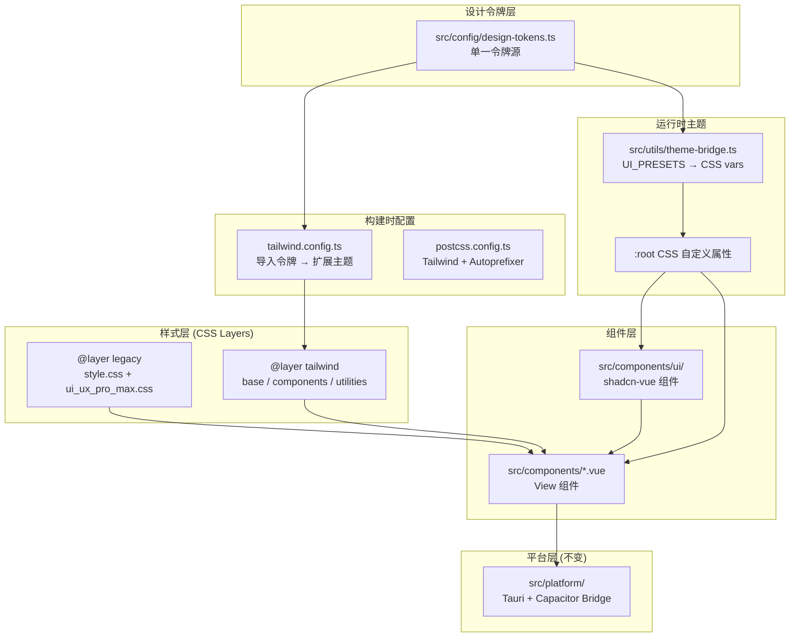
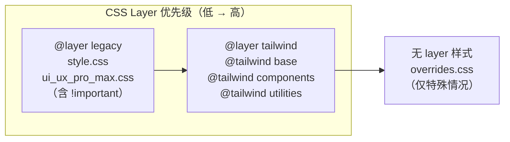
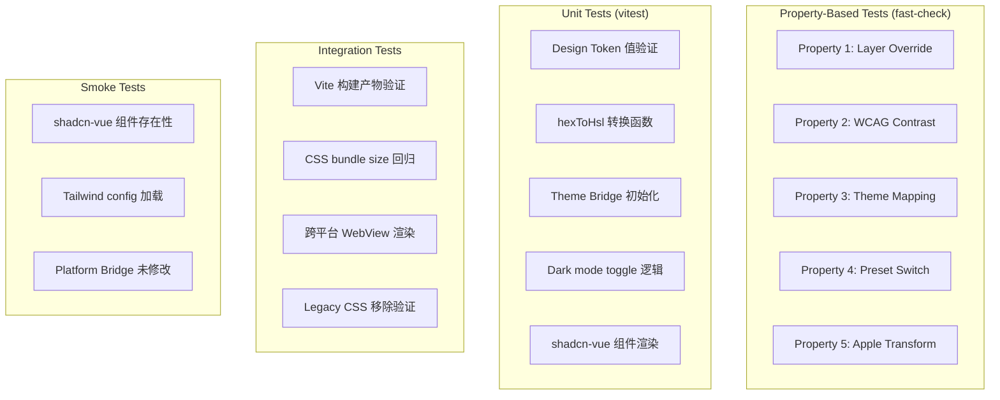

# Design Document: Frontend Vue3 + Tailwind CSS + shadcn-vue Migration

## Overview

本设计文档描述将 Mini-HBUT 项目前端样式系统从纯 CSS 变量 + 自定义 CSS 方案迁移到 Tailwind CSS + shadcn-vue 组件库的技术架构。迁移采用渐进式策略，通过 CSS Layer 隔离机制实现新旧样式共存，同时引入 DESIGN.md 中定义的 Apple 风格设计系统作为统一的设计令牌源。

### 设计目标

1. **全局 Apple 设计规范**：严格遵循 DESIGN.md 定义的 Apple 风格设计语言，**所有页面**（Dashboard、GradeView、ScheduleView、ExamView、ClassroomView、SettingsView、MeView、NotificationView 等全部 View 组件）均须改造为符合规范的视觉风格
2. **单一令牌源**：所有设计令牌（颜色、字体、间距、圆角）定义在一个 TypeScript 文件中，Tailwind 配置和 shadcn-vue 主题均从此文件消费
3. **渐进式迁移**：通过 `@layer legacy, tailwind` 声明实现旧 CSS 与新 Tailwind 工具类的优先级隔离，允许逐组件迁移
4. **运行时主题切换**：Theme_Bridge 将 UI_PRESETS 映射为 CSS 自定义属性，Tailwind 工具类通过 `var()` 引用实现无需重编译的主题切换
5. **跨平台一致性**：确保 Tailwind CSS 输出在 Tauri WebView（Windows/macOS）和 Capacitor WebView（Android/iOS）中一致渲染

### Apple 设计规范全局应用原则

根据 DESIGN.md 的核心特征，**所有页面**必须遵循以下视觉规范：

| 规范项 | 要求 | 禁止 |
|--------|------|------|
| 背景 | canvas-parchment (#f5f5f7) 纯色平面背景 | 渐变背景、mesh 装饰、radial-gradient 覆盖层 |
| 卡片 | 白色 (#ffffff) + 18px 圆角 + 1px hairline 边框 (#e0e0e0) + 24px 内边距 | box-shadow、glass-morphism (backdrop-filter blur)、彩色渐变背景 |
| 按钮 | pill 形状 (#0066cc 蓝色主按钮) 或 sm 圆角 (深色工具按钮) | 彩色渐变按钮、多色按钮、过大圆角方形按钮 |
| 字体 | SF Pro Display/Text 字体栈，17px body，负 letter-spacing | 自定义装饰字体、过大字号、正 letter-spacing |
| 颜色 | 单一蓝色强调 (#0066cc)，近黑文字 (#1d1d1f)，白/灰表面 | 多色强调、彩色图标背景、彩色装饰元素 |
| 阴影 | 仅产品图片使用一个 drop-shadow | 卡片阴影、按钮阴影、文字阴影 |
| 图标 | 单色 (ink #1d1d1f 或 primary #0066cc) | 双色图标、彩色图标背景、渐变图标 |
| 间距 | 严格使用 spacing tokens (8/12/17/24/32/48/80px) | 任意像素值、不一致的间距 |
| 暗色模式 | surface-tile-1 (#272729) 背景 + on-dark (#ffffff) 文字 + primary-on-dark (#2997ff) 强调 | 纯黑背景、低对比度文字 |

### 需要改造的页面清单

以下所有 View 组件均须从当前的 glass-morphism + 渐变风格改造为 Apple 设计规范：

| 页面组件 | 当前风格 | 目标风格 |
|----------|----------|----------|
| Dashboard.vue (首页) | 渐变背景 + glass-card + 彩色图标 | canvas-parchment + 白色卡片 + 单色图标 |
| GradeView.vue | glass-card + 渐变装饰 | 白色卡片 + hairline 边框 + 清晰数据排版 |
| ScheduleView.vue | 自定义课表卡片 | store-utility-card 规范卡片 |
| ExamView.vue | glass-card 列表 | 白色卡片列表 + tagline 标题 |
| ClassroomView.vue | glass-card + 搜索 | search-input (pill) + 白色结果卡片 |
| CalendarView.vue | 自定义日历 | 白色卡片 + 清晰网格 |
| ElectricityView.vue | glass-card | 白色卡片 + 数据可视化 |
| CampusCodeView.vue | 自定义布局 | 居中卡片 + pill 按钮 |
| SettingsView.vue | glass-card 分组 | 白色分组卡片 + separator |
| MeView.vue | 渐变头部 + glass-card | 平面头部 + 白色信息卡片 |
| NotificationView.vue | 通知列表 | 白色通知卡片 + badge |
| Login.vue / LoginV3.vue | 自定义登录 | 居中白色卡片 + pill 输入框 |
| AiChatView.vue | 聊天界面 | 白色消息气泡 + 清晰排版 |
| RankingView.vue | 排名列表 | 白色卡片 + 数据表格 |
| TransactionHistory.vue | 交易列表 | 白色卡片 + 时间线 |
| StudentInfoView.vue | 信息展示 | 白色信息卡片 + separator |
| LibraryView.vue | 图书列表 | store-utility-card 网格 |
| ResourceShareView.vue | 资源列表 | store-utility-card 网格 |
| MoreView.vue | 更多功能 | 工具网格 + 白色卡片 |

### 技术选型决策

| 决策项 | 选择 | 理由 |
|--------|------|------|
| CSS 框架 | Tailwind CSS v3.4+ | 与 Vite 深度集成，tree-shaking 优秀，社区生态成熟 |
| 组件库 | shadcn-vue (Radix Vue) | 无样式锁定，源码可控，ARIA 内建，与 Tailwind 原生配合 |
| 设计令牌格式 | TypeScript `as const` | 类型安全，IDE 补全，编译时校验 |
| 主题切换机制 | CSS 自定义属性 + class toggle | 零重编译，<100ms 切换，Pinia 持久化 |
| 暗色模式策略 | `darkMode: ["class"]` | 兼容 Pinia 持久化偏好 + OS prefers-color-scheme 检测 |
| CSS 隔离 | `@layer legacy, tailwind` | 解决 !important 覆盖问题，无需修改遗留 CSS |
| PBT 框架 | fast-check (已在 devDependencies) | 项目已集成，无需额外依赖 |

## Architecture

### 系统架构图



### 文件结构

```
src/
├── config/
│   ├── design-tokens.ts          # 设计令牌单一源（新增）
│   └── ui_settings.ts            # UI_PRESETS（现有，不修改）
├── styles/
│   ├── main.css                  # 现有遗留样式
│   ├── ui_ux_pro_max.css         # 现有遗留样式
│   └── overrides.css             # !important 特殊覆盖（新增）
├── components/
│   ├── ui/                       # shadcn-vue 组件目录（新增）
│   │   ├── button/
│   │   ├── card/
│   │   ├── input/
│   │   ├── select/
│   │   ├── dialog/
│   │   ├── toast/
│   │   ├── tabs/
│   │   ├── badge/
│   │   ├── avatar/
│   │   ├── separator/
│   │   ├── scroll-area/
│   │   ├── sheet/
│   │   └── dropdown-menu/
│   └── *.vue                     # 现有 View 组件
├── utils/
│   └── theme-bridge.ts           # 主题桥接（新增）
├── index.css                     # Tailwind 入口 + shadcn-vue 主题变量（新增）
├── style.css                     # 现有遗留入口
└── main.ts                       # 应用入口（修改 CSS 导入顺序）
tailwind.config.ts                # Tailwind 配置（新增）
postcss.config.ts                 # PostCSS 配置（新增）
components.json                   # shadcn-vue CLI 配置（新增）
```

### CSS Layer 优先级模型



**关键设计决策**：CSS `@layer` 规范中，层内的 `!important` 不会穿透到更高优先级的层。因此将遗留 CSS 包裹在 `@layer legacy` 中后，即使遗留样式使用了 `!important`，Tailwind 层的普通工具类也能覆盖它们。

### 全局页面设计规范（严格遵循 DESIGN.md）

#### 通用页面骨架

所有页面共享以下基础结构：

```
┌─────────────────────────────────────────┐
│  Header (52px)                          │
│  tagline 字体 (21px/600) + 返回按钮     │
├─────────────────────────────────────────┤
│                                         │
│  Content Area                           │
│  背景: canvas-parchment (#f5f5f7)       │
│  内边距: spacing-lg (24px)              │
│                                         │
│  ┌─────────────────────────────────┐    │
│  │ Card (store-utility-card 规范)   │    │
│  │ bg: #ffffff                      │    │
│  │ rounded: 18px (rounded-lg)       │    │
│  │ border: 1px solid #e0e0e0        │    │
│  │ padding: 24px                    │    │
│  │ shadow: none                     │    │
│  └─────────────────────────────────┘    │
│                                         │
│  卡片间距: spacing-md (17px)            │
│                                         │
├─────────────────────────────────────────┤
│  Bottom Tab Bar (仅主页面)              │
│  4 tabs: 首页/课表/通知/我的            │
│  active: primary (#0066cc)              │
│  inactive: ink-muted-48 (#7a7a7a)       │
└─────────────────────────────────────────┘
```

#### Header 规范

- **背景**: 透明或 canvas-parchment，无渐变
- **标题**: tagline 字体 (21px, weight 600, letter-spacing 0.231px)
- **返回按钮**: button-secondary-pill 规范（白色背景 + primary 文字 + pill 圆角）
- **高度**: 52px（与 DESIGN.md sub-nav-frosted 一致）
- **无阴影、无 backdrop-filter**

#### 卡片规范（全局统一）

所有页面中的卡片必须遵循 `store-utility-card` 组件规范：

```css
/* 标准卡片样式 */
.card {
  background: #ffffff;
  border-radius: 18px;        /* rounded-lg */
  border: 1px solid #e0e0e0;  /* hairline */
  padding: 24px;              /* spacing-lg */
  box-shadow: none;           /* 禁止阴影 */
}
```

对应 Tailwind 类：`bg-white rounded-lg border border-hairline p-lg shadow-none`

#### 按钮规范

| 按钮类型 | Tailwind 类组合 | 使用场景 |
|----------|----------------|----------|
| 主操作 (button-primary) | `bg-primary text-on-primary rounded-pill px-[22px] py-[11px] text-body` | 确认、提交、主要 CTA |
| 次要操作 (button-secondary-pill) | `bg-white text-primary border border-primary rounded-pill px-[22px] py-[11px]` | 取消、返回、次要 CTA |
| 工具按钮 (button-dark-utility) | `bg-ink text-on-dark rounded-sm px-[15px] py-[8px] text-caption` | 导航、工具栏 |
| 胶囊按钮 (button-pearl-capsule) | `bg-surface-pearl text-ink-muted-80 rounded-md px-[14px] py-[8px] text-caption` | 筛选、标签 |

#### 排版规范

| 用途 | Tailwind 类 | 效果 |
|------|-------------|------|
| 页面标题 | `text-tagline font-semibold tracking-[0.231px]` | 21px/600 |
| 卡片标题 | `text-body-strong tracking-tight-lg` | 17px/600 |
| 正文 | `text-body tracking-tight-lg` | 17px/400 |
| 说明文字 | `text-caption tracking-tight-md` | 14px/400 |
| 小字 | `text-fine-print tracking-tight-sm` | 12px/400 |

#### 颜色使用规范

| 用途 | 颜色 | Tailwind 类 |
|------|------|-------------|
| 页面背景 | #f5f5f7 | `bg-canvas-parchment` |
| 卡片背景 | #ffffff | `bg-canvas` / `bg-white` |
| 主文字 | #1d1d1f | `text-ink` |
| 次要文字 | #7a7a7a | `text-ink-muted-48` |
| 主强调色 | #0066cc | `text-primary` / `bg-primary` |
| 边框 | #e0e0e0 | `border-hairline` |
| 分割线 | #f0f0f0 | `border-divider-soft` |

#### 暗色模式对应

| 亮色 | 暗色 | 说明 |
|------|------|------|
| canvas-parchment (#f5f5f7) | surface-tile-1 (#272729) | 页面背景 |
| canvas (#ffffff) | surface-tile-2 (#2a2a2c) | 卡片背景 |
| ink (#1d1d1f) | on-dark (#ffffff) | 主文字 |
| ink-muted-48 (#7a7a7a) | body-muted (#cccccc) | 次要文字 |
| primary (#0066cc) | primary-on-dark (#2997ff) | 强调色 |
| hairline (#e0e0e0) | surface-tile-3 (#252527) | 边框 |

#### 禁止使用的视觉元素（全局）

以下视觉处理在 **任何页面** 中均不得使用：

1. ❌ `backdrop-filter: blur()` — glass-morphism 效果
2. ❌ `linear-gradient` / `radial-gradient` 作为背景装饰
3. ❌ `box-shadow` 在卡片或按钮上
4. ❌ 彩色图标背景（圆角方形彩色底色）
5. ❌ 多色渐变文字
6. ❌ 装饰性 mesh/grain 纹理覆盖
7. ❌ 过渡动画超过 200ms
8. ❌ 非 Design_System 定义的颜色值（禁止硬编码随意 hex）

## Components and Interfaces

### 0. 各页面 Apple 风格改造规范

#### Dashboard.vue (首页) — 完整改造

严格遵循 Requirement 13 和 DESIGN.md `store-utility-card` + `product-tile-parchment` 规范：

```
背景: canvas-parchment (#f5f5f7) 纯色
Header: "HBUT 校园助手" tagline (21px/600) + "首页" primary 指示器
用户卡片: 白色 + 18px 圆角 + hairline 边框 + pill 按钮
今日概览: 白色卡片 + 问候语 + 课程数 badge + 下节课信息
工具网格: 2×4 grid, 单色图标 (ink/primary) + caption 标签
今日课程: 白色卡片列表 或 "已结束" 占位
底部导航: 4 tabs, active=primary, inactive=ink-muted-48
```

#### GradeView.vue — 数据展示页

```
背景: canvas-parchment
Header: "成绩查询" tagline + 返回按钮 (button-secondary-pill)
筛选区: configurator-option-chip 规范 (pill 圆角, 选中态 2px primary 边框)
成绩卡片: store-utility-card 规范
  - 课程名: body-strong (17px/600)
  - 成绩: display-md 或 lead 字号
  - 学分/绩点: caption (14px/400)
  - 无彩色背景装饰
```

#### ScheduleView.vue — 课表页

```
背景: canvas-parchment
Header: "课表" tagline + 周次选择器 (pill chips)
日期栏: caption 字体, primary 高亮当天
课程格子: 白色卡片 + hairline 边框 + sm 圆角 (8px)
  - 课程名: caption-strong (14px/600)
  - 教室: fine-print (12px/400)
  - 无彩色背景, 仅用 primary 左边框指示当前课程
```

#### SettingsView.vue — 设置页

```
背景: canvas-parchment
Header: "设置" tagline
分组卡片: 白色 + 18px 圆角 + hairline 边框
  - 组标题: body-strong
  - 选项行: body + 右侧 chevron 图标 (ink-muted-48)
  - 分割线: divider-soft (#f0f0f0) 1px
  - 开关: primary 色激活态
```

#### Login.vue — 登录页

```
背景: canvas (#ffffff) 纯白
居中卡片: 白色 + lg 圆角 + hairline 边框
  - 标题: display-md (34px/600)
  - 输入框: search-input 规范 (pill 圆角, 44px 高度)
  - 登录按钮: button-primary (pill, primary 蓝)
  - 辅助链接: text-link (primary 蓝)
```

#### 通用列表页 (ExamView, ClassroomView, NotificationView 等)

```
背景: canvas-parchment
Header: 页面名 tagline + 返回按钮
搜索 (如有): search-input 规范 (pill, 44px)
列表项: 白色卡片 + hairline 边框 + lg 圆角
  - 主信息: body-strong
  - 次要信息: caption + ink-muted-48 色
  - 状态标签: badge (pill 圆角, primary 或 muted 背景)
  - 卡片间距: spacing-md (17px)
```

### 1. Design Tokens Module (`src/config/design-tokens.ts`)

```typescript
// 设计令牌单一源 - 所有值来自 DESIGN.md
export const colors = {
  primary: '#0066cc',
  'primary-focus': '#0071e3',
  'primary-on-dark': '#2997ff',
  ink: '#1d1d1f',
  canvas: '#ffffff',
  'canvas-parchment': '#f5f5f7',
  'surface-pearl': '#fafafc',
  'surface-tile-1': '#272729',
  'surface-tile-2': '#2a2a2c',
  'surface-tile-3': '#252527',
  'surface-black': '#000000',
  'on-primary': '#ffffff',
  'on-dark': '#ffffff',
  'body-muted': '#cccccc',
  'ink-muted-80': '#333333',
  'ink-muted-48': '#7a7a7a',
  'divider-soft': '#f0f0f0',
  hairline: '#e0e0e0',
  'surface-chip-translucent': '#d2d2d7',
} as const

export const fontFamily = {
  display: ['SF Pro Display', 'system-ui', '-apple-system', 'Inter', 'sans-serif'],
  text: ['SF Pro Text', 'system-ui', '-apple-system', 'Inter', 'sans-serif'],
} as const

export const fontSize = { /* ... 完整定义见 Data Models */ } as const
export const spacing = { /* ... */ } as const
export const borderRadius = { /* ... */ } as const

export type DesignColors = typeof colors
export type DesignFontFamily = typeof fontFamily
```

### 2. Tailwind Config (`tailwind.config.ts`)

```typescript
import type { Config } from 'tailwindcss'
import { colors, fontFamily, fontSize, spacing, borderRadius } from './src/config/design-tokens'

export default {
  darkMode: ['class'],
  content: ['./index.html', './src/**/*.{vue,js,ts,jsx,tsx}'],
  theme: {
    extend: {
      colors: {
        // 静态令牌
        ...colors,
        // 动态主题色（通过 CSS var 引用）
        primary: 'hsl(var(--primary) / <alpha-value>)',
        secondary: 'hsl(var(--secondary) / <alpha-value>)',
        background: 'hsl(var(--background) / <alpha-value>)',
        foreground: 'hsl(var(--foreground) / <alpha-value>)',
        card: 'hsl(var(--card) / <alpha-value>)',
        border: 'hsl(var(--border) / <alpha-value>)',
        muted: 'hsl(var(--muted) / <alpha-value>)',
        accent: 'hsl(var(--accent) / <alpha-value>)',
        destructive: 'hsl(var(--destructive) / <alpha-value>)',
      },
      fontFamily,
      fontSize: { /* 映射 design-tokens */ },
      spacing,
      borderRadius,
    },
  },
  plugins: [],
} satisfies Config
```

### 3. Theme Bridge (`src/utils/theme-bridge.ts`)

```typescript
import type { UiPreset } from '@/config/ui_settings'
import { UI_PRESETS } from '@/config/ui_settings'

export interface ThemeBridgeOptions {
  presetKey: string
  persist?: boolean
}

export function applyThemePreset(presetKey: string): void
export function initThemeBridge(): void
export function hexToHsl(hex: string): string
export function transformPresetToAppleDesign(preset: UiPreset): Record<string, string>
```

**职责**：
- 读取 Pinia 中持久化的主题偏好
- 将 UI_PRESETS 颜色转换为 Apple 设计系统规范的 HSL 值
- 注入 CSS 自定义属性到 `:root`
- 管理 `dark` class 的添加/移除
- 确保首次有意义绘制前完成主题应用

### 4. shadcn-vue 组件接口

所有 shadcn-vue 组件通过 `@/components/ui` 路径导入，遵循标准 shadcn-vue API：

```typescript
// Button 示例
import { Button } from '@/components/ui/button'
// <Button variant="default" size="default">操作</Button>
// <Button variant="secondary" size="sm">取消</Button>

// Card 示例
import { Card, CardHeader, CardContent } from '@/components/ui/card'
// <Card><CardHeader>标题</CardHeader><CardContent>内容</CardContent></Card>
```

### 5. CSS 入口文件 (`src/index.css`)

```css
@layer legacy, tailwind;

/* Legacy CSS (wrapped in layer) */
@layer legacy {
  @import './style.css';
  @import './styles/ui_ux_pro_max.css';
}

/* Tailwind CSS */
@layer tailwind {
  @tailwind base;
  @tailwind components;
  @tailwind utilities;
}

/* shadcn-vue 主题变量 */
@layer base {
  :root {
    --background: 0 0% 100%;
    --foreground: 222.2 84% 4.9%;
    --primary: 213 100% 40%;
    --primary-foreground: 0 0% 100%;
    --secondary: 210 40% 96.1%;
    --secondary-foreground: 222.2 47.4% 11.2%;
    --card: 0 0% 100%;
    --card-foreground: 222.2 84% 4.9%;
    --border: 214.3 31.8% 91.4%;
    --muted: 210 40% 96.1%;
    --muted-foreground: 215.4 16.3% 46.9%;
    --accent: 210 40% 96.1%;
    --accent-foreground: 222.2 47.4% 11.2%;
    --destructive: 0 84.2% 60.2%;
    --destructive-foreground: 0 0% 98%;
    --radius: 0.6875rem; /* 11px = rounded.md */
  }

  .dark {
    --background: 228 6% 15.7%;
    --foreground: 0 0% 100%;
    --primary: 210 100% 56%;
    --primary-foreground: 0 0% 100%;
    --card: 228 5% 16.5%;
    --card-foreground: 0 0% 100%;
    --border: 228 5% 25%;
    --muted: 228 5% 20%;
    --muted-foreground: 0 0% 80%;
    /* ... */
  }
}
```

## Data Models

### Design Tokens 完整结构

```typescript
// src/config/design-tokens.ts

export const colors = {
  primary: '#0066cc',
  'primary-focus': '#0071e3',
  'primary-on-dark': '#2997ff',
  ink: '#1d1d1f',
  body: '#1d1d1f',
  'body-on-dark': '#ffffff',
  'body-muted': '#cccccc',
  'ink-muted-80': '#333333',
  'ink-muted-48': '#7a7a7a',
  'divider-soft': '#f0f0f0',
  hairline: '#e0e0e0',
  canvas: '#ffffff',
  'canvas-parchment': '#f5f5f7',
  'surface-pearl': '#fafafc',
  'surface-tile-1': '#272729',
  'surface-tile-2': '#2a2a2c',
  'surface-tile-3': '#252527',
  'surface-black': '#000000',
  'surface-chip-translucent': '#d2d2d7',
  'on-primary': '#ffffff',
  'on-dark': '#ffffff',
} as const

export const fontFamily = {
  display: ['SF Pro Display', 'system-ui', '-apple-system', 'Inter', 'sans-serif'],
  text: ['SF Pro Text', 'system-ui', '-apple-system', 'Inter', 'sans-serif'],
} as const

export const fontSize = {
  'hero-display': ['3.5rem', { lineHeight: '1.07', fontWeight: '600', letterSpacing: '-0.28px' }],
  'display-lg': ['2.5rem', { lineHeight: '1.1', fontWeight: '600', letterSpacing: '0' }],
  'display-md': ['2.125rem', { lineHeight: '1.47', fontWeight: '600', letterSpacing: '-0.374px' }],
  'lead': ['1.75rem', { lineHeight: '1.14', fontWeight: '400', letterSpacing: '0.196px' }],
  'lead-airy': ['1.5rem', { lineHeight: '1.5', fontWeight: '300', letterSpacing: '0' }],
  'tagline': ['1.3125rem', { lineHeight: '1.19', fontWeight: '600', letterSpacing: '0.231px' }],
  'body-strong': ['1.0625rem', { lineHeight: '1.24', fontWeight: '600', letterSpacing: '-0.374px' }],
  'body': ['1.0625rem', { lineHeight: '1.47', fontWeight: '400', letterSpacing: '-0.374px' }],
  'caption': ['0.875rem', { lineHeight: '1.43', fontWeight: '400', letterSpacing: '-0.224px' }],
  'button-large': ['1.125rem', { lineHeight: '1.0', fontWeight: '300', letterSpacing: '0' }],
  'fine-print': ['0.75rem', { lineHeight: '1.0', fontWeight: '400', letterSpacing: '-0.12px' }],
  'nav-link': ['0.75rem', { lineHeight: '1.0', fontWeight: '400', letterSpacing: '-0.12px' }],
} as const

export const spacing = {
  xxs: '0.25rem',   // 4px
  xs: '0.5rem',     // 8px
  sm: '0.75rem',    // 12px
  md: '1.0625rem',  // 17px
  lg: '1.5rem',     // 24px
  xl: '2rem',       // 32px
  xxl: '3rem',      // 48px
  section: '5rem',  // 80px
} as const

export const borderRadius = {
  none: '0px',
  xs: '5px',
  sm: '8px',
  md: '11px',
  lg: '18px',
  pill: '9999px',
  full: '9999px',
} as const

export const letterSpacing = {
  'tight-sm': '-0.12px',
  'tight-md': '-0.224px',
  'tight-lg': '-0.374px',
  'tight-display': '-0.28px',
} as const

export const boxShadow = {
  none: 'none',
  product: 'rgba(0, 0, 0, 0.22) 3px 5px 30px 0',
} as const

// 类型导出
export type DesignColors = typeof colors
export type DesignSpacing = typeof spacing
export type DesignBorderRadius = typeof borderRadius
export type DesignFontSize = typeof fontSize
```

### Theme Bridge 数据流

```typescript
// Theme Bridge 转换模型
interface AppleThemeVars {
  '--primary': string        // HSL 值
  '--primary-foreground': string
  '--secondary': string
  '--secondary-foreground': string
  '--background': string
  '--foreground': string
  '--card': string
  '--card-foreground': string
  '--border': string
  '--muted': string
  '--muted-foreground': string
  '--accent': string
  '--accent-foreground': string
  '--destructive': string
  '--destructive-foreground': string
  '--radius': string
}

// UI_PRESETS → Apple Design 转换规则
// light 类别预设: primary → #0066cc, background → #f5f5f7, card → #ffffff
// dark 类别预设: primary → #2997ff, background → #272729, card → #272729
// vivid/neutral 类别预设: primary → #0066cc, background → #f5f5f7, card → #ffffff
```

### Migration Checklist 数据结构

```typescript
interface ImportantDeclaration {
  file: string
  selector: string
  property: string
  value: string
  migratedBy?: string      // 迁移该声明的组件名
  removedAt?: string       // 移除日期
  status: 'active' | 'overridden' | 'removed'
}
```

## Correctness Properties

*A property is a characteristic or behavior that should hold true across all valid executions of a system — essentially, a formal statement about what the system should do. Properties serve as the bridge between human-readable specifications and machine-verifiable correctness guarantees.*

### Property 1: CSS Layer Override Guarantees Tailwind Priority

*For any* HTML element that simultaneously has a legacy CSS class (from `@layer legacy`) applying a style with `!important` and a Tailwind utility class (from `@layer tailwind`) targeting the same CSS property, the computed style value SHALL equal the Tailwind utility's value, because `@layer tailwind` is declared after `@layer legacy` in the layer order.

**Validates: Requirements 4.4, 11.5**

### Property 2: WCAG AA Contrast Ratio for Design System Color Pairings

*For any* text/background color pairing defined in the Design_System (where the text color is drawn from `{ink, on-dark, on-primary, body-muted, ink-muted-80, ink-muted-48}` and the background color is drawn from `{canvas, canvas-parchment, surface-pearl, surface-tile-1, surface-tile-2, surface-tile-3, primary, primary-on-dark}`), the contrast ratio SHALL be at least 4.5:1 for normal text (below 18pt) or at least 3:1 for large text (18pt or above), per WCAG 2.1 AA.

**Validates: Requirements 10.2, 8.4**

### Property 3: Theme Bridge Mapping Completeness

*For any* valid object conforming to the `UiPreset` interface (containing `primary`, `secondary`, `background`, `text`, `muted` string fields and `category` of type `UiThemeCategory`), the `transformPresetToAppleDesign` function SHALL return an object containing all required CSS variable keys (`--primary`, `--primary-foreground`, `--secondary`, `--secondary-foreground`, `--background`, `--foreground`, `--card`, `--card-foreground`, `--border`, `--muted`, `--muted-foreground`, `--accent`, `--accent-foreground`, `--destructive`, `--destructive-foreground`, `--radius`) with non-empty string values in valid HSL format.

**Validates: Requirements 12.1, 12.8**

### Property 4: Theme Preset Switch Updates All Variables

*For any* two distinct preset keys from UI_PRESETS (e.g., switching from preset A to preset B), after calling `applyThemePreset(presetB)`, all CSS custom properties on `:root` that differ between preset A and preset B SHALL reflect preset B's transformed values, and no CSS variable SHALL retain preset A's value.

**Validates: Requirements 12.2**

### Property 5: Apple Aesthetic Transformation Rules

*For any* `UiPreset` with `category` equal to `'light'`, `'vivid'`, or `'neutral'`, the `transformPresetToAppleDesign` output SHALL have: (1) `--primary` resolving to the HSL equivalent of `#0066cc`, (2) `--background` containing no CSS gradient keywords (`linear-gradient`, `radial-gradient`), and (3) `--card` resolving to pure white (`#ffffff` equivalent in HSL). For any `UiPreset` with `category` equal to `'dark'`, the output SHALL have `--primary` resolving to the HSL equivalent of `#2997ff` and `--background` resolving to the HSL equivalent of `#272729`.

**Validates: Requirements 12.4, 12.5**

## Error Handling

### Build-Time Errors

| 错误场景 | 处理策略 |
|----------|----------|
| Design Token 类型不匹配 | TypeScript 编译失败，报告具体 token 名和期望类型 |
| Tailwind content 路径无匹配文件 | 构建警告，生成空 CSS（不阻断构建） |
| shadcn-vue 组件导入路径错误 | Vite 构建失败，报告模块解析错误 |
| PostCSS 插件配置错误 | 构建失败，报告 PostCSS 错误栈 |

### Runtime Errors

| 错误场景 | 处理策略 |
|----------|----------|
| Theme_Bridge 接收无效 preset key | 回退到默认 preset（campus_blue），console.warn 记录 |
| CSS 自定义属性注入失败 | 捕获异常，保持当前主题不变，记录错误日志 |
| hexToHsl 接收非法颜色值 | 返回默认 HSL 值（0 0% 0%），console.warn 记录 |
| Pinia 持久化读取失败 | 使用默认主题，不阻断应用启动 |
| OS prefers-color-scheme 查询失败 | 默认使用 light 模式 |

### CSS 降级策略

| 不支持的特性 | 降级方案 |
|-------------|----------|
| CSS `@layer` (Safari < 15.4) | 不降级 — 最低目标为 Safari 15+，已支持 |
| `env(safe-area-inset-*)` | 回退到 `padding: 0px`，通过 `@supports` 检测 |
| `color-mix()` | 仅在遗留 CSS 中使用，迁移后移除 |
| `backdrop-filter` | 遗留特性，Apple 风格设计不使用 |
| CSS 嵌套 | 不使用 — Tailwind 工具类不需要嵌套 |

## Testing Strategy

### 测试分层



### Property-Based Testing 配置

- **框架**: fast-check（已在 devDependencies 中）
- **最小迭代次数**: 100 次/属性
- **标签格式**: `Feature: frontend-vue3-tailwind-shadcn, Property {N}: {description}`

```typescript
// 示例：Property 3 测试结构
import fc from 'fast-check'
import { describe, it, expect } from 'vitest'
import { transformPresetToAppleDesign } from '@/utils/theme-bridge'

// Feature: frontend-vue3-tailwind-shadcn, Property 3: Theme Bridge Mapping Completeness
describe('Property 3: Theme Bridge Mapping Completeness', () => {
  const uiPresetArb = fc.record({
    label: fc.string({ minLength: 1 }),
    tagline: fc.string(),
    category: fc.constantFrom('light', 'dark', 'vivid', 'neutral'),
    primary: fc.hexaString({ minLength: 6, maxLength: 6 }).map(s => `#${s}`),
    secondary: fc.hexaString({ minLength: 6, maxLength: 6 }).map(s => `#${s}`),
    background: fc.string({ minLength: 1 }),
    text: fc.hexaString({ minLength: 6, maxLength: 6 }).map(s => `#${s}`),
    muted: fc.hexaString({ minLength: 6, maxLength: 6 }).map(s => `#${s}`),
  })

  it('should produce complete CSS variable set for any valid UiPreset', () => {
    fc.assert(
      fc.property(uiPresetArb, (preset) => {
        const result = transformPresetToAppleDesign(preset)
        const requiredKeys = [
          '--primary', '--primary-foreground', '--secondary', '--secondary-foreground',
          '--background', '--foreground', '--card', '--card-foreground',
          '--border', '--muted', '--muted-foreground', '--accent', '--accent-foreground',
          '--destructive', '--destructive-foreground', '--radius'
        ]
        for (const key of requiredKeys) {
          expect(result).toHaveProperty(key)
          expect(result[key]).toBeTruthy()
        }
      }),
      { numRuns: 100 }
    )
  })
})
```

### Unit Testing 重点

- **Design Tokens**: 验证每个 token 值与 DESIGN.md 规范一致
- **hexToHsl**: 边界值（#000000, #ffffff, 无效输入）
- **Theme Bridge 初始化**: Pinia 读取 → CSS 注入 → dark class 管理
- **Dark mode**: toggle 逻辑、OS 偏好检测、持久化
- **shadcn-vue 组件**: 各 variant 渲染正确的 class 组合

### Integration Testing 重点

- **构建产物**: CSS bundle size 不超过基线 150%
- **CSS Layer 结构**: 验证 `@layer legacy, tailwind` 声明存在
- **Chunk 分割**: runtime-bridge 和 vue-core chunks 保持不变
- **HMR 性能**: CSS 热更新 < 5 秒

### 测试执行命令

```bash
# 运行所有测试
npm run test

# 仅运行 Property-Based Tests
npm run test:pbt

# 运行特定 property test
npx vitest run -t "Property 3"
```

