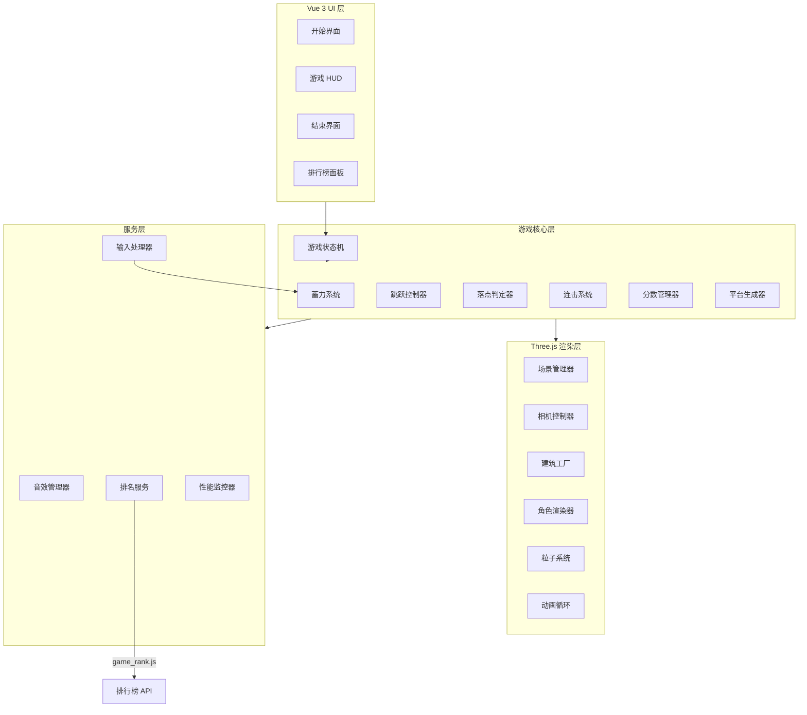
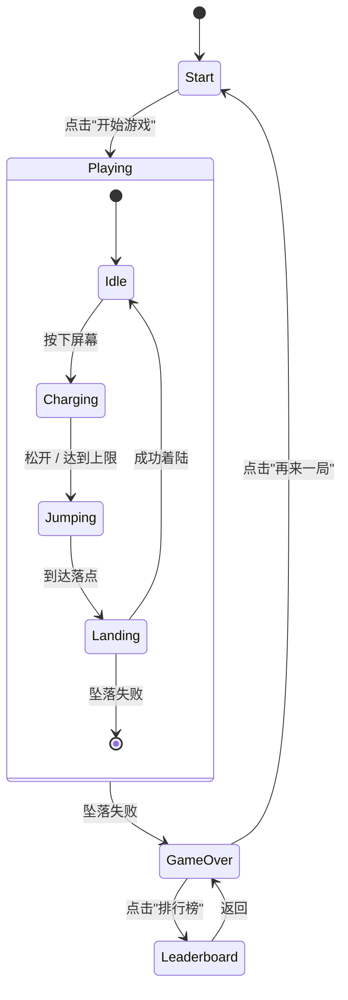

# Design Document: 跳出湖工大

## Overview

"跳出湖工大"是一款基于 Vue 3 + Three.js 的 2.5D 等距视角跳一跳小游戏模块。玩家通过按住蓄力、松开跳跃的方式，在以湖北工业大学标志性建筑为原型的 Low-Poly 3D 平台之间跳跃。

### 技术栈

| 层级 | 技术选型 | 版本要求 |
|------|----------|----------|
| UI 框架 | Vue 3 | >= 3.4 |
| 构建工具 | Vite | >= 5.0 |
| 3D 渲染 | Three.js | >= 0.150 |
| 动画缓动 | GSAP 或 Tween.js | <= 15KB gzip |
| 音效 | Web Audio API / Howler.js | <= 30KB gzip |
| 排名服务 | game_rank.js（复用） | — |

### 设计目标

1. 60fps 流畅渲染，首屏 < 3s，资源 < 2MB
2. 12 种 Low-Poly 建筑平台，纯几何体组合（非贴图）
3. 精确的蓄力-跳跃-落点判定数学模型
4. 移动端 + 桌面端全兼容
5. 与宿主应用排名系统无缝集成

## Architecture

### 系统架构图



### 目录结构

```
website/modules-src/jump_out_hbut/
├── module.json                    # 模块配置
└── project/
    ├── index.html                 # 入口 HTML
    ├── package.json               # 依赖声明
    ├── vite.config.js             # Vite 构建配置
    └── src/
        ├── main.js                # Vue 应用入口
        ├── App.vue                # 根组件
        ├── style.css              # 全局样式
        ├── components/            # Vue 组件
        │   ├── StartScreen.vue    # 开始界面
        │   ├── GameHUD.vue        # 游戏中 HUD
        │   ├── GameOverScreen.vue # 结束界面
        │   └── LeaderboardPanel.vue # 排行榜
        ├── game/                   # 游戏核心逻辑
        │   ├── GameEngine.js      # 游戏引擎主控
        │   ├── StateMachine.js    # 状态机
        │   ├── ChargeSystem.js    # 蓄力系统
        │   ├── JumpController.js  # 跳跃控制器
        │   ├── LandingDetector.js # 落点判定
        │   ├── ComboSystem.js     # 连击系统
        │   ├── ScoreManager.js    # 分数管理
        │   └── PlatformGenerator.js # 平台生成
        ├── renderer/              # Three.js 渲染
        │   ├── SceneManager.js    # 场景管理
        │   ├── CameraController.js # 相机控制
        │   ├── PlayerRenderer.js  # 角色渲染
        │   ├── ParticleSystem.js  # 粒子特效
        │   └── buildings/         # 建筑模型工厂
        │       ├── BuildingFactory.js  # 建筑工厂入口
        │       ├── Library.js          # 图书馆
        │       ├── EngineeringBuilding.js # 工程技术综合楼
        │       ├── Gymnasium.js        # 体育馆
        │       ├── SouthGate.js        # 南门
        │       ├── NorthGate.js        # 北门
        │       ├── Canteen.js          # 食堂
        │       ├── TeachingBuilding.js  # 教学楼
        │       ├── Laboratory.js       # 实验楼
        │       ├── Dormitory.js        # 宿舍楼
        │       ├── AdminBuilding.js    # 行政楼
        │       ├── ActivityCenter.js   # 活动中心
        │       ├── MetroStation.js     # 地铁站
        │       └── NanhuBridge.js      # 南湖桥
        ├── services/              # 服务层
        │   ├── AudioManager.js    # 音效管理
        │   ├── InputHandler.js    # 输入处理
        │   └── PerformanceMonitor.js # 性能监控
        ├── utils/                 # 工具
        │   ├── game_rank.js       # 排名工具（复制自公共库）
        │   ├── math.js            # 数学工具函数
        │   └── constants.js       # 游戏常量
        └── assets/                # 静态资源
            └── audio/             # 音效文件（总计 < 500KB）
                ├── charge.mp3
                ├── jump.mp3
                ├── land.mp3
                ├── perfect.mp3
                ├── fall.mp3
                └── combo.mp3
```

## Components and Interfaces

### 1. GameEngine（游戏引擎主控）

```typescript
interface GameEngine {
  // 生命周期
  init(container: HTMLElement): void
  start(): void
  reset(): void
  destroy(): void

  // 状态
  getState(): GameState
  getScore(): number
  getCombo(): number
  getJumpCount(): number
  getDuration(): number

  // 事件
  on(event: GameEvent, handler: Function): void
  off(event: GameEvent, handler: Function): void
}

type GameState = 'idle' | 'charging' | 'jumping' | 'landed' | 'gameover'
type GameEvent = 'stateChange' | 'scoreUpdate' | 'comboUpdate' | 'gameOver'
```

### 2. ChargeSystem（蓄力系统）

```typescript
interface ChargeSystem {
  startCharge(): void
  stopCharge(): number  // 返回蓄力百分比 0-1
  getChargePercent(): number
  isCharging(): boolean
  reset(): void
}

// 常量
const MAX_CHARGE_MS = 2000
const CHARGE_RATE = 1 / MAX_CHARGE_MS  // 每毫秒增加的百分比
```

### 3. JumpController（跳跃控制器）

```typescript
interface JumpController {
  // 根据蓄力百分比执行跳跃
  jump(chargePercent: number, direction: 'left' | 'right'): JumpTrajectory
  // 获取当前跳跃进度
  getProgress(): number  // 0-1
  // 是否正在跳跃
  isJumping(): boolean
  // 每帧更新
  update(deltaTime: number): Vector3  // 返回当前位置
}

interface JumpTrajectory {
  startPos: Vector3
  endPos: Vector3
  peakHeight: number
  duration: number  // 跳跃总时长 ms
}
```

### 4. LandingDetector（落点判定器）

```typescript
interface LandingDetector {
  // 检测落点
  detect(position: Vector3, platforms: Platform[]): LandingResult
}

interface LandingResult {
  success: boolean
  type: 'perfect' | 'normal' | 'edge_fall' | 'miss'
  platform?: Platform
  offset?: number  // 距离平台中心的偏移比例 0-1
}
```

### 5. PlatformGenerator（平台生成器）

```typescript
interface PlatformGenerator {
  // 生成下一个平台
  generateNext(currentPlatform: Platform, score: number): Platform
  // 获取初始平台
  getInitialPlatform(): Platform
  // 重置
  reset(): void
}

interface Platform {
  id: string
  type: BuildingType
  position: Vector3
  size: { width: number, depth: number, height: number }
  baseScore: number
  mesh: THREE.Group  // Three.js 网格组
}

type BuildingType =
  | 'library' | 'engineering' | 'gymnasium'      // 大型
  | 'south_gate' | 'north_gate' | 'canteen'      // 中型
  | 'teaching' | 'laboratory' | 'admin'           // 中型
  | 'activity_center'                             // 中型
  | 'dormitory' | 'metro_station'                 // 小型
  | 'nanhu_bridge'                                // 特殊
```

### 6. ComboSystem（连击系统）

```typescript
interface ComboSystem {
  // 记录一次着陆
  recordLanding(type: 'perfect' | 'normal'): ComboState
  // 获取当前状态
  getState(): ComboState
  // 重置
  reset(): void
}

interface ComboState {
  count: number       // 连击次数
  multiplier: number  // 当前倍率 1.0 / 1.5 / 2.0 / 2.5
}
```

### 7. ScoreManager（分数管理器）

```typescript
interface ScoreManager {
  // 计算并累加得分
  addScore(baseScore: number, multiplier: number): number  // 返回本次得分
  // 获取总分
  getTotal(): number
  // 重置
  reset(): void
}
```

### 8. CameraController（相机控制器）

```typescript
interface CameraController {
  // 初始化相机
  init(scene: THREE.Scene): THREE.OrthographicCamera
  // 跟随目标移动
  followTarget(targetPos: Vector3, duration?: number): void
  // 每帧更新
  update(deltaTime: number): void
  // 调整视口
  resize(width: number, height: number): void
}
```

### 9. AudioManager（音效管理器）

```typescript
interface AudioManager {
  init(): Promise<void>
  play(sound: SoundType): void
  setMuted(muted: boolean): void
  isMuted(): boolean
  destroy(): void
}

type SoundType = 'charge' | 'jump' | 'land' | 'perfect' | 'fall' | 'combo'
```

### 10. BuildingFactory（建筑工厂）

```typescript
interface BuildingFactory {
  // 创建指定类型的建筑模型
  create(type: BuildingType): THREE.Group
  // 获取建筑尺寸信息
  getSize(type: BuildingType): { width: number, depth: number, height: number }
  // 获取建筑基础分
  getBaseScore(type: BuildingType): number
}
```

## Data Models

### 游戏状态机



### 跳跃数学模型

**坐标系**：Three.js 右手坐标系，Y 轴向上，XZ 平面为地面。

**等距视角方向**：
- 左前方：X 轴负方向 + Z 轴正方向（45° 组合）
- 右前方：X 轴正方向 + Z 轴正方向（45° 组合）

**蓄力映射**：
```
chargePercent = clamp(elapsedTime / MAX_CHARGE_MS, 0, 1)
```

**跳跃距离计算**：
```
distance = MIN_JUMP_DISTANCE + chargePercent * (MAX_JUMP_DISTANCE - MIN_JUMP_DISTANCE)

其中：
  MIN_JUMP_DISTANCE = 1.5 单位（最小跳跃距离）
  MAX_JUMP_DISTANCE = 6.0 单位（最大跳跃距离，对应 100% 蓄力）
```

**抛物线轨迹**（参数化）：
```
设 t ∈ [0, 1] 为跳跃进度

水平位移：
  x(t) = startX + direction.x * distance * t
  z(t) = startZ + direction.z * distance * t

垂直位移（抛物线）：
  y(t) = startY + JUMP_HEIGHT * 4 * t * (1 - t)

其中：
  JUMP_HEIGHT = 2.0 + chargePercent * 1.5（跳跃峰值高度）
  direction = normalize(targetDirection)（单位方向向量）
```

**跳跃时长**：
```
jumpDuration = 400 + chargePercent * 200  // 400ms ~ 600ms
```

### 落点判定模型

```
设 landPos 为角色落点 XZ 坐标
设 platform 为目标平台

// 计算落点相对于平台中心的偏移
offsetX = |landPos.x - platform.center.x| / (platform.width / 2)
offsetZ = |landPos.z - platform.center.z| / (platform.depth / 2)
maxOffset = max(offsetX, offsetZ)

判定规则：
  maxOffset <= 0.3  → 完美着陆（中心 30%）
  maxOffset <= 1.0  → 普通着陆
  maxOffset > 1.0   → 坠落失败
```

### 平台生成算法

```
输入：currentPlatform, currentScore
输出：nextPlatform

1. 选择方向：随机 left 或 right
2. 选择建筑类型：根据分数阶段的概率分布
   - score < 500:   大型 40%, 中型 30%, 小型 20%, 特殊 10%
   - 500 <= score < 1500: 大型 25%, 中型 35%, 小型 30%, 特殊 10%
   - score >= 1500:  大型 15%, 中型 25%, 小型 50%, 特殊 10%
3. 计算距离：
   distance = currentPlatform.width * randomRange(1.2, 3.0)
   // 难度递进：分数越高，距离范围上限越大
   if score >= 1500: distance *= randomRange(1.0, 1.3)
4. 计算位置：
   angle = direction === 'left' ? -45° : 45°（相对于 Z 轴正方向）
   nextPos.x = currentPos.x + distance * sin(angle)
   nextPos.z = currentPos.z + distance * cos(angle)
   nextPos.y = 0（地面）
```

### 连击倍率表

| 连击次数 | 倍率 |
|---------|------|
| 0-1 | 1.0 |
| 2 | 1.5 |
| 3 | 2.0 |
| 4+ | 2.5（封顶）|

**分数公式**：`本次得分 = floor(平台基础分 × 连击倍率)`

### 建筑平台数据

| 建筑类型 | 分类 | 尺寸 (W×D×H) | 基础分 | 主色调 |
|---------|------|--------------|--------|--------|
| 图书馆 | 大型 | 3.0×2.5×2.0 | 1 | 蓝灰 #5B7B8A |
| 工程技术综合楼 | 大型 | 2.8×2.2×2.5 | 1 | 红棕 #8B4513 |
| 体育馆 | 大型 | 3.2×3.2×1.8 | 1 | 银灰 #A8A8A8 |
| 南门 | 中型 | 2.2×1.5×1.8 | 2 | 暗红 #8B0000 |
| 北门 | 中型 | 2.0×1.5×1.6 | 2 | 深灰 #4A4A4A |
| 食堂 | 中型 | 2.5×2.0×1.2 | 2 | 暖橙 #D2691E |
| 教学楼 | 中型 | 2.2×1.8×1.8 | 2 | 蓝灰 #6B8E9B |
| 实验楼 | 中型 | 2.0×1.8×2.0 | 2 | 灰白 #B0B0B0 |
| 行政楼 | 中型 | 2.2×1.8×1.6 | 2 | 米白 #F5DEB3 |
| 活动中心 | 中型 | 2.0×2.0×1.5 | 2 | 现代蓝 #4682B4 |
| 宿舍楼 | 小型 | 1.5×1.2×2.2 | 3 | 暖红 #CD5C5C |
| 地铁站 | 小型 | 1.5×1.5×0.8 | 3 | 地铁蓝 #003DA5 |
| 南湖桥 | 特殊 | 4.0×1.0×0.5 | 4 | 石灰 #808080 |

### 相机配置

```javascript
// 等距正交相机参数
const CAMERA_CONFIG = {
  type: 'OrthographicCamera',
  frustumSize: 12,          // 视锥体大小
  near: 0.1,
  far: 1000,
  // 等距视角：绕 Y 轴旋转 45°，俯角约 35.264°（arctan(1/√2)）
  position: { x: 10, y: 10, z: 10 },
  lookAt: { x: 0, y: 0, z: 0 },
  followEasing: 'easeOutCubic',
  followDuration: 300  // ms
}
```

### 12 种建筑 Low-Poly 建模方案

每种建筑使用 Three.js 基础几何体（BoxGeometry、CylinderGeometry、SphereGeometry 等）组合搭建，配合 MeshLambertMaterial / MeshPhongMaterial 实现 Low-Poly 风格。

#### 1. 图书馆（大型）
- **结构**：3 层方块堆叠（底层宽、中层略窄、顶层最窄），形成阶梯状
- **特征**：正面使用半透明蓝色材质模拟玻璃幕墙，顶部小方块模拟天窗
- **几何体**：3× BoxGeometry + 正面 PlaneGeometry（玻璃）
- **材质**：主体 #5B7B8A，玻璃 #87CEEB（opacity: 0.6）

#### 2. 工程技术综合楼（大型）
- **结构**：高层主体方块 + 侧翼低矮方块群组合
- **特征**：红棕色外墙，顶部有小方块阵列模拟设备层
- **几何体**：1× 主体 BoxGeometry + 2× 侧翼 BoxGeometry + 顶部小方块
- **材质**：主体 #8B4513，窗户凹槽 #2F1B0E

#### 3. 体育馆（大型）
- **结构**：方形基座 + 半球体/椭球体屋顶
- **特征**：圆弧屋顶是最显著特征，基座四周有柱状装饰
- **几何体**：1× BoxGeometry（基座）+ 1× SphereGeometry（半球，phiLength: π）+ 4× CylinderGeometry（柱子）
- **材质**：基座 #A8A8A8，屋顶 #C0C0C0（metalness: 0.3）

#### 4. 南门（中型）
- **结构**：两侧门柱 + 顶部横梁 + 中间拱形门洞
- **特征**：门柱上方有校名牌匾（小方块 + 不同色材质）
- **几何体**：2× BoxGeometry（门柱）+ 1× BoxGeometry（横梁）+ 1× 小 BoxGeometry（牌匾）
- **材质**：门柱 #8B0000，牌匾 #FFD700

#### 5. 北门（中型）
- **结构**：现代风格 — 两根斜柱 + 水平横梁
- **特征**：比南门更简洁现代，柱子有倾斜角度
- **几何体**：2× BoxGeometry（倾斜柱）+ 1× BoxGeometry（横梁）
- **材质**：深灰 #4A4A4A，横梁 #696969

#### 6. 食堂（中型）
- **结构**：扁平宽大方块主体 + 暖色调斜屋顶
- **特征**：屋顶使用三角形截面（棱柱），暖色调突出
- **几何体**：1× BoxGeometry（主体）+ 1× 三角棱柱（ExtrudeGeometry 或两个倾斜 BoxGeometry）
- **材质**：主体 #D2691E，屋顶 #FF8C00

#### 7. 教学楼（中型）
- **结构**：标准方块 + 正面窗户凹槽阵列（3×4 网格）
- **特征**：规整的窗户排列是辨识特征
- **几何体**：1× BoxGeometry（主体）+ 12× 小 BoxGeometry（窗户凹槽，scale 内嵌）
- **材质**：主体 #6B8E9B，窗户 #1C3A4A

#### 8. 实验楼（中型）
- **结构**：灰白色方块主体 + 屋顶设备/烟囱凸起
- **特征**：屋顶有 2-3 个圆柱体模拟通风管/烟囱
- **几何体**：1× BoxGeometry（主体）+ 2-3× CylinderGeometry（烟囱）
- **材质**：主体 #B0B0B0，烟囱 #808080

#### 9. 宿舍楼（小型）
- **结构**：窄高方块 + 侧面阳台凸起层（多层小方块）
- **特征**：高宽比大，侧面有规律的阳台凸出
- **几何体**：1× BoxGeometry（主体）+ 4-6× 薄 BoxGeometry（阳台层）
- **材质**：主体 #CD5C5C，阳台 #E8A0A0

#### 10. 行政楼（中型）
- **结构**：对称方块 + 中央入口凸出门廊
- **特征**：左右对称，中间有突出的入口结构
- **几何体**：1× BoxGeometry（主体）+ 1× BoxGeometry（中央门廊）+ 2× 小 BoxGeometry（对称装饰）
- **材质**：主体 #F5DEB3，门廊 #DEB887

#### 11. 大学生活动中心（中型）
- **结构**：不规则多边形组合 — 主体方块 + 倾斜侧面 + 圆柱装饰
- **特征**：现代感强，几何形状不规则
- **几何体**：1× BoxGeometry（主体）+ 1× 倾斜 BoxGeometry + 1× CylinderGeometry（圆柱装饰）
- **材质**：主体 #4682B4，装饰 #5F9EA0

#### 12. 地铁站（小型）
- **结构**：地面层低矮方块 + 圆形 M 标志 + 斜坡入口
- **特征**：圆形标志和下沉式入口斜坡
- **几何体**：1× BoxGeometry（地面层）+ 1× CylinderGeometry（M 标志圆盘）+ 1× 倾斜 BoxGeometry（斜坡）
- **材质**：主体 #003DA5，标志 #FFD700

#### 13. 南湖桥（特殊长条形）
- **结构**：长条弧形平台 — 扁平长方块 + 两侧低矮栏杆
- **特征**：跨度大（4.0）但宽度窄（1.0），增加跳跃难度
- **几何体**：1× BoxGeometry（桥面，长条形）+ 2× 薄 BoxGeometry（栏杆）+ 弧形装饰（TubeGeometry）
- **材质**：桥面 #808080，栏杆 #A0A0A0


## Correctness Properties

*A property is a characteristic or behavior that should hold true across all valid executions of a system — essentially, a formal statement about what the system should do. Properties serve as the bridge between human-readable specifications and machine-verifiable correctness guarantees.*

### Property 1: 蓄力线性累积

*For any* elapsed time `t` (in milliseconds), the charge percent returned by ChargeSystem SHALL equal `clamp(t / 2000, 0, 1)` — i.e., linearly increasing from 0 to 1 over 2000ms, capped at 1.0 for any t >= 2000.

**Validates: Requirements 1.2, 1.3**

### Property 2: 跳跃距离与蓄力成正比

*For any* charge percent `p` in [0, 1], the computed jump distance SHALL equal `MIN_JUMP_DISTANCE + p * (MAX_JUMP_DISTANCE - MIN_JUMP_DISTANCE)`, where MIN = 1.5 and MAX = 6.0.

**Validates: Requirements 1.4**

### Property 3: 落点判定分类正确性

*For any* landing position relative to a platform with dimensions (width, depth), given `maxOffset = max(|dx| / (width/2), |dz| / (depth/2))`:
- If `maxOffset <= 0.3`, the result SHALL be 'perfect'
- If `0.3 < maxOffset <= 1.0`, the result SHALL be 'normal'
- If `maxOffset > 1.0`, the result SHALL be 'miss'

**Validates: Requirements 2.1, 2.2, 2.3, 2.4**

### Property 4: 连击状态机正确性

*For any* sequence of landing types ('perfect' or 'normal'), the ComboSystem SHALL maintain:
- Consecutive 'perfect' landings increment the combo count
- Any 'normal' landing resets combo count to 0
- The multiplier SHALL always be: count <= 1 → 1.0, count == 2 → 1.5, count == 3 → 2.0, count >= 4 → 2.5
- The multiplier SHALL never be less than 1.0 or greater than 2.5

**Validates: Requirements 4.1, 4.2, 4.3, 11.2**

### Property 5: 分数累积不变量

*For any* sequence of successful landings with known (baseScore, comboMultiplier) pairs, the total score SHALL equal the sum of `floor(baseScore_i × multiplier_i)` for all landings i. No score is lost or gained outside of landing events.

**Validates: Requirements 3.6, 4.5, 11.1**

### Property 6: 平台生成距离约束

*For any* generated next platform given a current platform with width `w`, the Euclidean distance between platform centers (in XZ plane) SHALL be within `[1.2 * w, 3.0 * w]` (with difficulty scaling factor applied for high scores), and the direction SHALL be either left-forward or right-forward (±45° from Z axis).

**Validates: Requirements 3.4**

### Property 7: Run ID 唯一性

*For any* N calls to `createRunId()`, all N returned values SHALL be distinct (no collisions).

**Validates: Requirements 6.6, 11.4**

### Property 8: 分数提交数据有效性

*For any* completed game session, the submitted payload SHALL satisfy: `score >= 0` (integer), `max_level >= 0` (integer), `move_count >= 0` (integer), `duration_ms > 0` (integer), and `score <= move_count * 10` (theoretical maximum per jump = 4 × 2.5 = 10).

**Validates: Requirements 11.5**

### Property 9: 角色蓄力压缩动画

*For any* charge percent `p` in [0, 1], the player character's Y-axis scale during charging SHALL equal `1.0 - 0.4 * p` (linearly from 1.0 to 0.6).

**Validates: Requirements 5.5**

## Error Handling

### 网络错误

| 场景 | 处理策略 |
|------|----------|
| 排名提交失败 | 显示"排行榜暂时不可用"提示，不阻塞游戏流程，玩家可重新开始 |
| 排行榜获取失败 | 显示错误提示，提供重试按钮 |
| 请求超时（12s） | 同网络失败处理，使用 AbortController 取消请求 |
| 无网络连接 | 游戏正常运行，排名功能降级（隐藏排行榜按钮或显示离线提示） |

### 渲染错误

| 场景 | 处理策略 |
|------|----------|
| WebGL 不支持 | 显示友好提示"您的浏览器不支持 3D 渲染，请使用 Chrome/Firefox 最新版" |
| GPU 内存不足 | 自动降级到简化渲染模式（关闭阴影、减少粒子） |
| 帧率持续 < 30fps | 触发自适应降级：关闭阴影 → 减少多边形 → 禁用粒子 |
| Three.js 初始化失败 | 捕获异常，显示错误界面，提供刷新按钮 |

### 音效错误

| 场景 | 处理策略 |
|------|----------|
| Web Audio API 不支持 | 静默降级，游戏正常运行但无音效 |
| 音效文件加载失败 | 跳过该音效，不影响游戏流程 |
| AudioContext 被浏览器阻止 | 在首次用户交互时 resume AudioContext |

### 输入错误

| 场景 | 处理策略 |
|------|----------|
| 触摸事件和鼠标事件同时触发 | 使用 pointer events 统一处理，或设置互斥标志 |
| 快速连续点击 | 状态机保护：仅在 'idle' 状态接受新的蓄力输入 |
| 页面失焦（切后台） | 暂停游戏，恢复时显示继续提示 |

### 数据完整性

| 场景 | 处理策略 |
|------|----------|
| localStorage 不可用 | 降级为内存存储，排名功能可能受限 |
| 上下文参数缺失 | 使用默认值，排名功能降级但游戏可玩 |
| 分数计算溢出 | 使用 Number.MAX_SAFE_INTEGER 作为上限 |

## Testing Strategy

### 测试框架选型

- **单元测试 + 属性测试**：Vitest + fast-check
- **组件测试**：@vue/test-utils + Vitest
- **E2E 测试**：手动测试（游戏类项目 E2E 自动化 ROI 低）

### 属性测试（Property-Based Testing）

使用 [fast-check](https://github.com/dubzzz/fast-check) 库实现属性测试，每个属性测试运行 **最少 100 次迭代**。

每个属性测试必须以注释标注对应的设计属性：

```javascript
// Feature: jump-out-hbut, Property 1: 蓄力线性累积
test.prop([fc.integer({ min: 0, max: 5000 })], (elapsed) => {
  const expected = Math.min(elapsed / 2000, 1)
  expect(chargeSystem.computePercent(elapsed)).toBeCloseTo(expected)
})
```

**属性测试覆盖范围**：

| 属性 | 测试目标 | 生成器 |
|------|----------|--------|
| Property 1 | ChargeSystem.computePercent | fc.integer({ min: 0, max: 5000 }) |
| Property 2 | JumpController.computeDistance | fc.float({ min: 0, max: 1 }) |
| Property 3 | LandingDetector.classify | fc.record({ dx, dz, width, depth }) |
| Property 4 | ComboSystem state transitions | fc.array(fc.constantFrom('perfect', 'normal')) |
| Property 5 | ScoreManager accumulation | fc.array(fc.record({ baseScore, multiplier })) |
| Property 6 | PlatformGenerator.generateNext | fc.record({ width, score }) |
| Property 7 | createRunId uniqueness | fc.integer({ min: 10, max: 1000 }) for count |
| Property 8 | Submission payload validation | fc.record({ score, jumps, duration }) |
| Property 9 | PlayerRenderer.computeScale | fc.float({ min: 0, max: 1 }) |

### 单元测试

| 模块 | 测试重点 |
|------|----------|
| ChargeSystem | 边界值（0ms, 2000ms, 超过 2000ms） |
| JumpController | 抛物线轨迹关键点（起点、顶点、终点） |
| LandingDetector | 边界判定（恰好在 30% 线上、恰好在边缘） |
| ComboSystem | 状态转换序列 |
| ScoreManager | 累加正确性、整数取整 |
| PlatformGenerator | 类型分布、距离范围 |
| BuildingFactory | 每种建筑创建成功、尺寸正确 |
| AudioManager | 静音切换、事件映射 |

### 集成测试

| 场景 | 验证内容 |
|------|----------|
| 完整跳跃流程 | 蓄力 → 跳跃 → 落地 → 计分 全链路 |
| 排名提交 | submitGameRank 调用参数正确性 |
| 游戏状态流转 | Start → Playing → GameOver → Start 循环 |
| 性能降级 | 低帧率触发质量降低 |

### 测试配置

```javascript
// vitest.config.js
export default {
  test: {
    environment: 'jsdom',
    globals: true,
    testTimeout: 60000,  // 属性测试可能需要较长时间
  }
}
```

### 性能优化策略

#### 1. 对象池（Object Pool）

```javascript
// 粒子对象池 - 避免频繁 GC
class ParticlePool {
  constructor(maxSize = 50) { /* 预分配粒子对象 */ }
  acquire(): Particle { /* 从池中获取 */ }
  release(particle: Particle): void { /* 归还到池中 */ }
}
```

- 粒子系统：预分配 50 个粒子对象，完美着陆时从池中取用
- 平台对象：保留最近 5 个平台的 Mesh，超出范围的回收到池中

#### 2. LOD（Level of Detail）

- 当前平台 + 下一个平台：完整细节渲染
- 前 2-3 个历史平台：简化几何体（减少 50% 面数）
- 更远的平台：从场景中移除

#### 3. 自适应降级

```javascript
class PerformanceMonitor {
  // 连续 10 帧低于 45fps → 降级 Level 1
  // 连续 10 帧低于 30fps → 降级 Level 2
  
  Level 0 (默认): 全特效
  Level 1: 关闭阴影、粒子数减半
  Level 2: 关闭粒子、简化几何体、禁用后处理
}
```

#### 4. 渲染优化

- 使用 `BufferGeometry` 而非 `Geometry`
- 合并静态几何体（`BufferGeometryUtils.mergeBufferGeometries`）
- 使用 `MeshLambertMaterial`（比 Phong 更轻量）
- 限制阴影贴图分辨率为 512×512
- 仅对当前平台和角色投射阴影

#### 5. 资源优化

- 音效文件使用 MP3 格式，单个文件 < 100KB
- 不使用纹理贴图，纯几何体 + 材质颜色
- Three.js 按需导入（tree-shaking）

### 响应式适配方案

```javascript
// 根据屏幕宽度调整正交相机视锥体
function updateCameraFrustum(width, height) {
  const aspect = width / height
  const frustumSize = 12
  camera.left = -frustumSize * aspect / 2
  camera.right = frustumSize * aspect / 2
  camera.top = frustumSize / 2
  camera.bottom = -frustumSize / 2
  camera.updateProjectionMatrix()
}

// 监听 resize 事件（debounce 100ms）
window.addEventListener('resize', debounce(onResize, 100))
```

- 最小宽度 320px：缩小 frustumSize 以适配
- 横屏/竖屏：自动调整 aspect ratio
- 高 DPI 屏幕：`renderer.setPixelRatio(Math.min(window.devicePixelRatio, 2))`

### 构建与部署配置

```javascript
// vite.config.js
import { defineConfig } from 'vite'
import vue from '@vitejs/plugin-vue'

const stripCrossOrigin = () => ({
  name: 'strip-crossorigin',
  enforce: 'post',
  transformIndexHtml(html) {
    return html.replace(/ crossorigin/g, '')
  }
})

export default defineConfig({
  base: './',
  plugins: [vue(), stripCrossOrigin()],
  build: {
    outDir: 'dist',
    assetsInlineLimit: 4096,  // 小于 4KB 的资源内联
    rollupOptions: {
      output: {
        manualChunks: {
          three: ['three'],  // Three.js 单独分包
        }
      }
    }
  }
})
```

```json
// module.json
{
  "id": "jump_out_hbut",
  "name": "跳出湖工大",
  "icon": "🦘",
  "order": 3,
  "key_required": false,
  "entry_path": "index.html",
  "min_compatible_version": "self",
  "source_dir": "project",
  "release_notes": "跳出湖工大模块自动构建包"
}
```

```json
// package.json
{
  "name": "jump-out-hbut",
  "private": true,
  "version": "0.0.0",
  "type": "module",
  "scripts": {
    "dev": "vite",
    "build": "vite build",
    "preview": "vite preview",
    "test": "vitest --run",
    "test:watch": "vitest"
  },
  "dependencies": {
    "vue": "^3.4.0",
    "three": "^0.160.0"
  },
  "devDependencies": {
    "@vitejs/plugin-vue": "^5.0.0",
    "vite": "^5.0.0",
    "vitest": "^1.0.0",
    "fast-check": "^3.15.0",
    "@vue/test-utils": "^2.4.0",
    "jsdom": "^24.0.0"
  }
}
```
