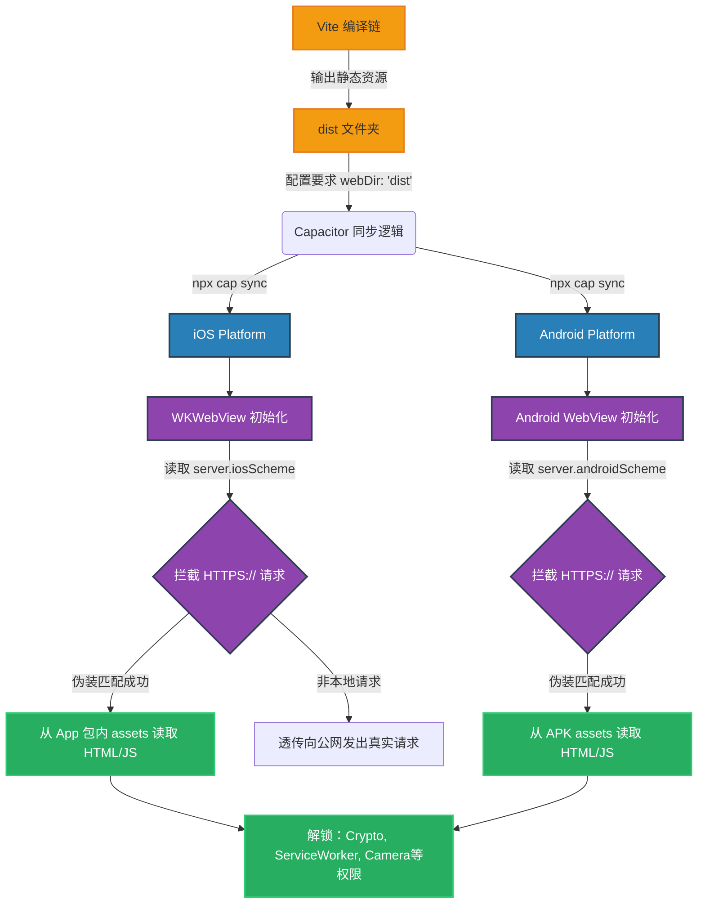

# `capacitor.config.ts` 深度解析文档

## 1. 定位与核心功能

在 `mini-hbut` 这个横跨多端的混合应用（Hybrid App）架构中，如果说 Tauri 掌管着 Windows/macOS 桌面端的封壳，那么 **Capacitor 则是封神移动端（Android & iOS）的核心容器引擎**。

`capacitor.config.ts` 是这个移动端外壳工程的中枢配置文件。它是由 `@capacitor/cli` 在执行初始化或平台同步（`npx cap sync`）时所读取的唯一配置文件。开发通过该文件告诉底层 Android Studio 和 Xcode 工程：
- 这个 App 叫什么名字；
- 它的包名（Bundle ID）是什么；
- 它的前端静态资源放置于何处；
- 本地服务器的网络拦截与 scheme 路由规则应该如何配置。

## 2. 逻辑原理与架构关联

### 2.1 依赖对齐与账户体系埋点
```typescript
const config: CapacitorConfig = {
  appId: 'com.hbut.mini',
  appName: 'Mini-HBUT',
  webDir: 'dist', // ...
}
```
`appId` 设置为 `'com.hbut.mini'`。这个 ID 极为重要，它直接映射到了自动生成的 Android 工程（对应的包名即为 `package="com.hbut.mini"`）以及 iOS 工程的 `Bundle Identifier`。
在此项目设计说明中明确提到，“appId 需要与 Tauri identifier 对齐”。在 Tauri 的 `tauri.conf.json` 中必定存在一致的配置。这种设计极大地方便了后期的全栈账号体系建设，如果对接微信登录、OAuth2授权、以及系统级通知推送（APNs、FCM）等，一个统一的跨端 identifier 能省去大量平台差异化兼容的运维成本。

### 2.2 构建流协同映射 (`webDir`)
`webDir: 'dist'` 表明 Capacitor 完全信任 Vite 的默认输出流。这是一种基于“分离构建”理念的实践：
前端工程师只负责维护 `src/` 中的 Vue 代码 -> 运行 `npm run build:web` 产出资源在 `dist` -> `npx cap sync` 将 `dist` 拷入 Android/iOS 的 assets 目录打包。实现了前端视角的逻辑收口，确保桌面与移动端逻辑绝对一致。

## 3. 代码级深度拆解：HTTPS Scheme 的博弈

```typescript
server: {
  androidScheme: 'https',
  iosScheme: 'https'
}
```
这段配置虽然仅仅几行，但解决了移动端 Hybrid 架构最棘手的几个硬核痛点问题：

**传统 WebView 的困境（HTTP/File Scheme）：**
早期诸如 Cordova 或者老版本 Capacitor 将本地 HTML 挂载为 `file://` 或 `http://localhost` 协议。这会导致：
1. Apple 强推的 iOS WKWebView 以及高版本 Android WebView 对 `file://` 下执行高权限动作（如录音、调用摄像头、使用 localStorage、ServiceWorker、Crypto API）进行严格拉黑和拦截。
2. 调用外部如教务系统的 HTTPS 接口时，如果自身是 `http` 会遭遇难以处理的 **Mixed Content**（混合内容内容策略）拦截或跨域死局。

**拦截器（Schema Interception）解法：**
设置为 `iosScheme: 'https'`，Capacitor 底层会在原生端启动一个网络拦截层路由。当网页内部发起 `https://localhost` 的访问请求时，原生层会截获该流量，并转化为读取本地手机存储中的 `dist` 文件夹缓存。
它的天才之处在于，**欺骗了现代浏览器内核**，让容器以为这正运行在一个安全的远程 HTTPS 环境中，由此畅通无阻地解锁所有现代浏览器的 PWA/HTML5 高级特性，同时也解决了调用学校域名的安全限制策略问题。

## 4. 特殊机制分析 & 优化留白

随着业务扩大，该文件可能还需要被扩充：
- **热更新接入池 (Live Update/Hot Reload)**：结合 `package.json` 中的 `hot-bundle` 脚本，此处的 `server` 日后可以介入 `url` 控制，例如令其在启动时读取远端的静态资源而不再是本地，从而完成线上代码的瞬间覆盖（这在不突破苹果审核红线的前提下是业界标配）。
- **原生插件偏好硬编码 (Plugins Object)**：对 `local-notifications` 或 `splashScreen` 进行全局的色彩和停顿时长注入。

## 5. 架构逻辑时序图

以下 Mermaid 为例说明了 `capacitor.config.ts` 是如何主导移动端的代码渲染与安全代理流转的：



*(End of document. 这份文档透视了单纯配置表象下对于 WebView 容器安全的深刻洞察。)*