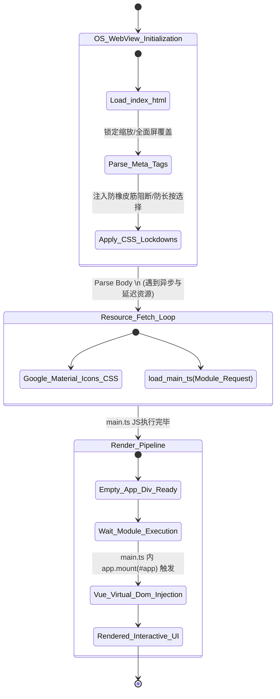

# `index.html` 深度解析文档

## 1. 定位与核心功能

作为前端 SPA（单页面应用）架构体系唯一的宿主承载页，`index.html` 是 Web 应用入口，更是 Tauri、Capacitor 此类跨平台 Native App 挂载 WebView2 或 WKWebView 内核时的**原点画布**。一切的 Vue 组件流与动态路由挂载都在这个页面中进行引爆并初始化。

本工程由于涉及到移动端（Capacitor 会将其套皮制作为 Android / iOS App），它的 HTML 文件承载了超出普通网页范围内的任务：通过元标签 (meta tags) 直接接管移动设备的视觉控制权、缩放逻辑以及边缘留白。简而言之，它不仅是一个网页容器，更是一个高度伪装为“平台原生界面”的壳层定义。

## 2. 逻辑原理与架构关联

### 2.1 强化原生体验的视口安全锁
常规网页中用户可以用双指或双击缩放页面视图，而在移动 APP 体验中，该行为极具毁坏性（会暴露出这只是个网页的本质）。开发团队在此大量铺设了安全钳制逻辑：
```html
<meta name="viewport" content="width=device-width, initial-scale=1.0, maximum-scale=1.0, user-scalable=no, viewport-fit=cover" />
```
- `maximum-scale=1.0, user-scalable=no` 斩断了任何形式的屏幕放缩能力。
- `viewport-fit=cover` 则是兼容现代 iOS 刘海屏与安卓异形全面屏设备的最重要一环，它强制 Web 界面“突破”传统白边安全区，浸入至状态栏背部，这在与 Capacitor StatusBar 插件配合时，能渲染出完美的原生沉浸式体验。
- `<meta name="HandheldFriendly" content="true" />` 继续对移动端进行标志性友好声明。

### 2.2 样式沙盒与防误触拦截（CSS 拦截原理）
除了头部的声明限制，作者在内联 `<style>` 中直接暴力重写了全局层叠机制：
```css
* {
    box-sizing: border-box;
    -webkit-touch-callout: none;
    -webkit-user-select: text;
    user-select: text;
}
html, body, #app {
    height: 100%;
    touch-action: manipulation;
    overscroll-behavior: none;
}
```
- `-webkit-touch-callout: none;`：彻底切断了在容器内部长按元素（比如图片、链接）引发的系统原生长按菜单（例如 iOS 或 Android 系统级的“分享、拷贝、下载”弹出框），极大地掩盖了其 Web 本质。
- `overscroll-behavior: none;`：用于切断浏览器或操作系统的弹性滑动边缘触发机制（比如苹果系统的滑到顶端时的橡胶回弹或 Chrome 历史后退返回），强行锁定滚动域在页面的 `#app` 内部本身进行受控的滚动计算。
- `touch-action: manipulation;`：针对 300ms 点击延时进行修复屏蔽。

### 2.3 入口注入流
```html
<div id="app"></div>
<script type="module" charset="utf-8" src="/src/main.ts"></script>
```
这二行指明了 Vue (通过 Vite 插件解析驱动) 处理的物理挂载点。在编译完毕后（结合前文 `vite.config.ts`），Vite 的处理引擎会自动把这段指向 `/src/main.ts` 的原生 ES Module 请求拦截，然后吐出海量的经映射压缩后的代码依赖拓扑。`main.ts` 里再接手执行 `createApp(...).mount('#app')`，整个 DOM 树此时起死回生。

## 3. 代码级深度拆解：字体挂载网络
```html
<link href="https://fonts.googleapis.com/icon?family=Material+Icons" rel="stylesheet">
```
这个外部链接加载了一个轻量级的 Google Material Icons 物料库。由于 Vue 相关组件里会复用 `m-icon` 此类的类名渲染图标，这里在初始化阶段即向远端取回图标字形文件，减轻内部图标库静态资源的存储压力。

## 4. 特殊机制分析 & 优化留白

这个配置看似完美，实则存在跨端时的细微隐患与优化空间：
- **CSP (Content Security Policy) 的缺失**：Capacitor 平台在应对诸如 Android WebView 或高版本 Safari 的内联脚本拦截时，由于工程未配置严格的 `<meta http-equiv="Content-Security-Policy">`，若外部内容注入将有 XSS 执行隐患，或者在某些魔改机型上导致 Vue 的 eval() 执行报错。
- **背景色的透明度**：body/html 未显式声名背景色或设定为暗黑模式背景。如果在原生环境下的加载白屏期存在空隙，用户可见的屏幕背景闪烁可能会降低体验。（但这常在 Native Splash 层面被桥接处理掉。）

## 5. 架构逻辑时序图

该 Mermaid 状态图反映了 `index.html` 被底层容器（Tauri / 智能外壳 WebView）拉取解析时的生命运转链条：



*(End of document. 这份详尽分析将伴随你随时复盘底层挂载基建设计的深层初衷。)*