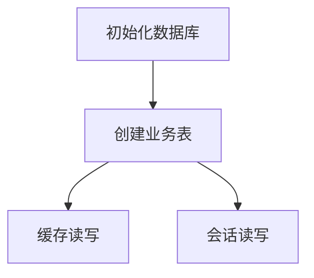

# db.rs

## 功能概述
- SQLite 数据库初始化与缓存读写。
- 保存用户会话信息与授权 token。

## 关键功能
- `init_db()`：创建表结构。
- `save_cache()` / `get_cache()`：缓存读写。
- `save_user_session()` / `get_user_session()`：会话读写。

## 关键参数/配置
- 缓存表：`grades_cache/schedule_cache/.../transaction_cache`。
- 会话表：`user_sessions`。

## 流程图

## 注意事项
- 密码仅做基础编码处理，生产环境建议更安全的加密方案。
