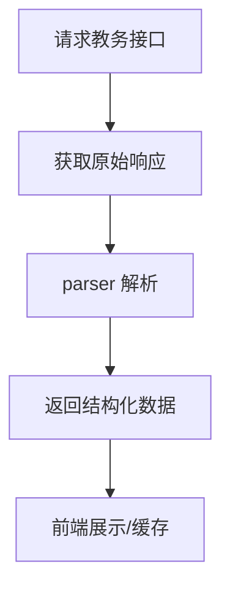

# http_client/academic.rs

## 功能概述
- 教务相关接口汇总：成绩、课表、考试、排名、校历、培养方案等。
- 解析逻辑依赖 parser 模块，统一输出结构化数据。

## 关键功能
- `get_current_semester()`：获取当前学期。
- `fetch_grades()` / `fetch_schedule()`：成绩与课表查询。
- `fetch_exams()` / `fetch_ranking()`：考试安排与排名。
- `fetch_student_info()`：学生基础信息。
- `fetch_calendar_data()`：校历解析与周次计算。
- `fetch_training_plan_*`：培养方案筛选项与课程列表。

## 关键参数/配置
- `semester`：学期字符串（如 2024-2025-1）。
- `student_id`：学号（部分接口可选）。
- 课表/空教室查询参数：周次、星期、节次、楼栋等。

## 流程图

## 注意事项
- 依赖登录态 Cookie，未登录可能返回空数据。
- 部分接口字段不稳定，解析逻辑集中在 parser。
