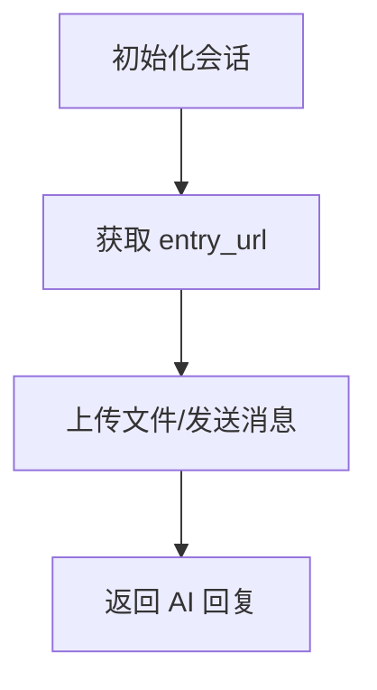

# http_client/ai.rs

## 功能概述
- AI 相关接口封装：初始化会话、上传、对话。

## 关键功能
- `ai_init()`：初始化 AI 会话并获取入口地址。
- `ai_upload()`：上传文件到 AI 服务。
- `ai_chat()`：发送消息并返回 AI 回复。

## 关键参数/配置
- AI 服务入口与鉴权参数由远程配置下发。

## 流程图

## 注意事项
- 网络波动会影响 AI 服务可用性，需适当超时与提示。
