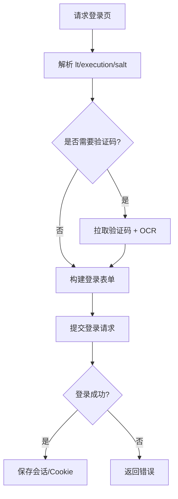

# http_client/auth.rs

## 功能概述
- 处理 CAS 登录页拉取与表单参数解析。
- 判断是否需要验证码，并调用 OCR 识别。
- 支持指定 `service` 的登录（用于 code/电费等服务）。

## 关键功能
- `get_login_page()` / `get_login_page_with_service()`：获取登录页并解析 `lt/execution/salt`。
- `login_for_service()`：对指定 service 进行 CAS 登录。
- `fetch_and_recognize_captcha()`：拉取验证码并调用 OCR。
- `login()`：完整登录流程，包含验证码处理与会话保存。

## 关键参数/配置
- `service_url`：目标服务地址（如 jwxt 或 code）。
- `lt/execution/salt`：CAS 必要参数。
- `ocr_endpoint`：OCR 服务端点（可通过设置下发）。

## 流程图

## 注意事项
- 日志不输出 execution 全量内容，仅输出长度。
- 若 OCR 失败，需允许用户手动输入。
- 登录请求必须复用 Cookie，避免 CAS 会话丢失。
