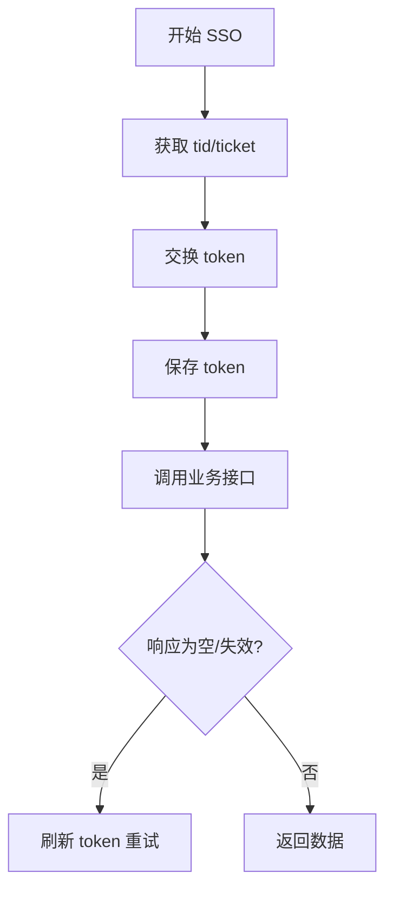

# http_client/electricity.rs

## 功能概述
- 电费与一码通授权流程（SSO + token 交换）。
- 查询电费位置、账户信息、交易记录。

## 关键功能
- `get_electricity_token()`：SSO 获取授权 token。
- `ensure_electricity_token()`：校验并刷新 token。
- `get_one_code_token()`：一码通独立 token 获取。
- `fetch_transaction_history()`：交易记录查询，包含空响应/失效重试。

## 关键参数/配置
- SSO 地址：`https://code.hbut.edu.cn/server/auth/host/open?host=28&org=2`
- 交易记录参数：`fromDate/toDate/pageNo/pageSize`。

## 流程图

## 注意事项
- 重登有冷却机制，避免触发风控。
- 交易记录空响应需做重试与 token 刷新。
