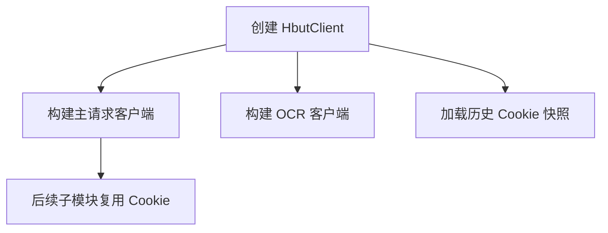

# http_client/mod.rs

## 功能概述
- 统一封装 `HbutClient`，管理请求客户端、Cookie、登录态与共享状态。
- 提供 AES-CBC 加密与随机串工具，供登录流程使用。
- 作为子模块（auth/session/academic/electricity/ai/utils）的入口与公共依赖。

## 关键功能
- `HbutClient::new()`：构建主客户端与 OCR 客户端，并加载历史会话快照。
- `get_random_string()`：生成 CAS 兼容的随机串。
- `encrypt_password_aes()`：模拟 CAS 前端加密逻辑（AES-CBC + Base64）。
- `set_credentials()` / `set_electricity_token()`：缓存登录与授权信息。

## 关键参数/配置
- `AUTH_BASE_URL` / `JWXT_BASE_URL` / `TARGET_SERVICE`：CAS 与教务的基础地址。
- `cookie_jar`：共享 Cookie 容器，所有请求必须复用。
- `ocr_client`：独立 OCR 请求客户端，避免污染主会话。

## 流程图

## 注意事项
- 必须保证所有网络请求复用同一 `cookie_jar`。
- OCR 客户端不携带 Cookie，仅用于识别验证码。
- 加密盐值必须为 16 字节，否则会失败。
