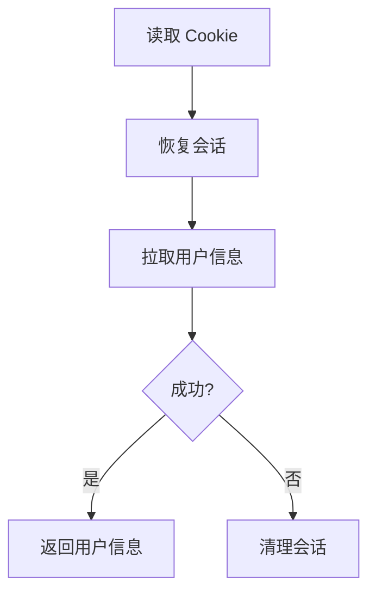

# http_client/session.rs

## 功能概述
- 会话与 Cookie 的读取、恢复与持久化。
- 提供会话刷新、清理与 Cookie 快照机制。

## 关键功能
- `fetch_user_info()`：获取当前登录用户信息。
- `restore_session()`：通过 Cookie 字符串恢复会话。
- `refresh_session()`：刷新会话保持登录态。
- `save_cookie_snapshot_to_file()` / `load_cookie_snapshot_from_file()`：快照持久化。

## 关键参数/配置
- Cookie 快照目录：应用数据目录（不同平台路径不同）。
- `cookie_snapshot.json`：默认快照文件名。

## 流程图

## 注意事项
- 恢复会话前应保证 Cookie 字符串完整。
- 不同平台的应用数据目录不同，需使用统一接口获取。
