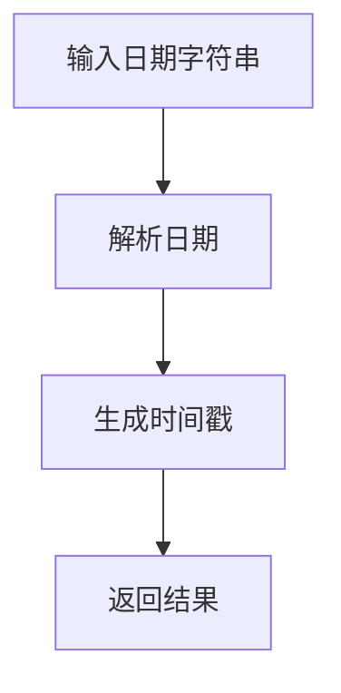

# http_client/utils.rs

## 功能概述
- 提供时间与参数格式化的工具函数。

## 关键功能
- `chrono_timestamp()`：将日期字符串转换为时间戳（秒）。

## 流程图

```mermaid
flowchart TD
  A[输入日期字符串] --> B[解析日期]
  B --> C[生成时间戳]
  C --> D[返回结果]
```

## 注意事项
- 日期格式不合法会返回默认值或错误，应在调用侧处理。
