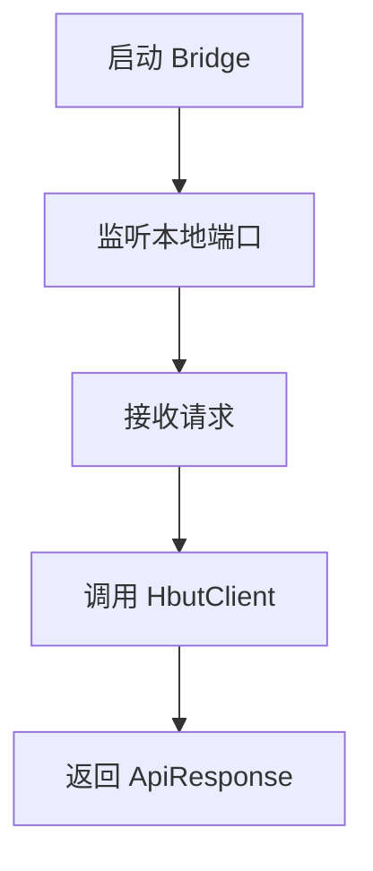

# http_server.rs

## 功能概述
- 本地 HTTP Bridge，用于脚本测试与自动化验证。

## 关键功能
- `ApiResponse` / `ApiError`：统一返回结构。
- `spawn_http_server()`：启动本地服务。

## 流程图

```mermaid
flowchart TD
  A[启动 Bridge] --> B[监听本地端口]
  B --> C[接收请求]
  C --> D[调用 HbutClient]
  D --> E[返回 ApiResponse]
```

## 注意事项
- 仅用于本地测试，不应暴露公网。
