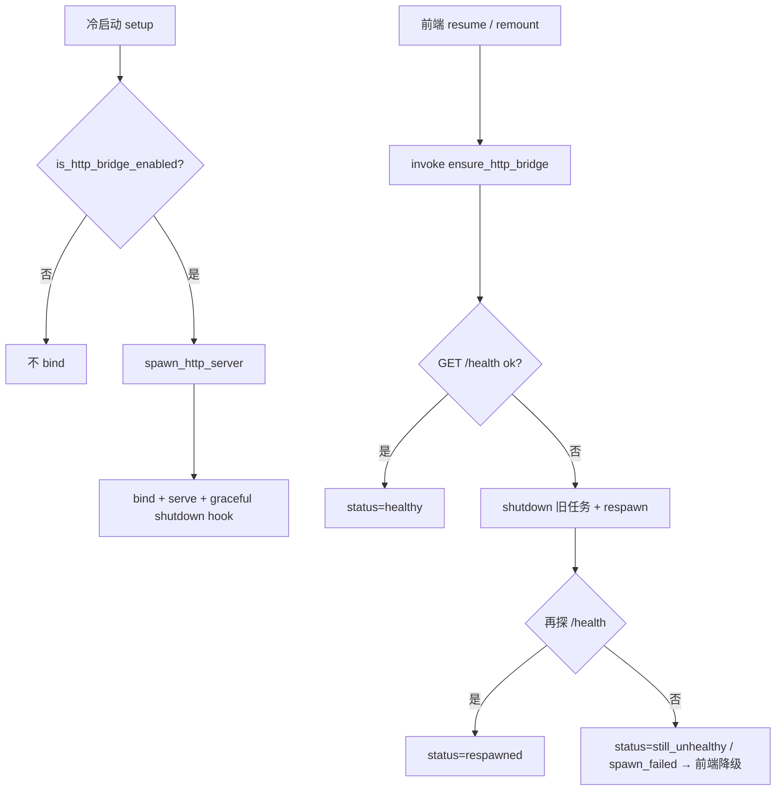

# http_server.rs

## 功能概述

- 本地 HTTP Bridge（默认 `127.0.0.1:4399`），用于：
  - 开发/调试脚本（`/debug/*`、登录同步等）
  - **iOS** 内嵌：学校官网 proxy、`module_bundle` 预览、校园导览等签名代理
- 统一返回结构（`ApiResponse`）与错误类型（`ApiError`）
- **仅监听 loopback**，不应暴露公网

## 平台启停矩阵（与代码 `is_http_bridge_enabled()` 一致）

| 平台 | Debug | Release | 说明 |
|------|-------|---------|------|
| **iOS** | ✅ 启 | ✅ 启 | 官网 `proxy-iframe` / 更多本地模块依赖 loopback |
| **Android** | ✅ 启（debug_assertions） | ❌ 默认不启 | 前端走 `external-open` / Capacitor 本地缓存，**不**静默依赖 4399 |
| **桌面** | ✅ 启 | ❌ 默认不启 | Release 需 `HBUT_HTTP_BRIDGE_ENABLED=1`（或 `true`） |

强制开关：

- `HBUT_HTTP_BRIDGE_ENABLED=1|true`：任意平台强制启
- `HBUT_HTTP_BRIDGE_PORT`：端口（默认 `4399`）
- `HBUT_HTTP_BRIDGE_HOST`：绑定地址（默认 `127.0.0.1`）

## 关键 API

| 符号 | 说明 |
|------|------|
| `spawn_http_server` | 冷启动 setup 调用；仅在 `is_http_bridge_enabled()` 时 bind |
| `ensure_http_bridge` | **Tauri 命令**：resume 时前端可 invoke；`/health` 不可达则 graceful shutdown + respawn |
| `probe_http_bridge_health` | 短超时 GET `/health` |
| `is_http_bridge_enabled` / `bridge_listen_addr` | 启停与地址解析 |

### `ensure_http_bridge` 返回（camelCase JSON）

```json
{
  "enabled": true,
  "healthy": true,
  "respawned": false,
  "addr": "127.0.0.1:4399",
  "status": "healthy",
  "detail": null
}
```

`status` 取值：`disabled` | `healthy` | `respawned` | `port_busy` | `spawn_failed` | `still_unhealthy`

## 流程图



## 注意事项

- 仅用于本地；敏感路由需 `HBUT_BRIDGE_TOKEN`（见 `SECURITY.md`）
- 长后台后 iOS 可能出现「进程在但端口无响应」：依赖 `ensure_http_bridge`，前端仍须在 `healthy=false` 时走可操作降级（#453）
- 单元测试：`ensure_http_bridge_tests`（序列化与地址解析）；完整 bind 建议在设备/集成环境验证
