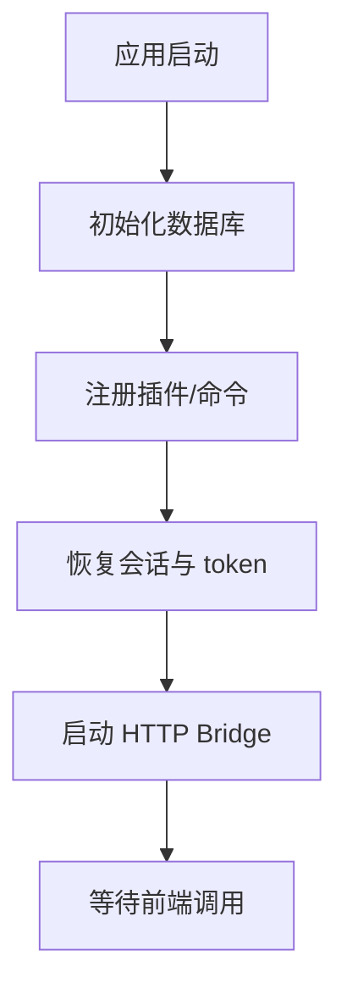

# lib.rs

## 功能概述
- Tauri 后端主入口，注册命令与全局状态。
- 负责会话恢复、后台任务、HTTP Bridge 启动。

## 关键功能
- `AppState`：全局共享 `HbutClient`。
- `tauri::command` 列表：登录、成绩、课表、电费、交易记录等。
- `run()`：初始化数据库、插件、后台任务与桥接服务。

## 关键参数/配置
- `DB_FILENAME`：本地数据库文件名。
- `SESSION_COOKIE_*`：前端会话持久化键。

## 流程图

## 注意事项
- 命令返回结构需保持一致，便于前端/脚本处理。
- 会话恢复优先使用数据库缓存，其次读取快照文件。
