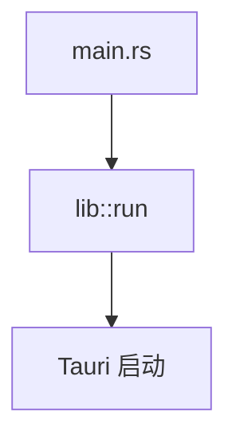

# main.rs

## 功能概述
- Tauri 应用入口文件，调用 `lib.rs::run()`。

## 流程图

```mermaid
flowchart TD
  A[main.rs] --> B[lib::run]
  B --> C[Tauri 启动]
```

## 注意事项
- 移动端入口由 `#[cfg_attr(mobile, tauri::mobile_entry_point)]` 控制。
