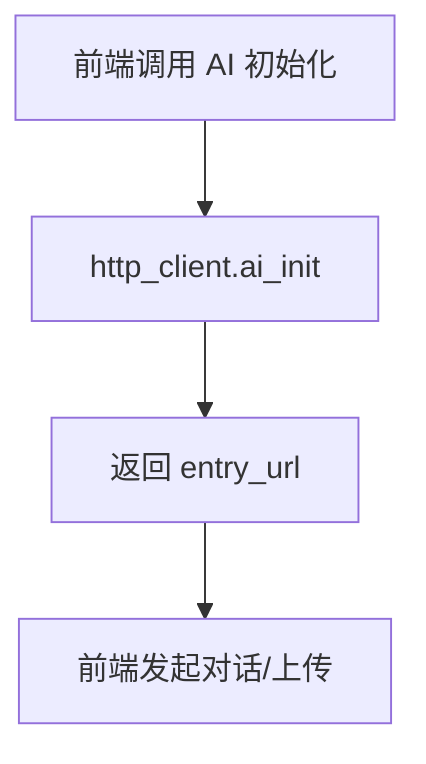

# modules/ai.rs

## 功能概述
- 将 AI 相关能力以模块方式提供给 Tauri 命令层。

## 关键功能
- `hbut_ai_init`：初始化 AI 会话。
- `hbut_ai_upload`：上传文件。
- `hbut_ai_chat`：对话请求。

## 流程图

```mermaid
flowchart TD
  A[前端调用 AI 初始化] --> B[http_client.ai_init]
  B --> C[返回 entry_url]
  C --> D[前端发起对话/上传]
```

## 注意事项
- AI 服务可用性依赖外部网络与远程配置。
