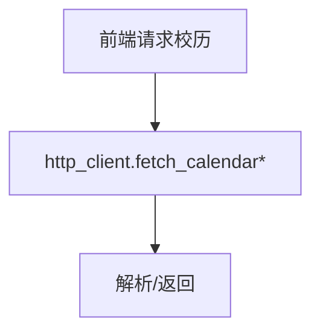

# modules/calendar.rs

## 功能概述
- 校历相关接口封装，提供给前端使用。

## 关键功能
- `fetch_calendar`：拉取校历事件。
- `fetch_calendar_data`：校历原始数据与周次解析。

## 流程图

```mermaid
flowchart TD
  A[前端请求校历] --> B[http_client.fetch_calendar*]
  B --> C[解析/返回]
```

## 注意事项
- 校历数据可能为空，应在前端显示友好提示。
