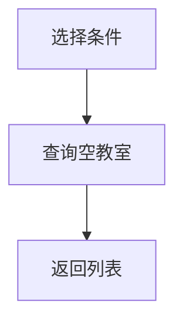

# modules/classroom.rs

## 功能概述
- 空教室查询模块。

## 关键功能
- `fetch_classroom_buildings`：获取楼栋列表。
- `fetch_classrooms`：按条件查询空教室。

## 流程图

```mermaid
flowchart TD
  A[选择条件] --> B[查询空教室]
  B --> C[返回列表]
```

## 注意事项
- 查询参数过多时需控制请求频率。
