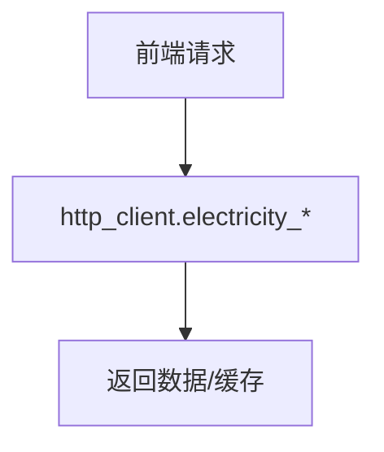

# modules/electricity.rs

## 功能概述
- 电费/交易记录相关能力封装。

## 关键功能
- `electricity_query_location`：位置层级查询。
- `electricity_query_account`：账户信息查询。
- `refresh_electricity_token`：刷新 token。
- `fetch_transaction_history`：交易记录查询。

## 流程图

## 注意事项
- token 失效需刷新后重试。
