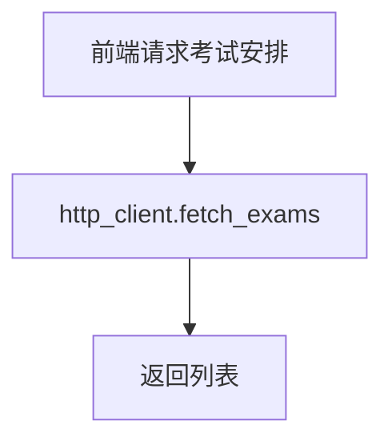

# modules/exam.rs

## 功能概述
- 考试安排查询模块。

## 关键功能
- `fetch_exams`：获取考试安排列表。

## 流程图

```mermaid
flowchart TD
  A[前端请求考试安排] --> B[http_client.fetch_exams]
  B --> C[返回列表]
```

## 注意事项
- 学期参数为空时使用默认学期。
