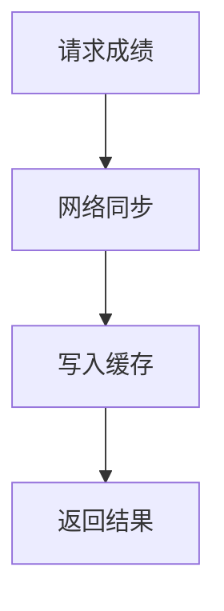

# modules/grades.rs

## 功能概述
- 成绩查询与缓存模块。

## 关键功能
- `sync_grades`：同步成绩并写入缓存。
- `get_grades_local`：读取本地缓存。

## 流程图

```mermaid
flowchart TD
  A[请求成绩] --> B[网络同步]
  B --> C[写入缓存]
  C --> D[返回结果]
```

## 注意事项
- 网络失败时可退化读取缓存。
