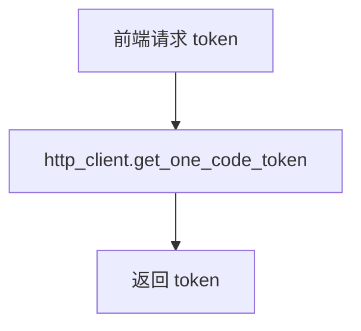

# modules/one_code.rs

## 功能概述
- 一码通 token 获取模块。

## 关键功能
- `hbut_one_code_token`：返回一码通 token。

## 流程图

```mermaid
flowchart TD
  A[前端请求 token] --> B[http_client.get_one_code_token]
  B --> C[返回 token]
```

## 注意事项
- 依赖登录态和 code 服务会话。
