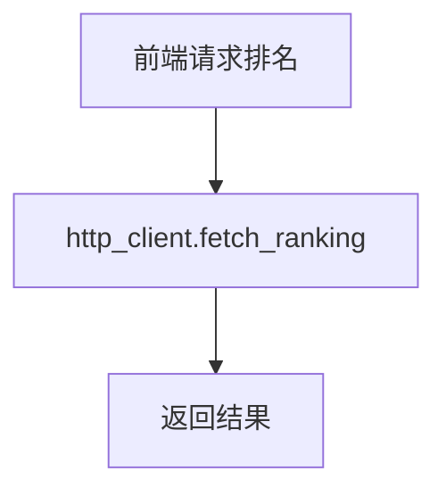

# modules/ranking.rs

## 功能概述
- 绩点/排名查询模块。

## 关键功能
- `fetch_ranking`：获取排名数据。

## 流程图

```mermaid
flowchart TD
  A[前端请求排名] --> B[http_client.fetch_ranking]
  B --> C[返回结果]
```

## 注意事项
- 学号为空时默认使用当前登录用户。
