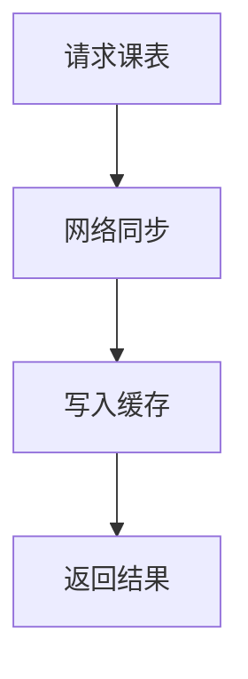

# modules/schedule.rs

## 功能概述
- 课表查询与缓存模块。

## 关键功能
- `sync_schedule`：同步课表并缓存。
- `get_schedule_local`：读取本地课表缓存。

## 流程图

```mermaid
flowchart TD
  A[请求课表] --> B[网络同步]
  B --> C[写入缓存]
  C --> D[返回结果]
```

## 注意事项
- 校历数据用于计算周次，失败时需回退。
