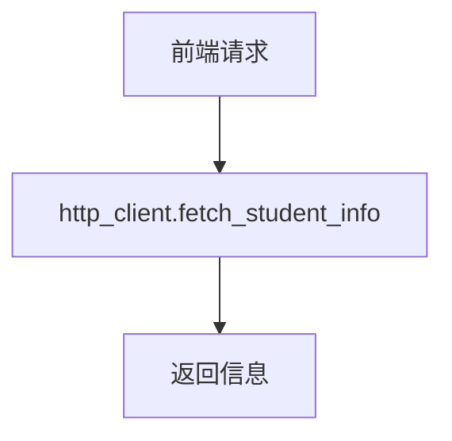

# modules/student_info.rs

## 功能概述
- 学生信息查询模块。

## 关键功能
- `fetch_student_info`：拉取学生基本信息。

## 流程图

```mermaid
flowchart TD
  A[前端请求] --> B[http_client.fetch_student_info]
  B --> C[返回信息]
```

## 注意事项
- 需要登录态 Cookie。
