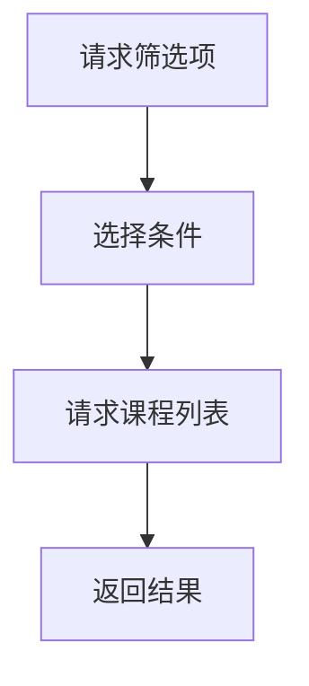

# modules/training_plan.rs

## 功能概述
- 培养方案查询模块。

## 关键功能
- `fetch_training_plan_options`：筛选项。
- `fetch_training_plan_jys`：教研室列表。
- `fetch_training_plan_courses`：课程列表。

## 流程图

## 注意事项
- 参数组合较多，建议前端做好校验。
