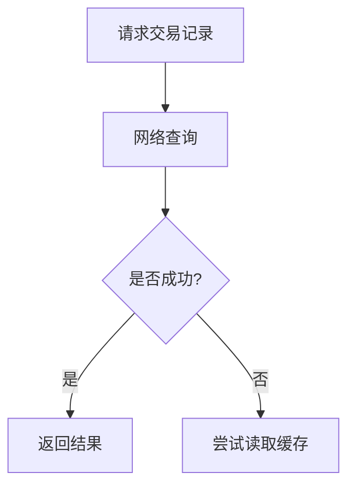

# modules/transaction.rs

## 功能概述
- 交易记录查询模块。

## 关键功能
- `fetch_transaction_history`：交易记录查询（网络优先，失败读缓存）。

## 流程图

```mermaid
flowchart TD
  A[请求交易记录] --> B[网络查询]
  B --> C{是否成功?}
  C -- 是 --> D[返回结果]
  C -- 否 --> E[尝试读取缓存]
```

## 注意事项
- 交易记录可能返回空响应，需做重试。
