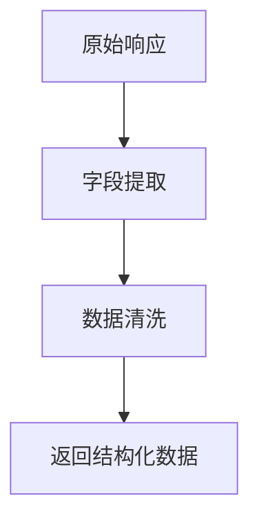

# parser.rs

## 功能概述
- 解析教务系统返回的 HTML/JSON，输出结构化数据。

## 关键功能
- 成绩、课表、考试、校历等解析函数。

## 流程图

```mermaid
flowchart TD
  A[原始响应] --> B[字段提取]
  B --> C[数据清洗]
  C --> D[返回结构化数据]
```

## 注意事项
- 教务字段可能变更，解析逻辑需持续维护。
