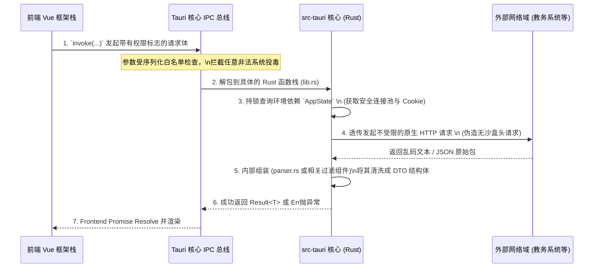

# `tauri-app/src-tauri` 文件夹全局架构与底层通信文档

## 1. 定位与全局职能

`src-tauri` 是 `Mini-HBUT` 后端工程中最为敏感的高特权执行禁区。在这套基于 Tauri 的多端融合生态结构中，这层 **Rust** 构建的代码树掌管着极为繁重的系统任务。

它的职能边界为：
- 初始化原生渲染引擎窗口 (OS Webview)。
- 建立从浏览器到系统层之间极其安全的封闭型 IPC（进程间通讯）双向白名单机制通道。
- 跳脱浏览器的同源策略与 CORS 限制，充当中间的特权无头网络爬虫驱动与加密处理。

## 2. 文件夹内部详细结构介绍

探索该目录深层基座，可见如下清晰板块划分：

### 2.1 顶级构建管理与入口声明
- **`Cargo.toml` / `Cargo.lock`**：定义所有的 Rust 包管理（例如 `tokio`, `reqwest`, `serde`，以及各平台的强绑定依赖项）。
- **`tauri.conf.json`**：该多端基座的最核心环境配置文件。包含了跨平台的应用识别标识符、窗体风格、透明度、更新地址清单配置等。
- **`build.rs`**：构建期的预处理指令。

### 2.2 后端逻辑源文件树 (`src/`) 剖析
此目录内部的所有文件合成了极为强壮的高并发服务与跨域穿透模块。
- **`main.rs`**：系统进程进入后第一道起搏器代码，非常精简，它全权转交进程控制权给下方的 lib 层。
- **`lib.rs`**：**全局注册统筹站**，初始化安全的全局状态持锁管理器 `AppState` 以及分发所有外部调用的 Command 指令。
- **`http_client.rs`** / **`http_server.rs`**：完全接管客户端所有的外部访问。它们以纯原生的能力保持 Cookie 持久化，强行下拽并加密与 `jwxt` 或统一教务平台的 TLS 报文包。
- **`db.rs`**：掌管断网状态下的原生系统离线数据库读取或配置快照。
- **`parser.rs`**：将抓取回来的海量恶劣 HTML 结构节点或参数，进行精准的正则切段并洗牌封卷成 JSON。
- **`debug_bridge.rs`** / **`modules/`**：向前端及测试阶段暴露特定的通信和业务重载扩展接口。

### 2.3 生成附属、测试用例与资源 (`target/`, `icons/`等)
- **`icons/` / `gen/`**：系统生成的托盘、应用系统打包用的特异性图标与资源绑定环境。
- **`target/`**：存放高强度的 Rust 编译过程缓存（此目录极其沉重且被安全隔离不并入最终推送）。
- **`.html / .db `**：测试网络接口抓包脱敏文件及实验数据库。

## 3. 逻辑原理：命令(Command)映射模型与拦截
在整个 `src-tauri` 运转的声明周期中，逻辑几乎完全遵循了指令驱动模型。与常规后端的基于 URL Route不同，它走的是宏绑定网络：通过 `#[tauri::command]` 修饰在各类函数顶层。当应用前端发射一个 IPC 访问时，Rust 底层会依据内置字典迅速定位指令函数，并借由多线程异步引擎极速推演并将数据原路遣返给 DOM 沙盒实例。

## 4. 全局跨界通信时序架构图 (Mermaid)

*(End of document)*