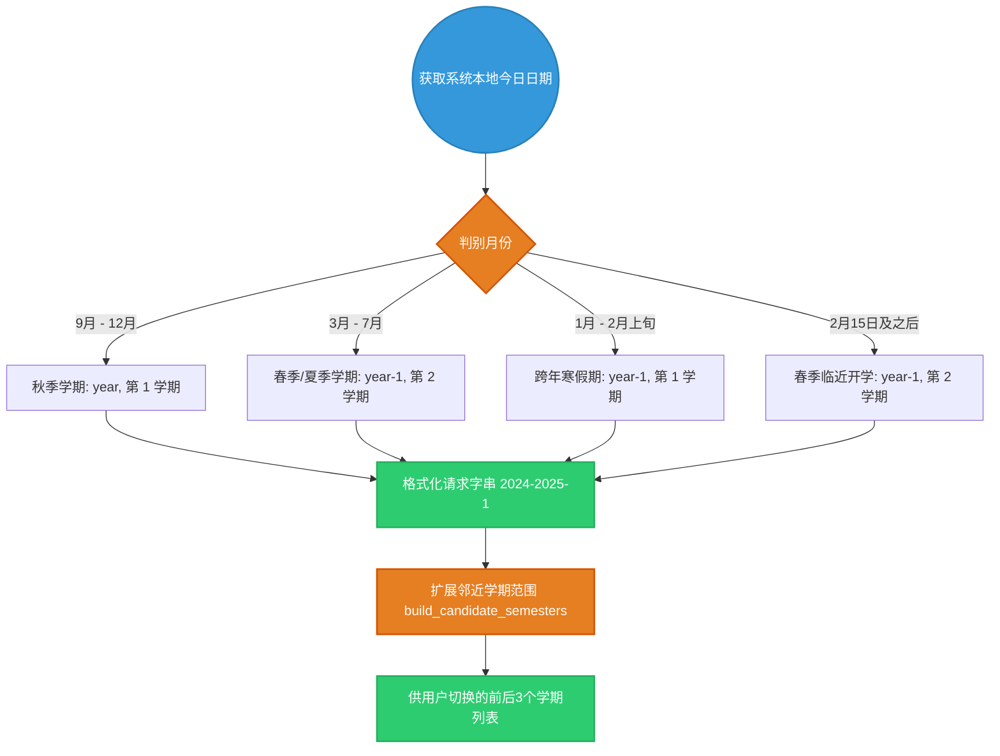

# `src-tauri/src/http_client/academic.rs` 教务数据抓取与日历运算原理解析

## 1. 文件概览

`academic.rs` 是系统内针对“教务系统（成绩、课表、考试、校历）”进行深度通讯抓取与核心数据运算的业务挂载点。
在所有由 `HbutClient` 发送给教务 API 的网络请求中，此类通常面临两个极大的挑战：1. 返回格式极度无规则；2. 业务需求需要极强的日期计算。本文件在此承担了大部分复杂的日期逻辑转换。

### 1.1 核心职责
1. **周次智能解析体系**: 利用 `chrono` 负责对学校校历数据进行重组（包含周次推算、放假天数倒计时推算）。
2. **多学期推衍算法**: 由于学校经常未开始学期就更新课表或处于交叉缓冲期，模块设计了根据月份与日期自动探测当前真实学年以及衍生邻近学期的推算引擎。
3. **数据反向补齐 (Normalizer)**: 处理某些脏数据，如强制修复日历 API 下发第一周周次为全 `null` 时强行计算纠正。

---

## 2. 日期计算与学期流转架构

通过下面的图表展示根据本地时钟如何推导请求学期参数（例如对于中国大多高校，春季由于春节问题，开学界限存在极大约定俗成规律的推演挑战）。



### 2.1 架构深度解读

#### a. 硬核日历推算 `semester_by_date`
```rust
let (academic_year_start, term) = if month >= 9 {
    (year, 1)
} else if month >= 3 {
    (year - 1, 2)
} else if month == 2 && day >= 15 {
    // 2月15日之后，虽然很多时候还没开学，
    // 但是前端通常希望查看下半学期的课表
    (year - 1, 2)
} else {
    (year - 1, 1)
};
```
这不是标准的 ISO 日期算法，而是融入了极其真实的**“大学放假规律的领域模型”**。专门打补丁给 2月15日 设定一个阈值，在这个期间如果查询由于没开学会报错，但学生通常希望预先得知新学期排课。这个魔法数字是作者深入一线长期观察校园规律得出的最佳体验值。

#### b. 周次平移修正 (`normalize_calendar_week_numbers`)
大学教务返回的校历中，周次 `zc`（推测为拼音 ZhouCi）这个键值，有时会面临首周无数字或者是数字错位（比如假期不记录）。通过本文件代码中的过滤器，寻找最小值：
```rust
let min_week_no = rows.iter().filter_map(Self::parse_calendar_week_no).min().unwrap_or(1);
let normalized_week = (week_no - min_week_no + 1).max(1);
```
将所有的原始周次强制对齐平移为从第一周开始算起的规范线性序列。保护了前端在绘制日历格子组件时不会抛出数组越界（OutOfBounds）或坐标飞出的灵异情况。

#### c. 平滑邻档推算 (`build_candidate_semesters`)
有些接口不会返回当前共有几个学期可以查询，因此采用纯粹的代数公式（由于一年固定只有两学期规律，这里作者巧妙运用了 `/2` 的商数和余数作为代数平滑基）：
```rust
let start_year = index.div_euclid(2);
let term = index.rem_euclid(2) + 1;
```
直接计算前置与后推学期。

---

## 3. 为什么这份文件值得考究

在抓取爬虫项目中遇到的最大瓶颈往往不是破解认证（Authentication），而是破解**杂乱且充满人类手写遗留错误的破烂接口数据**。
`academic.rs` 提供了一种防爆拆解策略，无论教务系统怎么吐数据，都在这一层被 Rust 強类型的结构如 `CalendarTermSummary` 直接拦截和消化，极大地增加了工程应对“坏数据服务”的自我修复能力和韧性。