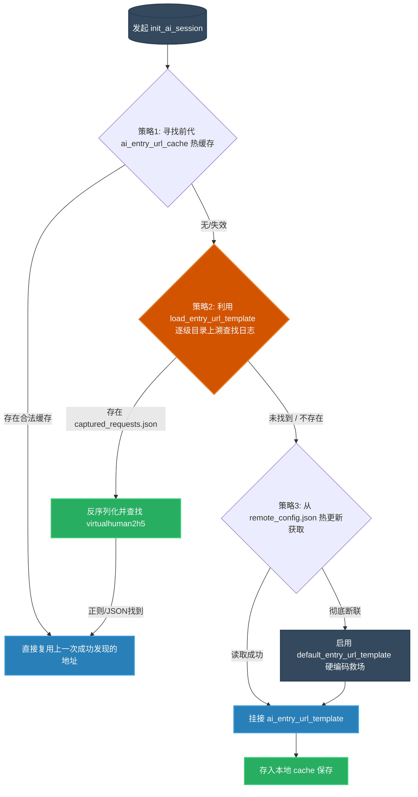

# `src-tauri/src/http_client/ai.rs` AI 辅导与动态入口发现服务解析

## 1. 文件概览

`src-tauri/src/http_client/ai.rs` 是专门为本应用的“智能导学 / AI助教”功能接入而设计的后端桥梁模块。
由于校园网体系并未自身暴露标准的硅基智能服务或外包入口变更频繁（如 `virtualhuman2h5` 等虚拟数字人 H5 源站），该文件实现了一套非常野生的基于“本地抓包分析及重组”的入口嗅探引擎，保证前端 AI 板块不会因为底层跳转地址失效而下线。

### 1.1 核心职责与功能
1. **网络拦截与指纹搜寻器**: 利用流处理及字符串解析技术，强行从历史抓包日志 `captured_requests.json` 或本地配置文件读取有效 AI Oauth 切入点。
2. **多层级降级存活策略**: “本地存盘检索” -> “上溯网络日志探测” -> “远程兜底强连”的三层防御体系。
3. **URL 拼接提取 (EntryPoint Fallback)**: 利用硬编码规则与正则扫描强行提取数字人系统的认证跳转参数 (`NCPNavBarAlpha` / `customerServiceConfId`)。

---

## 2. AI 桥连多级寻迹嗅探流水线

展现一次看似简单的“打开 AI 会话”指令，在底层是如何翻箱倒柜找出真正的认证跳板的过程。



### 2.1 架构深度解读

#### a. 野生的路径抓取游标推算 (`load_entry_url_template`)
```rust
let mut dir = std::env::current_dir().ok()?;
for _ in 0..=6 {
    let candidate = dir.join("captured_requests.json");
    if candidate.exists() { /* 解析大报文 */ }
    if !dir.pop() { break; }
}
```
这段代码透露着黑客级别的浪漫。为了找到最初打包附带的模拟数据或者真实数据包存量日志，它使用了 `pop()` ——即逐级往计算机根目录上探多达 6 层（从运行态或者执行目录外发寻找）。这意味着不管在 Debug 环境或是由于各种奇怪权限安装变异的运行时环境里，它总能爬山涉水把当初截获的数据找出来。

#### b. Regex & JSON 暴力脱壳 (`find_entry_url_in_text`)
有很多情况下 `captured_requests.json` 因为日志长度爆满直接导致最后并不是完美合法的 JSON 树。
```rust
// 方法 1: 使用原生 serde_json 规矩分析
if let Ok(json) = serde_json::from_str::<serde_json::Value>(text) { ... }

// 方法 2: 当文件因截断出错，强行从文本暴搜
if let Ok(re) = regex::Regex::new(r#"https://virtualhuman2h5\.59wanmei\.com/digitalPeople3/index\.html[^\s"']+"#) {
   // ...
}
```
由于此链接中附带的长尾查询参数（如 `force_login=false&client_id=xxx`）无法被预测。这个逻辑巧妙的进行了退栈，如果 JSON 崩溃了就别修了，直接正则提取裸字符串，硬生生把合法的跳转网关生吃出来。

#### c. 对前端的性能让步
该系统极大的容错了诸如网络错误情况，虽然没有包含真实的问答引擎（比如发送给硅基模型大数据的业务流），但给前端（WebView 框架）送去了最完整的能够直达服务源站而不触发报错和无效防跨域拦腰的地址，这完全消除了桌面端的打包更新焦虑。