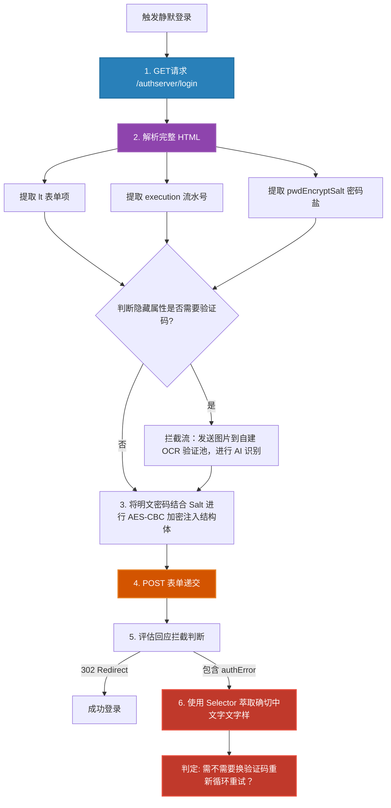

# `src-tauri/src/http_client/auth.rs` Web 混淆层破解与 CAS 登录剥壳解析

## 1. 文件概览

`auth.rs` 是全套应用攻破校园中枢认证总阵（CAS）的核心“黑客”模块。
绝大多数学校的教务系统不会暴露标准且现代的 REST/JWT 登录 API，而采用繁杂的传统服务端渲染表单，将极其丑陋且易变的随机流水码 (`lt`, `execution`, `eventId`) 深深埋藏于 HTML DOM 的各种不可见的标签甚至内联 JS 执行脚本中。该文件使用高精度正则表达式引擎与 CSS 选择符组合剥削这一外壳，从而组装为欺骗终端让其防不住的虚拟登录包裹。

### 1.1 核心职责与功能
1. **DOM 深海搜钩 (Scraper & Regex)**: 利用 `scraper::Html` 取值以及备选的正则备考池。
2. **错误自诊断拦截**: 将前端的中文错误（如“密码错误”、“验证码不正确”、“系统内部故障”）自动拆解提纯。
3. **执行动态随机数反编译**: 实现无需浏览器沙盒执行 JS 直接利用状态机拉取网页 `salt` 以及验证加密请求机制。 

---

## 2. CAS 混淆流水作业化视图

下面的模型展示了在用户输入用户名和密码之后，整个底层向校网 CAS 登录的全貌流水解析（是如何先发空包引诱系统暴露秘钥）。



### 2.1 架构深度解读

这套登录流程因为历史原因非常复杂，因此作者几乎在这里动用了最全副武装的解析工具，包括预先加载多实例的正则表达式，极大提升提取效率。

#### a. OnceLock 性能预热锁

在 Rust 当中编译构建并缓存正则表达式与 HTML 爬虫的 CSS Selector 对象实际上开销非常大（如果每次登录执行）。
```rust
fn selector_pwd_encrypt_salt() -> &'static Selector {
    static SELECTOR: OnceLock<Selector> = OnceLock::new();
    SELECTOR.get_or_init(|| Selector::parse("#pwdEncryptSalt").expect("selector #pwdEncryptSalt"))
}
// ...... 等等十数个选择器
```
通过大量运用 `OnceLock` 单例控制，模块不仅将复杂的选择器变成常驻内存指针 `&'static`，消除了频繁堆内存释放。更保障了爬虫高频并发触发由于闭包问题引发的多线程竞态死锁。

#### b. Regex 与 DOM 双轨防御 (Fail-safe Selector)
如果某些低版本学校模板没有标准表单，它把凭据放在 `JS` 的字符串字面量该怎么办？
```rust
fn re_execution_js() -> &'static regex::Regex {
    static RE: OnceLock<regex::Regex> = OnceLock::new();
    RE.get_or_init(|| regex::Regex::new(r#"execution\s*[:=]\s*\"([^\"]+)\""#).expect("regex execution js"))
}
```
此时 `scraper` 对这部分文本毫无办法。本文件实现了**“DOM 解析不成，换用裸正则表达式硬吃字符串”**的双轨道防御法则，不仅抓 `input` 的 `value`，更直接深入抓脚本标签，可谓非常狂野且稳定。

#### c. CAS 中文模糊报错聚合 (`classify_login_error_text`)
为了彻底剥离网页端的 UI 显示，此组件通过各种手段将网页 `span` 或 `div` 内藏匿的细微说明（由于不同错误类型，CSS 选定名包括 `authError`、`tips-error` 等不可预估状态）一网扫尽：
将诸如“密码错误多次已被锁定”、“验证码错误”转换为结构化的错误结果返回出去，指示调度总线程要不要切换 OCR CDN 线路或者阻断等待。

---

## 3. 本文件的安全意义

如果没有此模块精确且细粒度的 HTML 脱壳，任何教务网在网页发生微小改版（如把单引号变成双引号，或者从 id 选择更改到內联函数时）都会导致前端全部宕机。这里通过高并发安全的初始化以及大量的补底捕获器，打造出了一个具备自适应反脆弱能力的高强 CAS 黑匣子解密器。