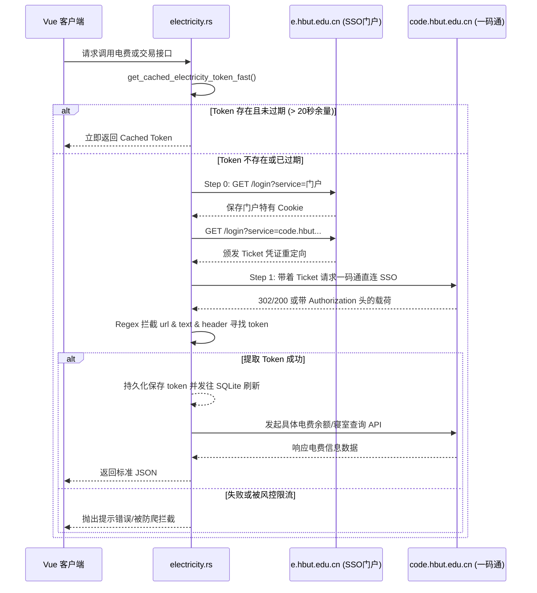

# `src-tauri/src/http_client/electricity.rs` 后端一码通与电费爬虫服务解析

## 1. 文件概览

`electricity.rs` 是专门针对湖北工业大学“一码通”及“学生宿舍电费查询/充值系统”的网络请求拦截与代理接口封装文件。由于该系统有非常严格的 SSO 令牌寿命以及异常复杂的鉴权步骤（需要双重跳板：融合门户 -> 一码通入口），这使得它成为教务以外另一个最复杂的网络请求子战场。

### 1.1 核心职责
1. **统一认证拦截**: 在教务系统已经获得的 CAS Cookie 基础之上，免密码二次利用门户跳转机制换取电费专属会话 `tid` 和 `ticket`。
2. **多态 Token 分发体系**: 解析与封装一码通特殊的基于头部 Header `Authorization` / `token` 携带的 API 鉴权，并抛弃老旧的 Cookie 机制。
3. **安全限流阻断 (Rate-Limit Fallback)**: 电费接口对于非常规的频繁重连具有强烈的黑洞风控惩罚机制，因此该文件对本地 `electricity_token` 也实现了软缓存和冷却控制。

---

## 2. SSO Token 交换与签发全流程架构图

下面的 Mermaid 展示了如何从原始统一认证入口跳转，提取关键 HTML 后获取真正调用宿管电费接口的令牌的过程。



### 2.1 架构深度解读

#### a. 跳板直通与兜底抓取 (Fallback Capture)
```rust
// 优先走“现有门户 Cookie 直连”路径（自动重定向），减少额外登录。
match self.client.get(sso_url).send().await {
    Ok(resp) => {
        let final_url = resp.url().to_string();
        if let Some(caps) = regex::Regex::new(r"tid=([^&]+)")?.captures(&final_url) {
            tid = caps.get(1).unwrap_or_default();
        }
        // ... (省略提取 Header Authorization 的部分代码)
    }
```
这段代码的容错性极高。它首先期望后端的自动重定向直接在 `finally_url` 中包含 `tid` 参数；若 URL 没有，它则进一步翻找 Headers 内藏匿的 `token`。如果都没找到最后再走非常慢但可靠的正则硬生生从最终返回的 `html` 中提取注入的凭据字符串！

#### b. 手工重定向跟踪系统 (`no_redirect_client`)
```rust
let no_redirect_client = Client::builder()
    .redirect(reqwest::redirect::Policy::none()) // 禁用自动重定向
```
因为 Rust 中 `reqwest` 如果开启自动跟随会导致所有中间 302 带着 Token 短暂闪过的 Header 全部丢失。作者单独开辟了一个 `no_redirect_client` 进行循环的手动路由分析，每吃一次 302 就提取一下 Headers 里的关键内容，将风控最严格的 SSO 抓取发挥到了淋漓尽致。

#### c. 高频并发节流护盾 (Token Throttle Guard)
```rust
if let Some(at) = self.electricity_token_at {
    if at.elapsed() < std::time::Duration::from_secs(600) {
        return Some(token);
    }
}
```
如果前面请求抛出了 401 ，一般的应用大概率会马上重新走一遍完整的登录流。但是在电费这一模块中如果 10 分钟内高频重登由于触发一码通的风控将会被永久踢出。这里的一个极简 `600s` 强短路时间差阻断，成功挡住了前端由于意外触发连环渲染刷新导致的灾难封号后果。