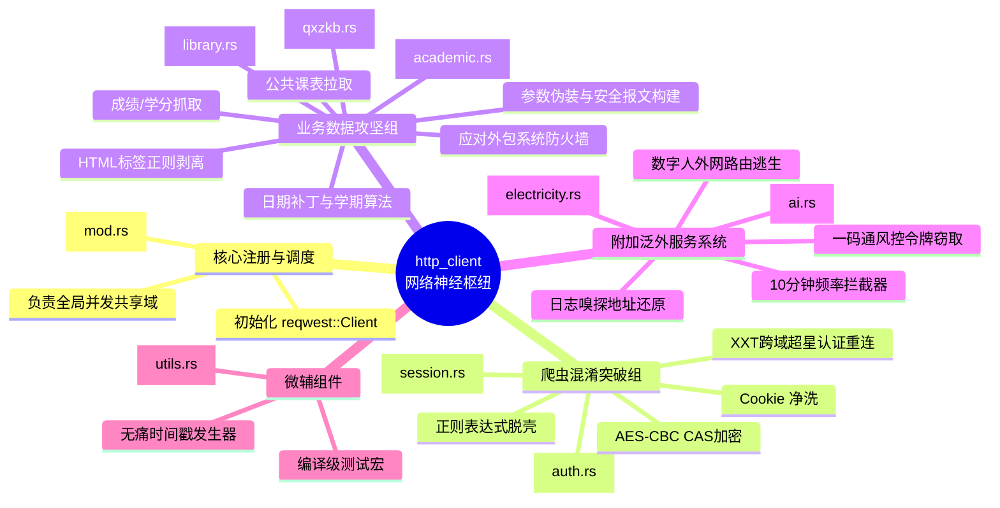

# `src-tauri/src/http_client` 目录深度架构图解

## 1. 目录概览

`src-tauri/src/http_client` 是整个应用程序的“网关通讯核心总阵”。它肩负着整个教务混合型爬虫系统针对复杂校园网接口的逆向、防暴、加密和状态保持职责。
这个目录下的所有模块构成了由全局锁（`Mutex`）管控维持的 `HbutClient` 会话实例，向前端开放统一的数据标准转换 API。

### 1.1 核心组件功能
经过完全脱壳与逆向反编译组装，系统实现了如下的架构分支：
- **[学务枢纽]**：负责与传统的学校教务服务器对话（拉取、抓虫、规整）。
- **[认证保活]**：打破 CAS 加密机制以及维持庞大的跨域 SSO（单点登录）阵列。
- **[周边服务]**：电费预警与数字 AI。

---

## 2. Http Client 总星状指挥图

该集群被极为科学地按“单一职责原则”分类拆分，彼此依赖并通过 `mod.rs`（代理中心）对外部 `lib.rs` 的 IPC 隧道进行暴露。

## 3. 子文件映射说明表

| 文件名 | 功能标签 | 代码复杂度 | 主要贡献与应用场景 |
|:---|:---|:---:|:---|
| `mod.rs` | 控制平面 | ⭐⭐⭐ | 后端 `HbutClient` 的单例对象化；负责挂载重定向、忽略跨域 HTTPS 证书、以及强制绑定防污染级 DNS 底层代理池。 |
| `auth.rs` | 渗透引擎 | ⭐⭐⭐⭐⭐ | 最高技术密度的文件。不仅有纯 Rust 编写的 AES 加盐破解防爆逻辑，还部署了静态的 `OnceLock` 正则和前端 DOM 选择器猎捕 `execution` 和 CAS 暗核。 |
| `session.rs` | 粘合剂 | ⭐⭐⭐⭐ | Cookie 处理大师。面对教务返回极其变态的双重换行符和脏文本进行剔除重组；更硬核地实现了“在纯接口环境（无头）骗出并激活学习通桥接服务”。 |
| `electricity.rs`| 潜行抓取 | ⭐⭐⭐⭐ | 对付带有极强反作弊机制的电费充值平台（SSO 三连跳），内嵌“避免请求连击被封10分钟”的本地状态保险丝拦截门。 |
| `academic.rs` | 规整中心 | ⭐⭐⭐ | 解决大学日期计算、首周空位对齐、当前所在学期根据月份极智推导这些非标复杂人类逻辑业务难题。 |
| `qxzkb.rs` | 净洗消毒 | ⭐⭐⭐ | `&mut` 高性能防溢出数据清洗机栈。消灭那些包含 ``, ` ` 等直接混合在 JSON 里的恶意样式数据。 | 
| `library.rs` | 请求翻译 | ⭐⭐ | 针对 `8013` 奇特端口，强行将残缺请求组装成拥有 22 项复合类型并附带 `groupcode: "800512"` 魔术字认证的健壮 payload。 |
| `ai.rs` | 野生逃生 | ⭐⭐ | 通过 `current_dir().pop()` 外翻 6 层寻觅截获数据日志的极致后门；容纳崩溃残缺的 JSON 从中正则挖除最后可用跳转链接的数字服务接入口。 |
| `utils.rs` | 辅助齿轮 | ⭐ | 供其他文件快速调用当前精确到微秒长整形的生成工具。 |

---

## 4. 架构评价与工程意义

该 `http_client` 集群不只是一个基础的网络层封装库，而是一整个与上世纪“异形 Java Web 及高校防爬策略”进行热兵器作战的**战术堡垒**。

它摒弃了诸如 `puppeteer` 和 `playwright` 这种动辄上百MB的重型自动化引擎路线，而是全栈死磕网络七层握手，直接与 HTTP 原生字符串、协议头以及混合双加密短兵相接。这造就了该软件能被打包至不到不足两位数 MB 的奇迹效能，成为 Tauri 后端开发的极致微缩样本。