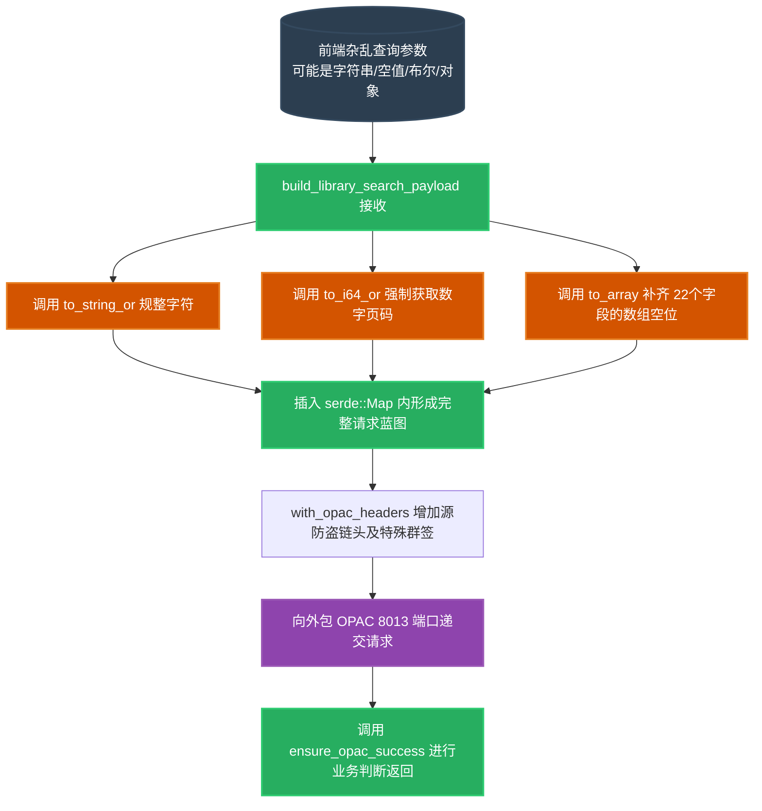

# `src-tauri/src/http_client/library.rs` 图书馆 OPAC 查询层解析

## 1. 文件概览

`library.rs` 负责驱动本项目关于“学校图书馆图书检索与详情抓取”的功能。因为学校的文献系统 (OPAC) 通常是由第三方外包提供（端口大多设定在硬编码带有跨域特征的 `8013`）且采用特定结构的 JSON POST 格式通讯。本文件构建了针对这套文献请求查询参数结构的完美映射与构造工具。

### 1.1 核心职责与功能
1. **构造检索包裹 Payload**: `build_library_search_payload` 提取前端散装且残缺不全的数据（由于 JS 弱类型引起的各类 `null` 以及类型混杂的非法属性）转化成后代可以识别的极其结构化复杂的巨型键值对。
2. **状态容错转化器**: 将任何从 JSON 解析出的类型 `Option<&Value>` 强行通过自造转化宏，转为泛型安全的数组或字符串，包括 `to_i64_or` 、`to_nullable_bool`。
3. **专制请求修护器**: 重写并劫持请求头部如 `groupcode` 欺骗防火墙，以绕过跨域并模拟客户端环境访问文献。

---

## 2. 图书搜索组装流水引擎架构图

展示一次凌乱的前端请求是如何被严密包裹和修正后提交给老式 OPAC 服务器的过程。



### 2.1 架构深度解读

#### a. 高度防爆的类型泛用转换器 (`to_i64_or` / `to_nullable_bool` 等)
后端对于传过来的类型容忍度各异，而在 JS 发往 Rust IPC 的时候，数字极容易被转化为混合带引号的字符串 (`"1"`)。
```rust
fn to_i64_or(input: Option<&Value>, default: i64) -> i64 {
    match input {
        Some(Value::Number(v)) => v.as_i64().unwrap_or(default),
        Some(Value::String(v)) => v.trim().parse::<i64>().unwrap_or(default),
        _ => default,
    }
}
```
这段代码确保了 Rust 绝对不会发生类似 `JSON panic` 的崩溃。它通过尝试作为原生数字抽取；如果不是，再尝试作为包含数字的字符串强转，最后提供带有保底的 `default` 值。极大稳固了 Tauri App 在数据接收层面的鲁棒性。

#### b. 魔改的防跨域 OPAC 请求头注入 (`with_opac_headers`)
外包系统的请求因为是独立的二级节点，有很多防护策略。
```rust
fn with_opac_headers(builder: RequestBuilder) -> RequestBuilder {
    builder
        .header("Content-Type", "application/json;charset=UTF-8")
        .header("x-lang", "CHI")
        .header("groupcode", "800512")
}
```
它伪造了前端的握手，尤其那个特殊魔法值 `groupcode: "800512"`（极大概率是图书馆的专属 Client 标识商户号），将后端请求伪装为受认可的内部正常客户端页面，规避了 IP 白名单或授权访问的安全域探测。

---

## 3. 功能战略层影响

虽然图书馆不是最高频调用的系统，但是其 JSON 的交互繁琐性在应用里是最高的（涉及超过 20 条以上不同复合格式字段）。`library.rs` 为这些“非标准教务”数据提供了一个完美的翻译模型，避免前端将这些面条形构造代码积压带在 `Vuex/Pinia` 里，确保了纯粹的前端应用层设计（只管发关键字，一切包裹组合细节让低层 Rust 消化处理）。