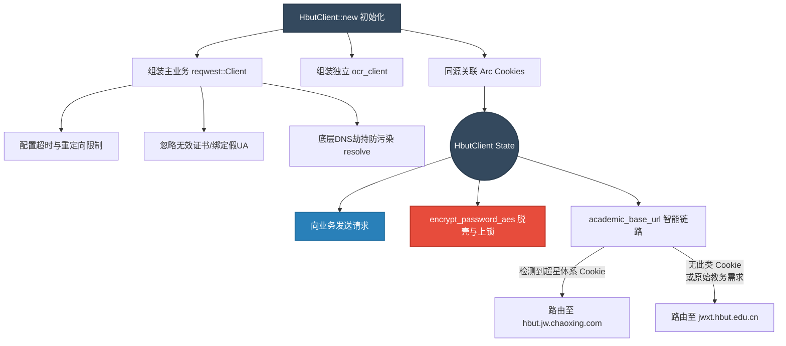

# `src-tauri/src/http_client/mod.rs` HTTP 会话中枢与加密组件层解析

## 1. 文件概览

`src-tauri/src/http_client/mod.rs` 是整个后端网络请求引擎的心脏模块。它不仅定义并组织了应用全部的对外通信客户端 (`HbutClient`)，也统一汇聚管理了包含电费、教务、图书馆、公共选修课等各大子模块。
同时，所有用于破解 CAS（中央认证服务）的关键加密算法和会话复用逻辑都沉淀于此。

### 1.1 核心职责与功能
1. **子业务模块中心枢纽**: 将所有 `http_client/*.rs` 目录下的业务模块 (`auth`, `academic`, `electricity`...) 进行统一组合和对外暴露。
2. **`HbutClient` 会话单例化**: 封装并持有 `reqwest::Client` 客户端，并共享全局的 `CookieStore / Jar` 实现自动维护和续期 CAS 登录凭证。
3. **CAS 高级模拟加密 (AES-CBC)**: 实现针对校园网前端特殊魔改的 `encrypt.js` 逻辑（加随机前缀以及 CBC 模式）。
4. **OCR 架构分体与高可用池**: 将主业务客户端与 OCR（验证码识别）的验证请求拆分，配备多个远程或本地回退服务地址 `DEFAULT_LOCAL_OCR_FALLBACK_ENDPOINTS`。

---

## 2. 爬虫层加密与路由控制化视图

下面梳理了整个项目通过 `HbutClient` 初始化、如何进行底层环境设定和自动双线切换（校园网原始源 vs 超星链路）。



### 2.1 架构深度解读

这里蕴藏着多处专门针对大学教务系统特性深度定制的**“硬核逆向反反爬策略”**。

#### a. 客户端的配置极客化 (Anti-Crawler Evasion)
```rust
fn build_http_client(jar: Arc<Jar>) -> Client {
    Client::builder()
        // ...
        .danger_accept_invalid_certs(true)
        // DNS 兜底：强制使用已知可用 IP 进行校园网穿透服务
        .resolve("auth.hbut.edu.cn", std::net::SocketAddr::from(([202, 114, 191, 47], 443)))
        .resolve("jwxt.hbut.edu.cn", std::net::SocketAddr::from(([202, 114, 191, 16], 443)))
        .user_agent("Mozilla/5.0 ...")
        // ...
}
```
这段代码直接在 HTTP 的构建层面上“挂载了硬编码的 DNS 路由记录 (`resolve`)”。在很多校园网络复杂架构或者外部公共 DNS 回源失败（DNS 污染）的情况下，直接绕开系统的 Hosts 查询直连原服，这反映了极强的生产环境容错考量。开启 `danger_accept_invalid_certs(true)` 强吃校园网由于没有续费或下发内部的 SSL 根证书报出的“无效证书”拦截问题。

#### b. 教务链接“超星化”的双轨感知 (`prefer_chaoxing_jwxt`)
```rust
pub(super) fn academic_base_url(&self) -> &'static str {
    // 学习通链路下，教务入口与接口主域名为 hbut.jw.chaoxing.com
}
```
学校经历过一次 CAS 的调整或者引入了教务“超星域版”。如果客户端依旧向老平台发请求，必定报 “未授权” 或触发无端重定向。HbutClient 直接内置了一个嗅探与决策阀。只要判断出当前 Cookie Jar 里持有 `chaoxing` 相关有效字段或已显式开启该模式，马上切换 Host。

#### c. CAS 登录核心加密算法逆向复现
在向 CAS 服务器提交 `password` 前，会调用此文件中的 `encrypt_password_aes`：
```rust
// 计算需要的缓冲区大小（PKCS7 填充）
let block_size = 16;
let cipher = Aes128CbcEnc::new(key.into(), iv_bytes.into());
```
它的具体流程是：用页面的 `salt` 当作 Key，自己随机生成 16 位的 `iv` 向量；再随机生成 **64** 位垃圾字符当前缀连上真实密码明文；最后跑一次原汁原味的 AES-CBC (128bit) + Pkcs7 加码。这套完全就是脱掉学校前端 JS “加盐混淆”的外衣后的纯级 Rust 实现，是整个后端能够实现**零页面后台静默自动登录**最最核心的武器！

---

## 3. 面向性能的数据状态管理结构

```rust
pub struct HbutClient {
    pub(super) client: Client,
    pub(super) ocr_client: Client, // 隔绝对话影响
    pub(super) cookie_jar: Arc<Jar>,
    // 丰富繁多的会话重连指标缓存 ...
}
```
由于 Rust 所有权极致的安全检查，系统无法随意穿透并读写全局变量，在这里 HbutClient 顺势升级成为一个**巨型应用聚合上下文（Context）**。从 OCR 远端备用列表池，再到一码通（电费）专属 Token 短期缓存和上一次失败重试时间的截断记录系统。整个应用所有非 SQLite 持久化的**在网临时数据**全部在这一单例内存下流动并受严格的 Mutex （见 `lib.rs` 的包裹）控制。