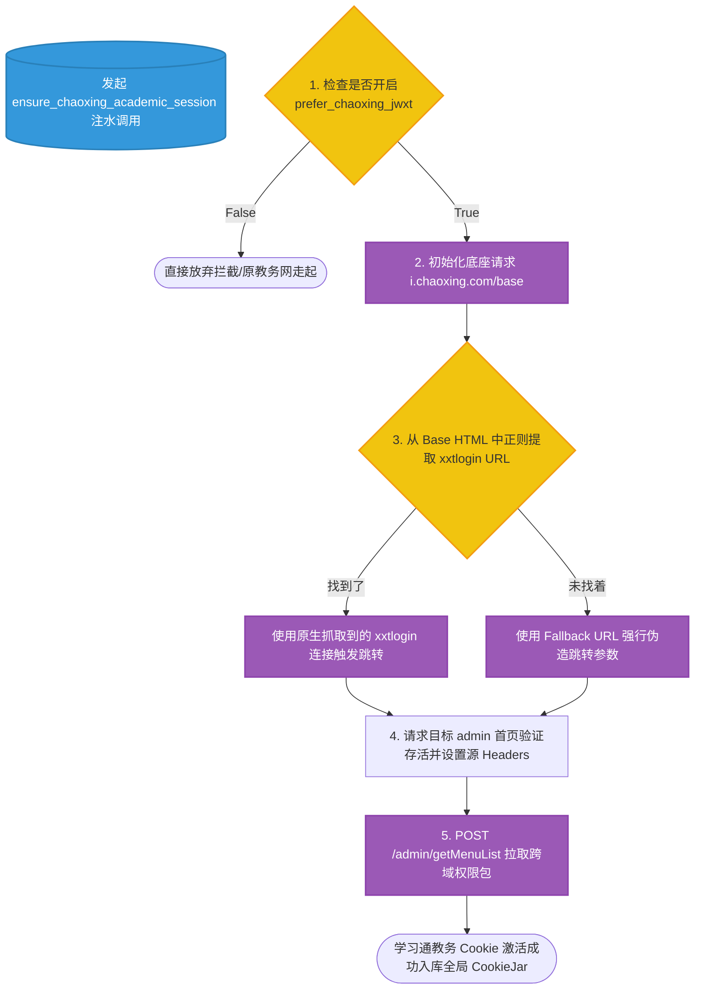

# `src-tauri/src/http_client/session.rs` Cookie 会话保活与管理层解析

## 1. 文件概览

`session.rs` 充当了本项目后端的 "HTTP 粘合剂"。教务系统复杂的微服务集群（学籍、成绩单查询模块、图书馆系统以及超星链路的跨域鉴权）非常依赖 Cookie 序列维持长时间的免密访问状态。
该文件专门处理 `CookieStore` 内部状态的串行化导出、异形 Cookie 解析，以及应对复杂的“跨主域学习通”补票流（`xxtlogin`）。

### 1.1 核心职责
1. **Cookie 字符串净洗 (Sanitization)**: 获取原始响应中参差不齐且格式混乱的 Cookies 字段并抹平合并为可用态。
2. **多态链路重构 (Session Bridge)**: 教务系统可能挂载于学习通域名 (`hbut.jw.chaoxing.com`) 下，在此应对因环境丢失的临时跨域验证提供“无头浏览器式补票”功能。
3. **安全截断输出规则**: 提供安全的 API 切割并暴露出只供给本作用域业务的相关身份牌 (Auth Blob)。

---

## 2. 学习通双线并轨补票拓扑图



### 2.1 架构深度解读

#### a. 针对脏数据的精细解离 (`parse_cookie_pairs`)
由于老旧 Java/JSP 教务框架在 Header 吐出的 Cookie 非常“反人类”，可能含有回车 `\r\n`，以及无用的 `Auth:` 或 `Jwxt:` 日志标记。
```rust
fn normalize_cookie_blob(raw: &str) -> String {
    raw.replace('\r', "").replace('\n', "").replace("Code:", "").replace('|', ";")
}
```
经过 `normalize_cookie_blob` 洗礼和 `is_valid_cookie_name` 逐位强校验后（防报错），它才会被转化成符合 Rust 标准库安全组装的可传递载荷，并且加入了 `HashSet` 防止被覆盖注入双重名相同的变量。

#### b. 极限补票反爬对抗 (`ensure_chaoxing_academic_session`)
如果是通过超星学习通进行跳板访问教务，学习通的 OAUTH 认证会在中间隐式发生数次带有特殊 `t` 参数的长跳板认证。后端通过这几步：
1. 请求带有当前时间戳的 `i.chaoxing.com/base` 来激活网关发牌器发牌。
2. 从返回网页提取极其关键跨域地址 `xxtlogin`。如果没提取到，作者直接暴力硬编码了 `fallback_bridge` 来发起 302 Oauth 重定向欺骗，完成最后一公里的联通。最后再去验证 `/admin/getMenuList` 以诱发服务器吐出真正的业务执行 JWT/Cookies 碎片。
这一套复杂的伪装访问，彻底保障了无头（Headless）状态下的异步多域访问。 

---

## 3. 在后端的地位

如果 `auth.rs` 是专门打开“前门”的钥匙，那么 `session.rs` 则是那个进门以后在各个相通的服务大厅中来回穿梭却“不断线”、不断被询问身份时能够掏出最新身份证件流转中枢。这是大型高校平台多部门杂交合并项目的特色衍生安全产物。