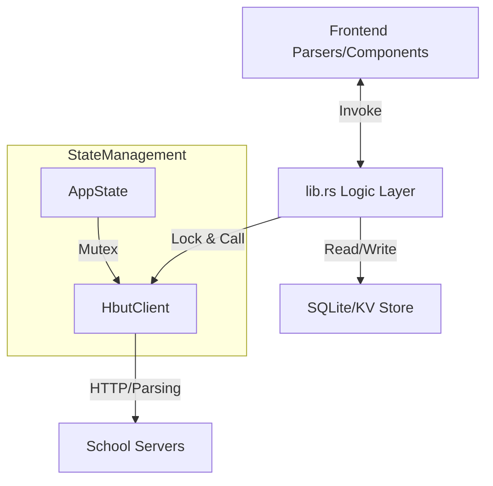

# 核心库逻辑文档 (lib.rs)

## 1. 模块概述
`lib.rs` 是 Tauri 后端的入口与胶水层，主要职责连接前端 UI 与后端 Rust 逻辑。
它负责：
1.  **定义 Tauri Commands**: 通过 `#[tauri::command]` 宏暴露异步函数给前端调用。
2.  **状态管理 (State Management)**: 使用 `AppState` 结构体持有全局唯一的 `HbutClient` 实例，并通过 `Mutex` 保证线程安全。
3.  **数据传输对象 (DTO)**: 定义与前端交互的 JSON 序列化结构体（如 `UserInfo`, `Grade`, `ScheduleCourse` 等）。
4.  **初始化流程**: `run()` 函数构建 Tauri 应用，注册插件和命令。

## 2. 核心架构图



## 3. 命令映射表 (Command Mapping)

此表展示了前端调用的 Tauri 命令与底层实现的对应关系：

| Tauri Command | HttpClient Method | 逻辑描述 |
| :--- | :--- | :--- |
| **认证模块** | | |
| `login` | `login` | 执行 CAS 登录流程，处理验证码和加密 |
| `get_captcha` | `get_captcha` | 获取登录验证码图片 |
| `check_login_status` | N/A | 检查 `HbutClient.is_logged_in` 标志 |
| **教务模块** | | |
| `fetch_info` | `fetch_user_info` | 获取学生基本信息（姓名、班级等） |
| `fetch_image` | (Direct Reqwest) | 获取学生证件照 |
| `fetch_grades` | `fetch_grades` | 获取成绩单，包含缓存策略 |
| `get_grades_local` | N/A | 仅从本地数据库读取缓存的成绩 |
| `fetch_schedule` | `fetch_schedule` | 获取课表，整合校历周次信息 |
| `fetch_exams` | `fetch_exams` | 获取考试安排 |
| `fetch_ranking` | `fetch_ranking` | 获取加权排名信息 |
| **培养方案** | | |
| `fetch_training_plan_options` | `fetch_training_plan_options` | 获取培养方案筛选下拉选项 |
| `fetch_training_plan_courses` | `fetch_training_plan_courses` | 查询培养方案课程列表 |
| **电费模块** | | |
| `login_electricity` | `ensure_electricity_token` | 触发电费 OAuth 流程获取 Token |
| `fetch_electricity_balance` | `fetch_electricity_balance` | 获取指定房间电费余额 |

## 4. 关键数据结构

*   **UserInfo**: 学生基本信息，用于侧边栏展示。
*   **Grade**: 包含课程名、学分、成绩、性质等标准字段。
*   **ScheduleCourse**: 包含周次解析后的课表项，前端可直接渲染。
*   **AppState**:
    ```rust
    pub struct AppState {
        pub client: Mutex<HbutClient>,
    }
    ```

## 5. 缓存策略
大部分 `fetch_*` 命令采用 "Network First, Cache Fallback" 或 "Network with Cache Update" 策略：
1.  尝试从网络获取最新数据。
2.  如果不为空，写入本地数据库 `grades.db` (KV Store)。
3.  如果网络失败，返回错误（部分接口未来可优化为返回旧缓存）。
4.  提供 `get_*_local` 接口仅读取缓存，用于离线模式或快速首屏展示。
