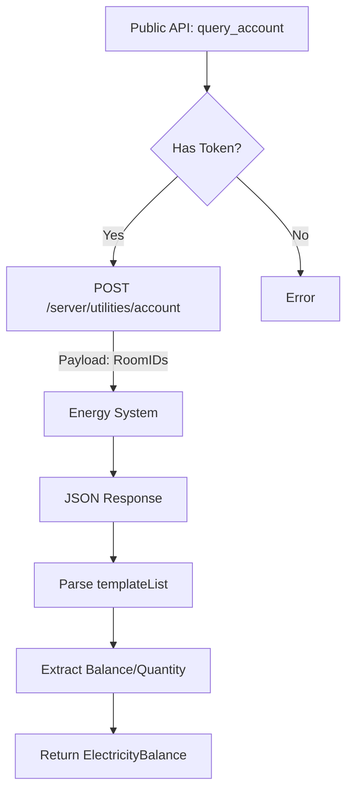

# 电费查询模块逻辑 (electricity.rs)

## 1. 模块概述
`electricity.rs` 处理与学校 Fusion Portal (code.hbut.edu.cn) 及其后端能耗系统的交互。
该系统与教务系统独立，使用 JWT Token 进行认证。
注意：本模块只处理查询逻辑，Token 的获取由 `http_client.rs` 中的 OAuth 流程处理。

## 2. 核心结构
*   **ElectricityBalance**: 电费余额信息（余额、剩余电量、供电状态）。
*   **LocationItem**: 位置层级节点（区域、楼栋、楼层、房间）。
*   **ElectricityModule**: 封装查询方法，需要注入 OAuth Token。

## 3. 逻辑流程图

## 4. 层级关系
查询流程通常是级联的：
1.  `get_root_areas` -> 区域列表 (如 "东区", "西区")
2.  `get_buildings(area_id)` -> 楼栋列表
3.  `get_units(area_id, building_id)` -> 楼层/单元列表
4.  `get_rooms(..., unit_id)` -> 房间列表
5.  `query_account(full_ids)` -> 余额

## 5. API 依赖
*   查询位置: `https://code.hbut.edu.cn/server/utilities/location`
*   查询余额: `https://code.hbut.edu.cn/server/utilities/account`
*   Headers: 需要 `Authorization: <token>`, `Origin`, `Referer`。
