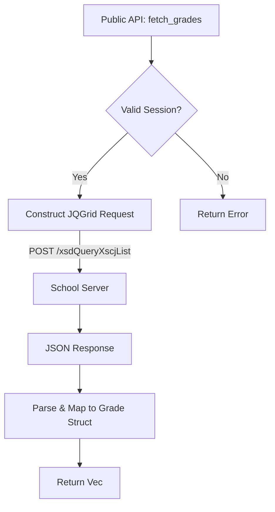

# 成绩查询模块逻辑 (grades.rs)

## 1. 模块概述
`grades.rs` 实现了与学校教务系统 (JWXT) 的成绩查询接口对接。
该模块对应 Python 后端的 `backend/modules/grades.py`。
主要职责是构建 HTTP 请求，解析返回的 JSON 数据，并映射为 Rust 结构体 `Grade`。

## 2. 核心结构
*   **Grade**: 成绩实体，包含学期、课程名、学分、分数、绩点等信息。
*   **GradesModule**: 模块封装结构，持有 HTTP 客户端和 Cookie 状态。

## 3. 逻辑流程图

## 4. 关键函数
*   `new(client)`: 初始化模块。
*   `fetch_grades()`: 发送带有 `queryFields` 的 POST 请求，获取所有成绩列表。

## 5. 注意事项
*   该模块目前设计为独立组件，通过 `cookies` 哈希表维护会话。
*   请求参数 `gridtype: jqgrid` 是必须的，否则服务器返回 HTML。
*   API 地址: `https://jwxt.hbut.edu.cn/admin/xsd/xsdcjcx/xsdQueryXscjList`
