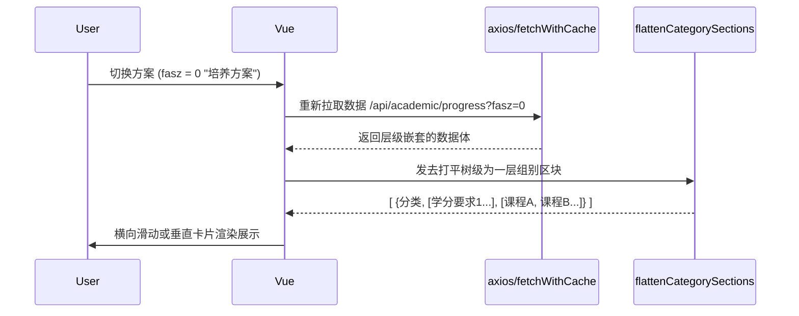

# 学业进度分析视图与毕业护航板 (AcademicProgressView.vue)

## 1. 组件地位与业务背景

对于高校学生而言，毕业前是否有遗漏的核心课程（如必修学分不够、跨学科选修未满足）是最大的痛点。
`AcademicProgressView.vue` 专门用来承载与展示教务系统复杂的**“方案完成度”、“教学计划树”**。
通过抓取深层的数据结构，结合前端递归式的视图计算，这个组件不仅是数据展示器，更是大学生涯的仪表盘。它支持多种视角的切换（如：按课程性质、按培养方案等）。

## 2. 核心状态与响应式映射

组件包含大量的 `ref` 数据锚点：
```javascript
const loading = ref(false)
const progressData = ref(null) // 承载整个学术体数据的根节点
const fasz = ref(1) // 方案视角：0-培养方案 1-课程性质 2-教学计划 4-毕业学分
const showDetail = ref(false)
```

数据结构通过 `computed` 进行二次处理，从而分装为展示面板所需的 `summaryItems`（全局成就）与 `categorySections`（分项明细）：
```javascript
const EXPECTED_SUMMARY = ['gpa', 'pjcj', 'hdzxf', 'yxkms', 'bjgms', 'gpazypm', 'xwjdpm']
// 成绩、学分、挂科总数到专业、学位的双排名系统
```

## 3. 递归树形数据展平器 (`flattenCategorySections`)

学术计划数据往往是一个无限下降的树 `tree: [{ id: 1, children: [{ id: 2, kcList: [...] }] }]`。
在手机屏幕上，层层嵌套不适合垂直长滚动。该组件使用深度优先搜索（DFS）算法，将树状结构**压平 (Flatten)**：

```javascript
const flattenCategorySections = (tree) => {
  const sections = []
  const walk = (nodes, parentPath = []) => {
    nodes.forEach((node, idx) => {
      // 记录父级路径，形成面包屑 e.g. "公共必修课 / 基础数学"
      const path = [...parentPath, nodeName]
      const courses = node.kcList.map(c => ({...c, _categoryPath: path}))
      // 如果本层级有课，就在这里阻断并提取作为一个列表块
      if (courses.length) {
        sections.push({ name: nodeName, path, courses })
      }
      walk(node.children, path) // 继续往下探底
    })
  }
  walk(tree, [])
  return sections
}
```

## 4. UI 标签与数据洗涤引擎

教务数据中包含大量古早和不一致的字符集记录（有的用 1/0，有的用 Y/N，有的写 "已修" / "未通过"）。
组件利用强大的数据清洗阀：

### 4.1 真假值洗涤归一
```javascript
const normalizeCourseFieldValue = (key, rawValue) => {
  if (['1', '是', 'Y', 'y', 'true', 'TRUE'].includes(value)) return '是'
  if (['0', '否', 'N', 'n', 'false', 'FALSE', '-'].includes(value)) return '否'
  return value
}
```
把诸如“是否补考 (sfbk)”、“是否缓考 (sfsq)”全部抹平为人话。

### 4.2 状态胶囊着色 (`completionPillClass`)
依据正则表达式判定修读结果，并赋予 CSS Class，通过不同颜色预警风险：
- **绿灯 (`state-done`)**: `/(已修|完成|通过)/.test` 但决不可含有“未通过”（防止“未通过”被误判）。
- **红灯 (`state-todo`)**: `/(未修|未完成|未通过)/` 强警示补考信息。
- **黄灯 (`state-pending`)**: `/(已选课|未得分|在修)/`，指示该课程当前正在本学期列表中。

## 5. 交互图解：切换视角流



组件将这些硬核逻辑打包在一个简练清新的单页面内，使用户只需点开就能了解距离毕业还差什么。