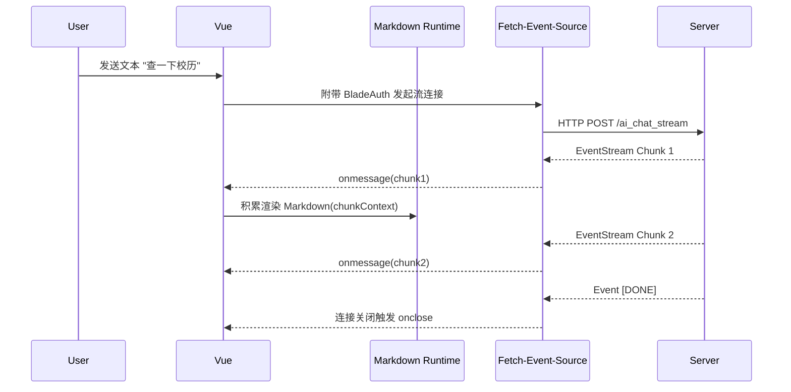

# 人工智能助手核心界面引擎 (AiChatView.vue)

## 1. 模块边界与定位

“湖工小实” 是本项目的重器——前端嵌入的一个强力大模型对话系统接口，提供了类似于 ChatGPT 式的多会话流式交互体验。
`AiChatView.vue` 是一个多达数千行的高密度视图模块（基于其状态的复杂度估算）。集成了 Markdown 流式解析、键盘占位计算、SSE 响应控制以及历史对话追踪体系，完全具备独立成端的能力。

## 2. 多模型切换与映射引擎

由于 AI 供应商多变，系统采用硬编码枚举与 API 动态加载联合策略：
通过 `normalizedModelOptions` 对传入的各类杂乱参数进行洗牌。

```javascript
const defaultModelOptions = [
  { label: 'Qwen-Plus', value: 'qwen-plus' },
  { label: 'DeepSeek-R1', value: 'ep-20250207092149-pvc95' }, // 满血版部署模型编码
  // ...
]
```
系统通过 `MODEL_ALIAS_MAP` 字典建立别名关系，防止哪怕接口传来了下划线分隔名的 `qwen_plus` 或非驼峰名依然能稳准狠识别并渲染为正确的“Qwen-Plus”。

## 3. SSE 流式通信机制框架

它放弃了传统的 Axios / Fetch 来做问答响应等待（长达10秒的白屏），引入了巨头微软级的 `@microsoft/fetch-event-source` 库处理流：
- **STREAM_ENDPOINT**：向它抛送历史历史上下文，然后持续监听 `onmessage` 钩子。
- 每接收到一个 Chunk，都会计算 `delta` 并更新 UI 内的状态机以触发文字像打字机一样上浮（Typewriter Effect）。
- `streamStats` 会监听实时的网络活动情况：“正在组织语言... / 处理速度”。



## 4. 极致的前端排版与键盘逃逸计算

移动端手机浏览器最臭名昭著的问题——调出外建虚拟软键盘时，直接遮挡底部输入框。
本应用引入了高级浏览器接口级 `visualViewport`（视觉视口适配器）：

```javascript
const updateKeyboardOffset = () => {
  const vv = window.visualViewport
  // 用屏幕物理高度 减去 视口可用高度 加 视口上方位移 计算出键盘鼓包多大
  const offset = Math.max(0, Math.round(window.innerHeight - vv.height - vv.offsetTop))
  setRootCssVar('--ai-keyboard-offset', `${offset}px`) 
}
```
结合 Vue 的 `@focus="handleInputFocus"` 钩子，输入框在聚集时实时计算出键盘高，通过注入 `:root` CSS 的自定义属性，使得输入栏能够随键盘“浮上去”，保证聊天区域绝不被隐匿。

## 5. 对话历史全周期管控
不仅只保留单次缓存，本组件内直接打通了 `/ai_chat_session/history` 以及删除节点。
引入了一个侧边或上栏滑动式的“历史列表”（Session History）状态表。并利用深度的 `computed` 和 `localStorage` 进行 `hbu_ai_history_v2_{studentId}` 离线灾备记忆。保障没网时看过的解答还能留存。