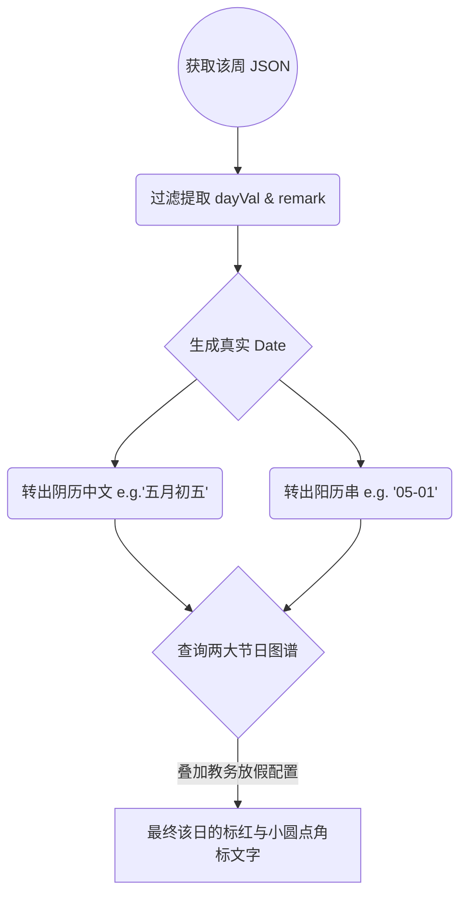

# 多维智能校历视图基座 (CalendarView.vue)

## 1. 模块定位与职责

大学校历不仅仅是一张图片，而是包含了“第几教学周”、“每天上何种课”、“何时放节假日”的交互式数据库。
`CalendarView.vue` 组件从教务远端拉取长阵列数据，对全校全年排班日历进行渲染。其最突出的成就在于集成了一套纯净的原生 JavaScript 阴阳历（农历）换算接口进行双规制渲染。

## 2. AI 级的模糊字段挖掘器

老旧系统中，同一字段不同年份和接口间可能会随意变大小写及加下划线。其针对该烂摊式设计做出了极具防御深度的嗅探代码：

```javascript
const getDayRemark = (item, dayKey) => {
  // 备选垃圾回收池
  const candidates = [
    `${dayKey}remark`, `${dayKey}Remark`, `${dayKey}_remark`,
    `${dayKey}bz`,     `${dayKey}Bz`,     `${dayKey}_bz`,
    `${dayKey}jr`,     `${dayKey}jrxx`,   `${dayKey}holiday`
  ]
  for (const key of candidates) {
    if (item.hasOwnProperty(key)) {
      // 命中有效的就不往下探
      return normalizeRemark(item[key])
    }
  }
}
```
这段暴力反射穷举能够覆盖不同时期各外包厂商迭代遗留的混乱 Payload（Payload中有叫 `monday_remark` 的、有叫 `mondaybz` 周一备注的）。

## 3. 零依赖阴阳双历转换器 (`Intl.DateTimeFormat`)

相比很多中国产的日历组件强行塞入高达 500KB 的阴天库（lunar.js），这里使用了世界级游览器原生生态特技：

```javascript
const chineseLunarFormatter = (() => {
  try {
    return new Intl.DateTimeFormat('zh-CN-u-ca-chinese', {
      month: 'long',
      day: 'numeric'
    })
  } catch { return null }
})()
```
依靠现代 JS 引擎内置的 Locale 特性转换 `zh-CN-u-ca-chinese`：直接将 `new Date(2025, 1, 10)` 转投出“正月十四”的汉字结构。极大减轻了应用负担。

## 4. 日偏与节假日自动标识字典

它建立并预置了两大常量基站：
1. `solarFestivalMap`: 抓取法定与习惯节日（'05-01': '劳动节', '09-10': '教师节'）。
2. `lunarFestivalMap`: 基于农历中文串直接匹配（'正月初一': '春节', '腊月三十': '除夕'）。

渲染管道流：

任何教务本身备注中包含 `/(节|假|休|放假)/` 的字样，均会被 `isHolidayRemark` 所甄并触发前端高亮变色警告。

## 5. UI 解析与构建矩阵
借由 `calendarRows` 的超级计算缓存（computed），将每天独立为一个 `buildDayCell` 返回给由 `display: grid; grid-template-columns: repeat(7, 1fr)` 的 Vue Table 结构中。不仅能够处理开学日期和目前进度标红，更实现了不翻页跨时期的滑动支持。