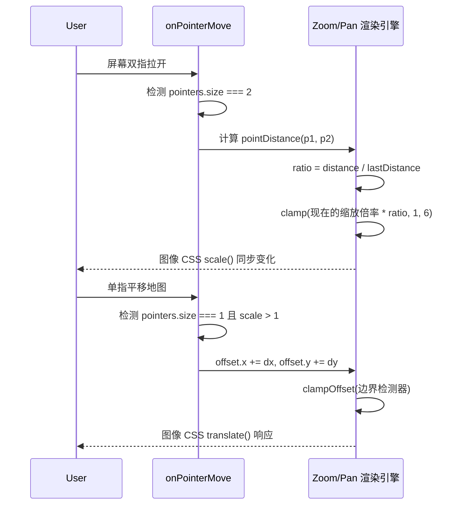

# 多指手势校园地图底座 (CampusMapView.vue)

## 1. 模块地位与核心价值

一所大学的占地面积通常十分庞大，校园地图必不可少。然而很多应用仅仅是放了一张图片标签 ``。导致的后果是：用户无法缩放、放大后图片模糊、无法双指协同拖拽查看边缘建筑。
`CampusMapView.vue` 引入了**纯原生的双指手势矩阵 (PointerEvents) 与 Matrix 矩阵重算机制**，用一个 Vue 组件手搓出了一整套带惯性与边界控制的地图浏览系统。

## 2. 状态映射与远端图床兜底

```typescript
const maps: CampusMapItem[] = [
  { id: 'map1', title: '主校区', url: 'https://raw.gitcode.com/.../map1.jpg' }
]
// 降级机制
const fallbackToRemote = (item: CampusMapItem) => {
  cachedSrcMap.value[item.id] = item.url
  loadStateMap.value[item.id] = 'error'
}
```
当系统本地的 IndexedDB 无法找回高清级原图时，会通过 `image_cache.ts` 失效，转而从远程 GitCode (由 Gitee 托管) 高速下发直连。

## 3. 双端 Pointer 手势追踪循环

摒弃了历史遗留的 `touchstart / touchmove`（因为容易在 PC 端引起兼容性问题）。采用了标准的 `PointerEvent`，全面兼顾鼠标拖曳和屏幕双指捏合（Pinch-To-Zoom）。



## 4. 视口钳位逃逸防御 `clampOffset`
如果我们不加入 `clamp` 控制，用户只要用力一划，图片就会飞出屏幕之外（飞向了无穷大的宇宙），屏幕彻底变白。
为了防御该问题：
```typescript
const maxPan = () => {
  const el = viewportRef.value
  const k = Math.max(0, scale.value - 1)
  // 如果缩放越大，允许你平移的安全矩形狂野就越大
  return {
    x: el.clientWidth * (0.5 + k * 0.9),
    y: el.clientHeight * (0.5 + k * 0.9)
  }
}
```
一旦用户的 `offset.x` 即将超出 `maxPan` 算法规定的边界时，`Math.min` 和 `Math.max` 将其强行拍在边界墙上，模拟了物理边框的质感。

## 5. 小程序唤醒生态打通
不仅自己提供地图，更给用户保留了跳转“官方导览”的特殊入口。利用硬编码的 `WECHAT_CAMPUS_GUIDE_CODE` 与小程序调起协议 (`weixin://dl/business/?appid=...`)。做到了点击一个按钮直接弹出微信并在微信中渲染腾讯 3D 地图。在业务层面实现了完美的降本增效（别人做好的直接唤醒）。