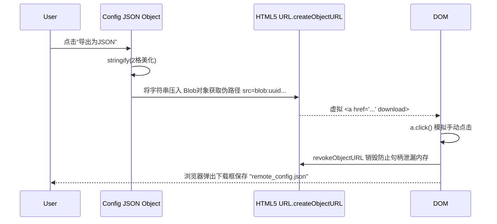

# 超级远程终端配置工程 (ConfigEditor.vue)

## 1. 模块地位与核心价值

这个组件与其说给学生用，不如说是给开发者（SuperDaobo 或任何有权修改根配置的高玩）特供给后台系统的管理中心面板。
它通过视觉化渲染与深度 Vue Model 双向绑定，编辑控制整个 App 远端下发的 `remote_config.json` 的拓扑结构。从 OCR 的微服务探针地址改变，到首页滚动公告的内容，都被集中在这。

## 2. 核心架构字典：预定义的树

应用有一棵极端巨大的备用树兜底（`defaultConfig`）：
```javascript
const defaultConfig = {
  announcements: { ticker: [], pinned: [], list: [], confirm: [] },
  force_update: { min_version: '', message: '' },
  ocr: { endpoint: '', enabled: true },
  resource_share: { endpoint: '...', username: '...' },
  cloud_sync: { mode: 'proxy', timeout_ms: 12000 }
}
```

为了防止后端返回来的 JSON 节点缺失（例如云端不小心把 `cloud_sync` 这个对象全删了），使用了 `ensureStruct()` 清理器，将服务器拿到的不健康对象重构缝合：
如果 `config.value.cloud_sync` 不存在，用展开运算符 `...defaultConfig.cloud_sync` 吸补回去。

## 3. 多栏目通知流派分发

Vue 的 v-model 能够让开发者在四个标签页（Tab）下管理公告。
- **Ticker**：主页一直横移滚动的警报跑马灯。
- **Pinned**：在成绩查询榜顶置红光的严重警报。
- **List**：普通的帮助与新闻发布池。
- **Confirm**：包含 Markdown 的必点弹窗（例如用户协议必须点击同意）。

通过 `activeTab.value` 计算属性将当前选择页与 `currentList` 响应式钩合。甚至可以直接在界面里填写 `[MD Markdown]` 然后调用底层 `renderMarkdown`。

## 4. 对象导出与本地流管道 (`exportJson`)

在修改完千字以上的配置之后，它没有去发网络请求给谁（由于 GitHub 等是静态托管配置档）。而是借由 Blob 强制吐出了一个物理下载文件。



并且设计了针对 WebView 沙箱的复制降级。如果没法保存实体文件（被 iOS 拦截了下载行为），则：
`navigator.clipboard.writeText(data)` 强制打进剪贴板里，以一种极其鲁棒的姿态服务管理员。