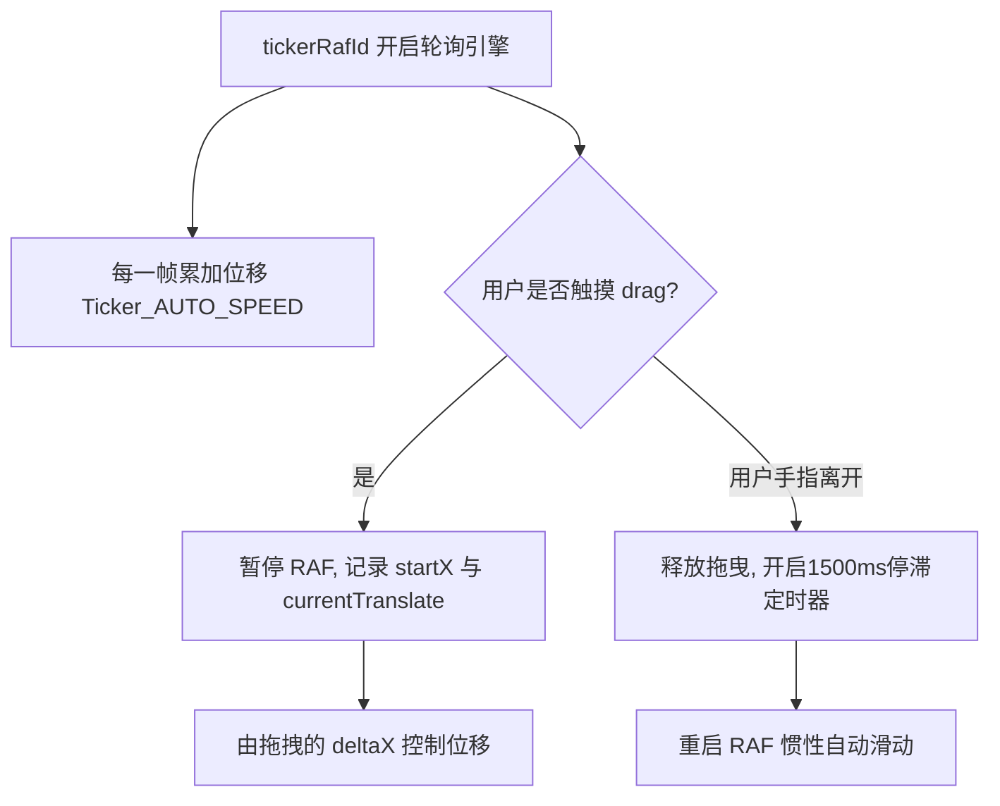

# 全功能综合仪表盘/控制台 (Dashboard.vue)

## 1. 模块边界与核心职责

一旦用户登录成功，跨越验证栏后，展现在眼前的第一个综合阵列就是 `Dashboard.vue`。
它不是简单的按钮堆砌，它承担了极高频的轮询、自动倒班、广告滚动、维护状态侦听与应用级缓存拉取的多级调度重担。是整个前端的心脏泵。

## 2. 跑马灯与交互状态机 (`tickerDragActive`)

主页的 `Ticker` (顶部滚动公告) 是基于 `requestAnimationFrame` 驱动的纯前端 60fps 平滑移动器，告别了 `setInterval` 带来的一卡一卡问题。


这是一个自己实现的高级横向手势走马灯。配合 `tickerLoopWidth` 宽度冗余铺垫完美完成无限无缝大回环。

## 3. 课程刻度轴推进器（时间线预判器）

仪表盘并不是单纯把你一天的课罗列出来就算了，它甚至能感知“上课到哪了”：

```javascript
const currentMinutePrecise = computed(() => {
  return now.getHours() * 60 + now.getMinutes() + now.getSeconds() / 60
})
const timelineCourses = computed(() => {
  // 把已经上完的课抛在脑后，不再展示，并只切片截取前4个。
  return todayCourses.value.filter((c) => c.endMinutes > currentMinutePrecise.value).slice(0, 4)
})
```
为了更新 `nowTick`，不仅部署了一个每秒 `CLOCK_TICK_MS` 执行的定时器；更监听了 `document.visibilityState`：当用户把 App 退回后台很长一段时间后再次唤起，可以瞬间修正 `nowTick` 来避免时间线偏移（假死恢复）。

## 4. 全局模块白名单锁

`JWXT_MODULE_ALLOWLIST` 定义了包含诸如 `grades`, `classroom`, `exams` 等在内的 10 项功能。若因为夜间学校系统断电（常有的事）维护：
- 根据父级传入的 `jwxtMaintenance: true` 进行全局加锁，将带有教务背景的图标统统涂灰。
- 但是，不会锁死“不依赖教务的模块”（如 `campus_map` 校园地图、或利用自己微服务的 `resource_share`）。
做到了故障隔离降级。

## 5. 多数据并发装载
在 `onMounted` 之后，组件会并行唤起 `App` 预留的一系列数据：通知查询、校历时间表，甚至预测是否该提示更新。全部异步进行，没有阻塞任何界面渲染。