# 考务雷达与历史清算板 (ExamView.vue)

## 1. 模块定位与职责

大学中极为重要的痛点：搞乱考试时间或考场。
`ExamView.vue` 通过连接 v2 接口，动态提取出某个学期的期中期末、通识选修考场安排。同时，这个视图还充当了“考史管理库”，将未结束考试与过往考试进行强隔离显示。

## 2. 状态映射与智能隔离排序 (`processedExams`)

由于原始接口返回的数组可能完全乱序，Vue 中应用了经典的复合计算排序。

### 降级切割术

```mermaid
graph TD
    A[exams.value 数据注入] --> B{遍历每个考试项目是否 isPassed?}
    B -- 未结束 (New Date < Today) --> C[丢入 future 组]
    B -- 已结束 --> D[丢入 passed 组]
    C --> E[对 future 组按日期进行 升序 排序：让最近最危急的在第一名]
    D --> F[对 passed 组按日期进行 降序 排序：越远的沉越深]
    E --> G[future + passed 重组输出]
    F --> G
```

因为学生最不希望的是去海底捞针，`['exam-card', { 'is-passed': isPassed... }]` 加上了变灰处理，使得用户每次只需看本周有哪些红色卡片即可。

## 3. 标准化无状态网络流

它的结构异常干净，采用了 Vue3 Composition API 的极简流：
```javascript
onMounted(async () => {
  await fetchSemesters()
  await fetchExams()
})
```
使用 `selectedSemester` 直接双向绑定到 `<IOSSelect>`。通过 `@change="handleSemesterChange"` 直接再起一波查询请求。
当请求触发时，构建 Cache Fingerprint `exams:{studentid}:{semester}`，结合 `fetchWithCache` 将该学期的考表无缝存入存储内。

## 4. UI渲染排布与图标注入

因为所有的考试列表信息通常都很干燥，页面针对不同数据项做了极为严密的无数据收敛（即：如果座号没有，就不渲染那一栏而不是渲染一个“座号：无”）：

```html
<div class="detail-item" v-if="exam.exam_date"><span class="icon">📅</span></div>
<div class="detail-item" v-if="exam.exam_time"><span class="icon">⏰</span></div>
<div class="detail-item" v-if="exam.location"><span class="icon">📍</span></div>
...
```
并通过 `v-if="offline"` 挂载了一个醒目横幅 `当前显示为离线数据，更新于XX分钟前`，使得用户可以放心这是离线的镜像而不会因为误会错过考期。